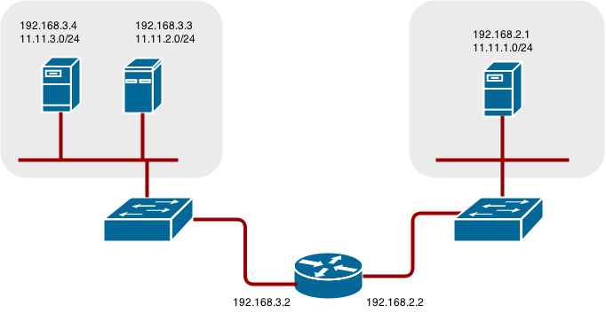

Native container routing using network infrastructure
==========================================================

Introduction
----------------------------------------------------------
This document describes how one could setup container networking using existing switches/routers and using
the kernel networking stack in Linux. The setup requires that the network administrator or some script
modifies the router[s] as new nodes are added to the cluster. The document will describe the steps to
use a Linux server as a simple router. The steps could then be adapted to any particular router.


Network Layout
----------------------------------------------------------
The diagram below shows the setup used in the document. It has one Linux node with two network interface
cards serving as a router, two switches and three nodes connected to these switches. 




Network Overview
----------------------------------------------------------
* 11.11.0.0/16 is the container network.
* 11.11.x.0/24 subnet is reserved for each node and assigned to the docker linux bridge.
* Each node has a route to the router for reaching anything 11.11.0.0/16 except the local subnet.
* Router has routes for each node, so it can direct to the right node.
* Nodes don't need any changes when new nodes are added unless the network topology is modified.
* IP forwarding is enabled on each node.


Node setup
-----------------------------------------------------------
* Assign an unused 11.11.x.0/24 subnet ip address to the linux bridge on the node.
```
brctl addbr lbr0
ip addr add 11.11.1.1/24 dev lbr0
ip link set dev lbr0 up
```
* Modify docker startup script to use the new bridge (/etc/sysconfig/docker on Fedora).
```
docker -d -b lbr0 --other-options
```
* Add a route for the 11.11.0.0/16 network to the router.
```
ip route add 11.11.0.0/16 via 192.168.2.2 dev p3p1
```
* Enable IP forwarding on the node.
```
sysctl -w net.ipv4.ip_forward=1
```

Router setup
---------------------------------------------------------------
The steps below assume a linux box with multiple NICs as a router.
They would have to be modified to use the syntax for the particular router.

* Enable IP forwarding on the router.
```
sysctl -w net.ipv4.ip_forward=1
```
* Add a route per node added to the cluster.
```
ip route add <node_subnet> via <node_ip_address> dev <interface through which node is L2 accessible>
ip route add 11.11.1.0/24 via 192.168.2.1 dev p3p1 
ip route add 11.11.2.0/24 via 192.168.3.3 dev p3p2 
ip route add 11.11.3.0/24 via 192.168.3.4 dev p3p2 
```

