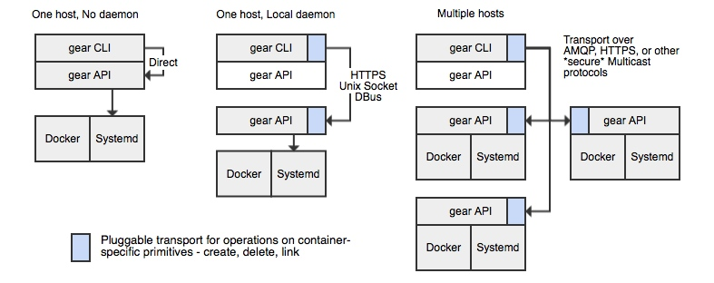
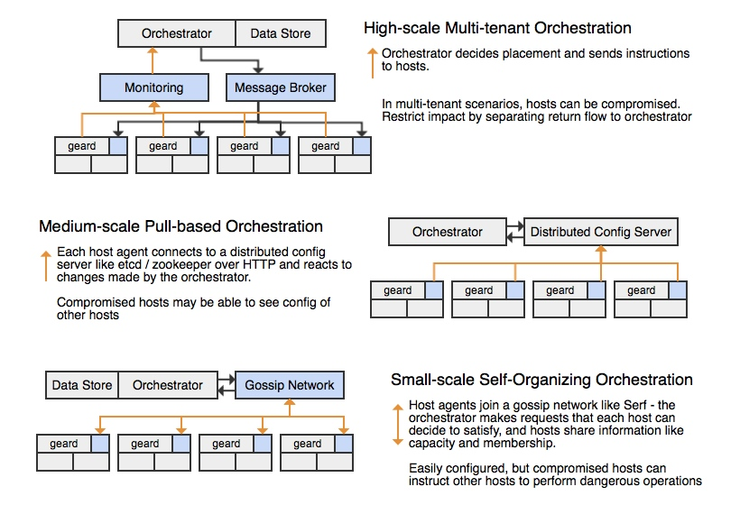

Orchestration Topologies
------------------------

There are three important roles for orchestration at different scales of use:

* from a command line tool, administrators can quickly spin up containers and interconnect them across a few machines
* as an administrator managing a pool of resources centrally who wishes to deploy one or more applications without directly managing assignment
* as a developer or end user deploying an application into a very large resource pool, where administrators control allocation but topology is under the user's control.

For all of the scales of use above, it's desirable to describe and define application topology the same way across those scales.  As a client, it should be possible to directly materialize that topology as containers by talking to local components (like Docker) or a local API endpoint.  Ideally that API endpoint would be consistent when moving to a high level orchestration tool, so that it's possible to test locally and then deploy remotely.

At larger scales, an orchestrator component is required to implement features like automatic rebalancing of hosts, failure detection, and autoscaling.  The different types of orchestrators and some of their limitations are shown in the diagrams below:

As noted, the different topologies have different security and isolation characteristics - generally you trade ease of setup and ease of distributing changes for increasing host isolation.  At the extreme, a large multi-tenant provider may want to minimize the risks of host compromise by preventing nodes from being able to talk to each other, except when the orchestrator delegates.  The orchestrator can then give node 1 a token which allows it to call an API on node 2.  In addition, in the pull-model the hosts can be given only a limited set of access to the central config store (much like Puppet) so they are only allowed to view the subset that applies to them.

A second part of securing large clusters is ensuring the data flowing back to the orchestrator can be properly attributed - if a host is compromised it should not be able to write data onto a shared message bus that masquerades as other hosts, or to execute commands on those other hosts.  This usually means a request-reply pattern (such as implemented by MCollective over STOMP) where requests are read off one queue and written to another, and the caller is responsible for checking that responses match valid requests.

On the other end of the spectrum, in small clusters ease of setup is the gating factor and there tend to be less extreme multi-tenant security concerns.  A [gossip network](http://www.serfdom.io) or distributed config server like [etcd](https://github.com/coreos/etcd) can make simple configuration easy.
