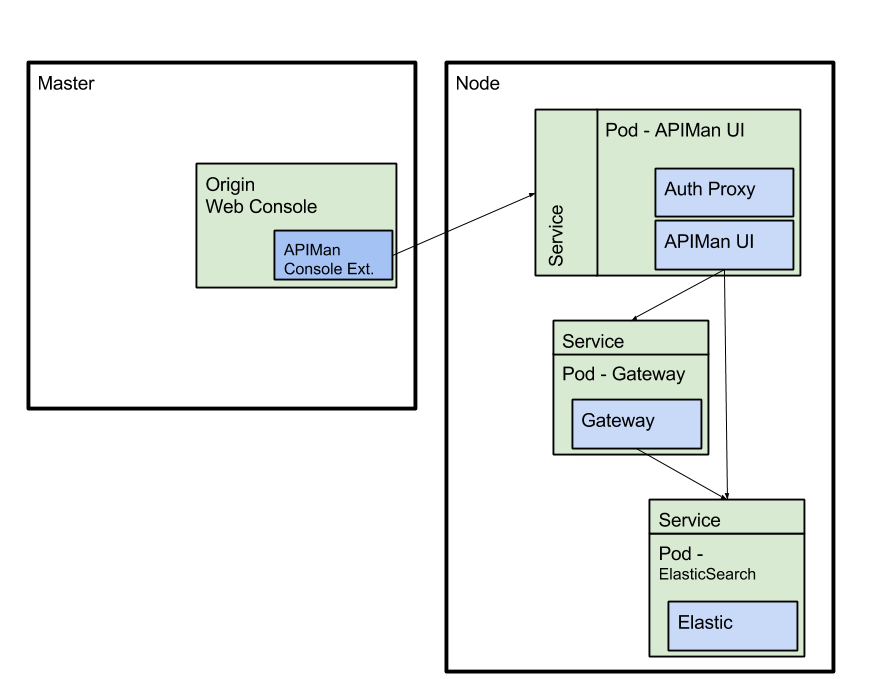
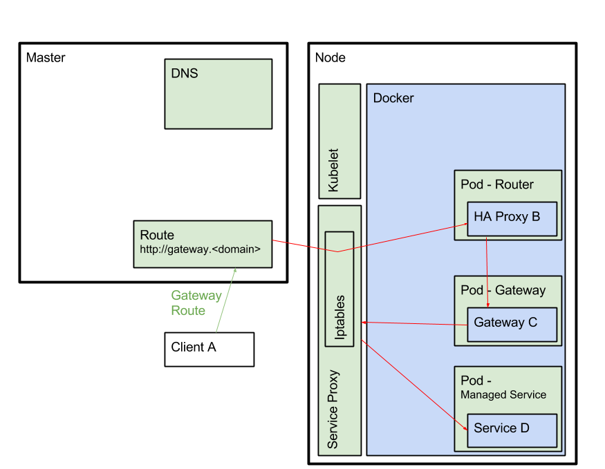

# APIMan Integration

## Abstract
This proposes a design for integrating [APIMan](http://www.apiman.io/) with OpenShift in order to provide  micro-services governance for API service providers.

## Motivation
Providers of services may have the need to control who and how their services are consumed.  This will be realized as policies defined by providers to control their service in any number of ways (e.g security, throttling/quota, billing and metrics)<sup>[1](#r1)</sup>. 

## Constraints and Assumptions
### Authentication
The OAuth token identifying a user in OpenShift will be utilized by APIMan to associate service policy to their identity.  This will ensure a user's identity is ubiquitous across the cluster when interacting with OpenShift and the APIMan management console.

### Deployment
#### Communication
APIMan components (e.g. gateway, management interface) integrated with the cluster will utilize mutual TLS for internal communication.

#### Storage
APIMan is capable of using several backends (e.g. ElasticSearch, Postgresql) to store configuration, policy, and metrics.  The initial integration will utilize an ElasticSearch cluster dedicated to APIMan.  The ElasticSearch image is a common image that is shared with aggregated logging.  The [ACL plugin](https://github.com/fabric8io/openshift-elasticsearch-plugin)<sup>[2](#r2)</sup> that is deployed as part of the common Elastisearch image will be configured accordingly to support APIMan, disabling some features that are unnecessary for it use. Additionally, the ElasicSearch index management<sup>[3](#r3)</sup>  will be modified so that it will not cull APIMan data.


Cluster administrators can configure APIMan to use an alternate, off cluster ElasticSearch instance if desired.  Some organizations may have an existing instance of ElasticSearch cluster that already defines policy, and administrators may desire to use it instead of the one provided with aggregated logging.

## Use Cases
* **UC01** As an API provider, I want to navigate from the OpenShift web console to the APIMan management interface, so I can define my service policies.
* **UC02** As an API provider, I want to explicitly expose my service when navigating to the APIMan  management interface, so that it is consumable according to my policies.  
* **UC03** As a cluster administrator, I want a gateway to route API traffic only, so that it manages traffic based on a service's policies.
* **UC04** As a cluster administrator, I want to deploy APIMan such that it has no dependencies on other integrated infrastructure components (e.g. ElasticSearch for logging).
* **UC05** As an API consumer, I want to configure my services to consume other services.

## Specification

API services will be scoped to OpenShift projects. Projects will have one-to-one relationship to an APIMan namespace (formally organization). APIMan will utilize namespace to organize policies for a service.

### Deployment Scenario - APIMan Gateway Fronted by a Router

The primary deployment scenario is to deploy APIMan components as shown in **Figure 1**.  APIMan will be deployed as a cluster level service for managing API service end points.  APIMan will be deployed with a dedicated ElasticSearch cluster for storage.  Communication between APIMan and ElasticSearch will make use of mutual TLS similiar to aggregated logging.  An APIMan deployer will handle installation of APIMan components including certificate and password generation as needed.


**Figure 1 - APIMan Deployment Diagram**



The APIMan gateway is deployed in conjunction with a supported OpenShift router.  A typical request to a managed endpoint is initially routed to the gateway and then further routed by the gateway to the targeted service.  This flow can be seen in **Figure 2** where the APIMan gateway relies upon the service proxy to find pods.  This deployment scenario was chosen as it is the simplest to implement given current time constraints and APIMan's current feature set.     

**Figure 2 - Managed Service Request Flow with APIMan Gateway and Router**




### Service Annotations
Services intended to be managed and exposed as API Endpoints will be annotated<sup>[5](#r5)</sup>.  An example of the annotations are repeated below for convenience and the actual values may vary:

```
  apiVersion: "v1"
  kind: "Service"
  metadata: 
    annotations: 
      api.service.kubernetes.io/protocol: REST
      api.service.kubernetes.io/scheme: http
      api.service.kubernetes.io/path: cxfcdi
      api.service.kubernetes.io/description-path: cxfcdi/swagger.json
      api.service.kubernetes.io/description-language: SwaggerJSON
```
Additionally, services can further be annotated to take advantage of APIMan features: auto import/publish, and plans.  The proposed annotations are:
```
  annotation          value description                       example
  ----------          -----------------                       -------
  apiman.io/publish   import or publish                       publish
  apiman.io/plans     comma separated list of plan:version    gold:1.0,silver:1.1
```
When a service includes the annotation `apiman.io/publish`, then
- a value set to `import` will only import the service into APIMan
- a value set to `publish` will import the service into APIMan and published to the APIMan gateway

Plans are a pre-configured policy chain that is defined for a project.  Upon service import, APIMan will look for the `apiman.io/plans` annotation. 
- If this annotation is not available or no plan is specified, the API will be set to 'Public'
- If plans are provided, they are applied to the API and the plan `version` will default to 1.0, unless specified.

### OpenShift Web Console UI Extension
A custom extension<sup>[6](#r6)</sup> will be created and deployed with the OpenShift web console to support API endpoints.  The extension will allow a user to navigate to the APIMan management interface to:

* Manage an API endpoint
* Expose an annotated service as a new API endpoint

The extension will provide the following details to the APIMan management interface:

* Service name
* Service namespace
* User's Oauth token
* Back link to the openshift web console

Calls from the extension to the APIMan management interface will utilize a REST POST call where the oauth token is part of the payload.  It will utilize a similiar design<sup>[7](#r7)</sup> that is realized by the OpenShift origin aggregated logging integration.  It is necessary for security reasons to not add the token as a query parameter.  

### APIMan Gateway
The APIMan gateway will be deployed as a cluster-wide infrastructure component to handle services exposed as API endpoints.  Internal and external clients will use the gateway to access APIs.  Admins can configure the cluster to limit direct access to services and require consumers of API endpoints to utilize the gateway by deploying the multi-tenant SDN plugin.  This plugin controls service to service communication between projects and will force traffic through the gateway.  A route will be created as a well known endpoint to the APIMan gateway through which all API services traffic will flow.

#### Service Consumption & Authentication
The details of service authentication and consumption depend upon the type (i.e public, contracted) of published service and the policies associated with it. Users of a public service need to only full-fill the policies associated with the service in order to use the endpoint.  Users of contracted services will submit an APIMan generated token with their request.  These are fundamental features of APIMan and are described here to provide a basic understanding of consuming APIMan controlled services.  Additional information can be found in the [APIMan](http://www.apiman.io/) documentation.

## Concerns
### Scalability
There is a concern that utilizing ElasticSearch for storage is not as well understood as other options (e.g Postgresql).  Additionally, performance testing will need to be conducted to confirm the impact of adding a second, small ElasticSearch cluster to the infrastructure.  An alternative solution is to deploy a different storage engine which is better understood, has a smaller resource footprint but introduces scaling challenges.  APIMan can also generate metrics data which impacts its storage requirements; metrics could be off-loaded to the existing origin metrics<sup>[8](#r8)</sup> solution.  There is an existing RFE to investigate this change.  APIMan will initially be deployed with metrics disabled to minimize its storage requirements.

### Certificates
This proposal provides a deployer component to handle CA and client certificates similiar to what is provided as with origin metrics and aggregated logging.  The same concerns that affect aggregated logging and metrics apply to APIMan: certificate expiration, certificate generation, etc.

### APIMan Behind a Router
We need to better understand and document how placing the APIMan gateway behind a router will affect the network characteristics of requests to a managed endpoint.  Further investigation is required to understand things such as session affinity, dynamic reloading, route scaling, etc.

## References
* <span id="r1">[1]</span> APIMan - http://www.apiman.io/
* <span id="r2">[2]</span> OpenShift ElasticSearch plugin - https://github.com/fabric8io/openshift-elasticsearch-plugin
* <span id="r3">[3]</span> OpenShift Aggregated Logging Index Management - https://github.com/openshift/origin-aggregated-logging/pull/57
* <span id="r4">[4]</span> Origin Aggregated Logging - https://github.com/openshift/origin-aggregated-logging
* <span id="r5">[5]</span> Service Discovery - https://github.com/kubernetes/kubernetes/blob/master/docs/proposals/service-discovery.md
* <span id="r6">[6]</span> Web Console Extensions - https://docs.openshift.org/latest/install_config/web_console_customization.html
* <span id="r7">[7]</span> Kibana API Discovery - https://github.com/openshift/origin/blob/master/assets/app/scripts/directives/logViewer.js#L337
* <span id="r8">[8]</span> Origin Metrics - https://github.com/openshift/origin-metrics
