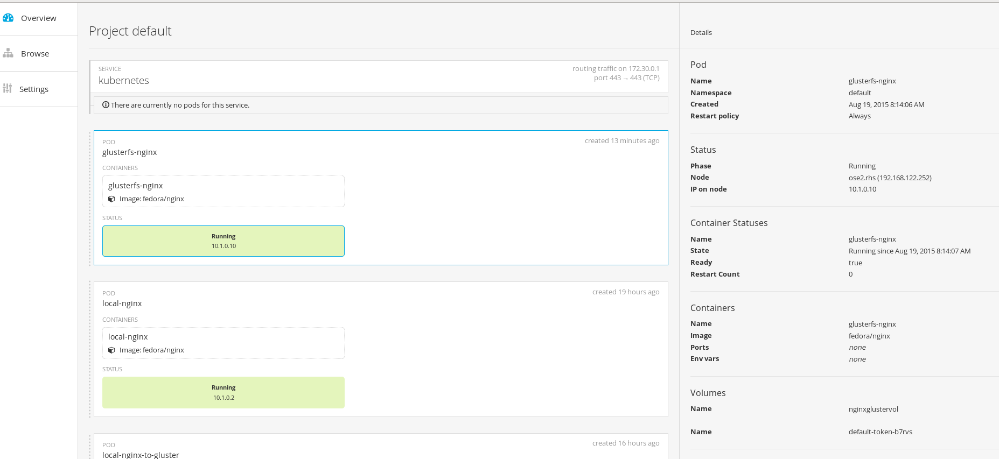

## Example 2: Deploy NGINX application using GlusterFS Plugin to Auotomatically attach storage to the pod/container - No PV or PVC at this point
---

**Summary**: 

At this point, all [environment assumptions](..) are met, and we have a Gluster Cluster running on separate hosts (gluster1.rhs and gluster2.rhs for this example).  We also installed and mounted the Gluster Volumes on our Atomic RHEL hosts (myVol1 and myVol2).  We will use the myVol1 in this example to show a simple pod that uses Distributed Storage.  We have shown several ways to use storage (local, manually mounted/mapped with local), and now we will use  the glusterfs plugin that is shipped with OpenShift and automatically mount/map the Distributed Gluster Storage to the pod.

- For this example, you will have to define the GlusterFS Cluster as “EndPoints” within Kubernets/OpenShift platform using a file similar to [endpoints configuration file](gluster-endpoints.json).  You must define the IP/Hostname of your gluster servers and the port that you want to use.  The port value can be any numeric value within the accepted range of ports.

        { 
           "kind": "Endpoints", 
           "apiVersion": "v1", 
           "metadata": { 
               "name": "glusterfs-cluster" 
           }, 
           "subsets": [ 
               { 
                   "addresses": [ 
                      { 
                          "IP": "192.168.122.221"
                      } 
                   ], 
                   "ports": [ 
                       { 
                           "port": 1 
                       } 
                   ] 
               }, 
               { 
                   "addresses": [ 
                       { 
                            "IP": "192.168.122.222"
                       } 
                   ], 
                   "ports": [ 
                       { 
                            "port": 1 
                       } 
                   ] 
               } 
           ] 
        } 

*Note: It seems that the IP value under `addresses` must be an actual IP Address of the gluster server, not a fully qualified hostname, this will most likely change in future releases.*

        oc create -f gluster-endpoints.json

        [root@OpenShift1 nginx_gluster]# oc create -f gluster-endpoints.json 
        endpoints/glusterfs-cluster 

        oc get endpoints

        [root@OpenShift1 nginx_gluster]# oc get endpoints 
        NAME                ENDPOINTS 
        glusterfs-cluster   192.168.122.221:1,192.168.122.222:1 
        kubernetes          192.168.122.251:8443 

- To persist the Endpoints, you need to use [service configuration file](glusterfs-service.json) to create a service:

        oc create -f gluster-service.json

        [root@OpenShift1 nginx_gluster]# oc create -f gluster-service.json 

_then check the service status via_

        oc get service

- Following similar deployment to what we did in the previous examples, we will modify the [pod configuration file](gluster-nginx-pod.json) to utilize the “glusterfs” plugin

        { 
            "apiVersion": "v1", 
            "id": "glusterfs-nginx", 
            "kind": "Pod", 
            "metadata": { 
                "name": "glusterfs-nginx" 
            }, 
            "spec": { 
                "containers": [ 
                    { 
                        "name": "glusterfs-nginx", 
                        "image": "fedora/nginx", 
                        "volumeMounts": [ 
                            { 
                                 "mountPath": "/usr/share/nginx/html/test", 
                                 "name": "nginxglustervol" 
                            } 
                        ] ,
                        "securityContext": { 
                             "capabilities": {}, 
                             "privileged": true 
                        } 
                    } 
                ], 
                "volumes": [ 
                    { 
                        "name": "nginxglustervol", 
                        "glusterfs": {  
                             "endpoints": "glusterfs-cluster",
                             "path": "myVol1",
                             "readOnly": false                   
                        } 
                    } 
                ] 
            } 
        } 

_Under volumeMounts_

        mountPath: /usr/share/nginx/html/test        This is the local container directory that will be mapped to the actual storage path (so from container, this path will be created)
        name:      nginxglustervol                   This is the name you give to the mount volume and it should match any volumes listed below in the volume section
        

_Under securityContext_     [see this for more info on Security Context](https://github.com/kubernetes/kubernetes/blob/master/docs/design/security_context.md). _You may also have to configure the scc privileged `Security Constraint` - more information about this can be found_ [here](https://docs.openshift.com/enterprise/3.0/admin_guide/manage_scc.html#grant-access-to-the-privileged-scc) 
        
        privileged: true             This security setting will allow the container to run as privileged so the mount can be created.

_Under volumes_

        endpoints:   glusterfs-cluster   Tells the glusterfs plugin/kubernetes to search for myVol1 on the following endpoints, takes the first one found       
        name:        nginxglustervol     matches name: nginxglustervol from volumeMounts
        path:        myVol1              path is the Gluster Volume that you are mapping to, it is already defined in Gluster

- Create the pod

        oc create -f gluster-nginx-pod.json

        [root@OpenShift1 nginx_gluster]# oc create -f gluster-nginx-pod.json 
        pods/glusterfs-nginx 

- After a few minutes (this may vary), check and make sure the pod is running

        oc get pods

        [root@OpenShift1 nginx_gluster]# oc get pods 
        NAME                     READY     STATUS    RESTARTS   AGE 
        glusterfs-nginx          1/1       Running   0          10m 
        local-nginx              1/1       Running   0          18h 
        local-nginx-to-gluster   1/1       Running   0          15h 

- You should now also see it in your OpenShift web GUI  (https://your master host:8443/console)  (user:  `admin`  passwd: `admin`)

- From the OpenShift Console, click on your pod and note the “IP on node” and “Node” values, which will tell you what ip and node the nginx application is running on.   We will use this in a later step to curl the web server

- Create a sample html page to serve from the Gluster Storage Server.  SSH to one of the gluster hosts and create your page.  For this example I did the following:

        ssh root@gluster1.rhs   (gluster server)

   Navigate to the mounted directory, in this case for my example

        cd /mnt/glustervol1      (mapped to gluster volume --> myVol1)
        mkdir glusterfs-nginx
   
     
   Create a helloworld.html file

        This is a test using the OpenShift glusterfs plugin creating a nginx application that uses gluster distributed storage to serve this page.  The nginx application container was defined 
        from a configuration file and the container mount was created by the plugin and we are now mapped to a real GlusterFS!!

- SSH into the node where the container is running (remember the details from the OpenShift Console Web GUI) and using the container_id obtained from “docker ps” command, jump into the container shell and then we will explore what we have.

     From the Atomic Host where the Container is running:

        docker ps

        bash-4.3# exit[root@OpenShift2 teststorage]# docker ps 
        CONTAINER ID        IMAGE                         COMMAND             CREATED             STATUS              PORTS               NAMES 
        ec8c801fcd81        fedora/nginx                  "/usr/sbin/nginx"   29 minutes ago      Up 29 minutes                           k8s_glusterfs-nginx.6ed56923_glusterfs-nginx_default_c978d0b4-466b-11e5-	ae70-52540008f001_f97147d7                 

        docker exec -it 8dda35c5f9ad bash

        [root@OpenShift2 teststorage]# docker exec -it ec8c801fcd81 bash

     From the Container bash shell:

        bash-4.3# cd /usr/share/nginx/html/test/                                                                                                                                                                            
        bash-4.3# ls 
        *glusterfs-nginx*  glusterfs-nginx-atomichost-mount  helloworld.html  test1  test2  test3 
        

        bash-4.3# cd glusterfs-nginx 
        bash-4.3# ls 
        helloworld.html 

        mount   (will show the mounted gluster volume)

        192.168.122.221:myVol1 on /usr/share/nginx/html/test type fuse.glusterfs (rw,relatime,user_id=0,group_id=0,default_permissions,allow_other,max_read=131072) 

              
*Notice when we go to our mounted nginx root test directory, we can now see all the contents of our GlusterFS Storage mount, including the directory we created “glusterfs-nginx”*

*Notice we also see our helloworld.html file that we created within that directory*

- Enter simple curl command from the docker container to serve the page

        curl http://10.1.0.10/test/glusterfs-nginx/helloworld.html

        bash-4.3# curl http://10.1.0.10/test/glusterfs-nginx/helloworld.html 
        This is a test using the OpenShift glusterfs plugin creating a nginx application that uses gluster distributed storage to serve this page.  The nginx application container was defined from a configuration file and the container mount was created by the plugin and we are now mapped to a real GlusterFS!! 

===

[Previous](../nginx_gluster_host)  |  [Main List](../)  |  [Next](../nginx_gluster_pvc)

===

