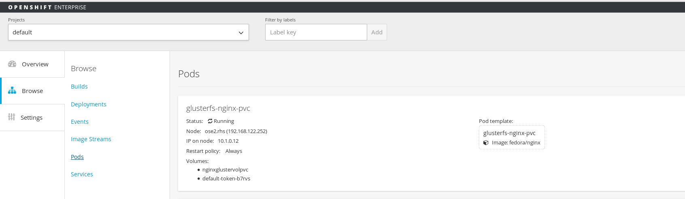

## Example 3: Deploy Distributed File System hosted NGINX application on Atomic Host Using PersistentVolume Storage and PersistentVolumeClaim with OpenShift Console
---

**Summary**: 

At this point, all [environment assumptions](../../gluster-examples) are met, and we have a Gluster Cluster running on separate hosts (gluster1.rhs and gluster2.rhs for this example).  We also installed and mounted the Gluster Volumes on our Atomic RHEL hosts (myVol1 and myVol2).  We will use the myVol1 in this example to show a simple pod that uses Distributed Storage.  We have shown several ways to use storage (local, manually mounted/mapped with local and automatically mounted/mapped with the glusterfs plugin shipped with OpenShift v3), this next example will attempt to set up a PersistentVolume and PersistentVolumeClaim within OpenShift for the default project we are working on.

- `(OPTIONAL – only if they do not already exist)` For this example, you will have to define the GlusterFS Cluster as “EndPoints” within Kubernets/OpenShift platform.  See [endpoints configuration file](gluster-endpoints.json) for an example.  For this file, it's important to note that you must define the IP/Hostname of your gluster servers and the port that you want to use.  The port value can be any numeric value within the accepted range of ports.

        oc create -f gluster-endpoints.json

        [root@OpenShift1 nginx_gluster]# oc create -f gluster-endpoints.json 
        endpoints/glusterfs-cluster 

        oc get endpoints

        [root@OpenShift1 nginx_gluster]# oc get endpoints 
        NAME                ENDPOINTS 
        glusterfs-cluster   192.168.122.221:1,192.168.122.222:1 
        kubernetes          192.168.122.251:8443 

- Create the [PersistentVolume configuration file](gluster-nginx-pv.json) that will register your gluster volume with OpenShift and make it available to be used for claims and storage across all the pods/containers in your current project.

        { 
           "apiVersion": "v1", 
           "kind": "PersistentVolume", 
           "metadata": { 
               "name": "gluster-default-volume" 
           }, 
           "spec": { 
                "capacity": { 
                     "storage": "2Gi" 
                     }, 
                "accessModes": [ "ReadWriteMany" ], 
                "glusterfs": { 
                    "endpoints": "glusterfs-cluster", 
                    "path": "myVol1", 
                    "readOnly": false
                }, 
                "persistentVolumeReclaimPolicy": "Recycle" 
            } 
        }

        oc create -f gluster-nginx-pv.json

        [root@OpenShift1 nginx_gluster_pvc]# oc create -f gluster-nginx-pv.json 
        persistentvolumes/gluster-default-volume 

        oc get pv

        [root@OpenShift1 nginx_gluster_pvc]# oc get pv 
        NAME                     LABELS    CAPACITY     ACCESSMODES   STATUS      CLAIM     REASON 
        gluster-default-volume   <none>    2147483648   RWX           Available  

*Notice, we now have a Persistent Volume – it shows `Available` but is not yet bound.*

        oc describe pv gluster-default-volume    (name from get pv)

        [root@OpenShift1 nginx_gluster_pvc]# oc describe pv gluster-default-volume 
        Name:		gluster-default-volume 
        Labels:		<none> 
        Status:		Available 
        Claim:		 
        Reclaim Policy:	%!d(api.PersistentVolumeReclaimPolicy=Recycle) 
        Message:	%!d(string=) 

- Create the [PersistentVolumeClaim configuration file](gluster-nginx-pvc.json).

        { 
            "apiVersion": "v1", 
            "kind": "PersistentVolumeClaim", 
            "metadata": { 
                "name": "claim-default" 
            }, 
            "spec": { 
                 "accessModes": [ "ReadWriteMany" ], 
                 "resources": { 
                      "requests": { 
                          "storage": "2Gi" 
                      } 
                 } 
            } 
         }

        oc create -f gluster-nginx-pvc.json

        [root@OpenShift1 nginx_gluster_pvc]# oc create -f gluster-nginx-pvc.json 
        persistentvolumeclaims/claim-default 

        oc get pv 

        [root@OpenShift1 nginx_gluster_pvc2]# oc get pv 
        NAME                      LABELS    CAPACITY     ACCESSMODES   STATUS      CLAIM                   REASON 
        gluster-default-volume    <none>    2147483648   RWX           Bound       default/claim-default   

*Notice now, that the PV Status becomes bound.*

         oc get pvc

         [root@OpenShift1 nginx_gluster_pvc]# oc get pvc 
         NAME            LABELS    STATUS    VOLUME 
         claim-default   map[]     Bound     gluster-default-volume 

         oc describe pvc claim-default    (name from get pv)

         [root@OpenShift1 nginx_gluster_pvc]# oc get pvc 
         NAME            LABELS    STATUS    VOLUME 
         claim-default   map[]     Bound     gluster-default-volume 

         [root@OpenShift1 nginx_gluster_pvc]# oc describe pvc claim-default 
         Name:		claim-default 
         Namespace:	default 
         Status:		%!d(api.PersistentVolumeClaimPhase=Bound) 
         Volume:		%!d(string=gluster-default-volume) 

- Create the [pod configuration file](gluster-nginx-pvc-pod.json) with the reference to the PVC embedded in the configuration to utilize the “glusterfs” plugin

        { 
            "apiVersion": "v1", 
            "id": "glusterfs-nginx-pvc", 
            "kind": "Pod", 
            "metadata": { 
                "name": "glusterfs-nginx-pvc" 
            }, 
            "spec": { 
                "containers": [ 
                    { 
                        "name": "glusterfs-nginx-pvc", 
                        "image": "fedora/nginx", 
                        "volumeMounts": [ 
                            { 
                                 "mountPath": "/usr/share/nginx/html/test", 
                                 "name": "nginxglustervolpvc" 
                            } 
                        ], 
                        "securityContext": { 
                            "capabilities": {}, 
                            "privileged": true 
                        } 
                   } 
               ], 
               "volumes": [ 
                   { 
                       "name": "nginxglustervolpvc", 
                       "persistentVolumeClaim": { 
                           "claimName": "claim-default" 
                       } 
                   } 
               ] 
            } 
        } 

        oc create -f gluster-nginx-pvc-pod.json

        [root@OpenShift1 nginx_gluster_pvc]# oc create -f gluster-nginx-pvc-pod.json 
        pods/glusterfs-nginx-pvc 

- After a few minutes (this may vary), check and make sure the pod is running

        oc get pods

        [root@OpenShift1 nginx_gluster_pvc]# oc get pods 
        NAME                     READY     STATUS    RESTARTS   AGE 
        glusterfs-nginx          1/1       Running   0          1h 
        glusterfs-nginx-pvc      1/1       Running   0          14s 
        glusterfs-nginx1         1/1       Running   0          18m 
        local-nginx              1/1       Running   0          20h 
        local-nginx-to-gluster   1/1       Running   0          17h 

- You should now also see it in your OpenShift web GUI  (https://host:8443/console)  (user:  `admin`  passwd: `admin`)

- From the OpenShift Console, Note the “IP on node” and “Node” values, which will tell you what ip and node the nginx application is running on.   We will use this in a later step to curl the web server

- Create a sample html page to serve from the Gluster Storage Server.  SSH to one of the gluster hosts and create your page.  For this example I did the following:

        ssh root@gluster1.rhs   (gluster server)

   Navigate to the mounted directory, in this case for my example

        cd /mnt/glustervol1      (mapped to gluster volume --> myVol1)
        mkdir glusterfs-nginx-pvc
   
     
   Create a helloworld.html file

                                
        This is using GlusterFS Distributed Storage to serve this page.  Created by OpenShift Console using PersistentVolume and PersistentVolumeClaim.  OpenShift + GLUSTERFS!!! 

- SSH into the node where the container is running (remember the details from the OpenShift Console Web GUI) and using the container_id obtained from “docker ps” command, jump into the container shell and then we will explore what we have.

      From the Atomic Host Where the Container is running:

        docker ps

        [root@OpenShift2 data2]# docker ps 
        CONTAINER ID        IMAGE                         COMMAND             CREATED             STATUS              PORTS               NAMES 
        eefb2a76f6c5        fedora/nginx                  "/usr/sbin/nginx"   6 minutes ago       Up 6 minutes                            k8s_glusterfs-nginx-pvc.ccb56be2_glusterfs-nginx-pvc_default_4e49d7b6-4679-11e5               

        docker exec -it 8dda35c5f9ad bash

        [root@OpenShift2 data2]# docker exec -it eefb2a76f6c5 bash 
        bash-4.3# ls 
        bin  boot  dev	etc  home  lib	lib64  lost+found  media  mnt  opt  proc  root	run  sbin  srv	sys  tmp  usr  var 
        bash-4.3# cd /usr/share/nginx/html/test 
        bash-4.3# ls 
        glusterfs-nginx  glusterfs-nginx-atomichost-mount  glusterfs-nginx-pvc	helloworld.html  test1	test2  test3 

     From the Container:

        mount   (will show the mounted gluster volume)

        192.168.122.221:myVol1 on /usr/share/nginx/html/test type fuse.glusterfs (rw,relatime,user_id=0,group_id=0,default_permissions,allow_other,max_read=131072) 

              
*Notice when we go to our mounted nginx root test directory, we can now see all the contents of our GlusterFS Storage mount, including the directory we created “glusterfs-nginx”*

*Notice we also see our helloworld.html file that we created within that directory*

- Enter simple curl command from the docker container to serve the page

        curl http://10.1.0.12/test/glusterfs-nginx-pvc/helloworld.html

        [root@OpenShift2 data2]# docker exec -it eefb2a76f6c5 bash 
        bash-4.3# curl http://10.1.0.12/test/glusterfs-nginx-pvchelloworld.html 
        This is using GlusterFS Distributed Storage to serve this page.  Created by OpenShift Console using PersistentVolume and PersistentVolumeClaim.  OpenShift + GLUSTERFS!!! 

## Review: 

At this point, we have successfully completed 3 examples, with multiple ways to utilize distributed storage from OpenShift and Docker/Kubernetes. From your Atomic Host where these pods/containers are running you can issue the `mount` command and you should see all your pods/containers and their current mounts.  Below we have 2 active mounts that show up on the host, one from each pod that we were running.  The last one in the list is from this example and notice it using the `gluster-default-volume` from our PersistentVolume.

        gluster1.rhs:/myVol1 on /mnt/gvol1 type fuse.glusterfs (rw,relatime,user_id=0,group_id=0,default_permissions,allow_other,max_read=131072) 
        gluster1.rhs:/myVol2 on /mnt/gvol2 type fuse.glusterfs (rw,relatime,user_id=0,group_id=0,default_permissions,allow_other,max_read=131072) 
        tmpfs on /var/lib/openshift/openshift.local.volumes/pods/d7747b33-45ce-11e5-ae70-52540008f001/volumes/kubernetes.io~secret/default-token-b7rvs type tmpfs (rw,relatime) 
        tmpfs on /var/lib/openshift/openshift.local.volumes/pods/ca995463-45e8-11e5-ae70-52540008f001/volumes/kubernetes.io~secret/default-token-b7rvs type tmpfs (rw,relatime) 
        192.168.122.221:myVol1 on /var/lib/openshift/openshift.local.volumes/pods/78de046d-4b37-11e5-b57b-52540008f001/volumes/kubernetes.io~glusterfs/nginxglustervol type fuse.glusterfs        (rw,relatime,user_id=0,group_id=0,default_permissions,allow_other,max_read=131072)
        tmpfs on /var/lib/openshift/openshift.local.volumes/pods/78de046d-4b37-11e5-b57b-52540008f001/volumes/kubernetes.io~secret/default-token-b7rvs type tmpfs (rw,relatime)
        192.168.122.221:myVol1 on /var/lib/openshift/openshift.local.volumes/pods/abde06b5-4b37-11e5-b57b-52540008f001/volumes/kubernetes.io~glusterfs/gluster-default-volume type fuse.glusterfs  (rw,relatime,user_id=0,group_id=0,default_permissions,allow_other,max_read=131072)

===

[Previous](../nginx_gluster_plugin)  |  [Main List](../)  |  [Next](../nginx_template)

===

