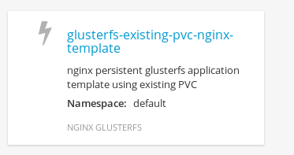
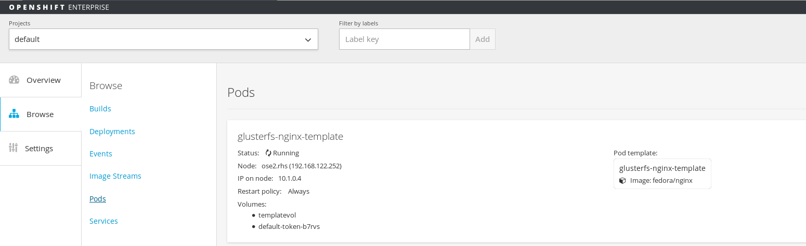

## Example 4: Deploy simple NGINX applications using OpenShift Template functionality with Persistent Storage
---

**Summary**: 

At this point, all [environment assumptions](..) are met, and we have seen how to deploy simple nginx applications that use multiple techniques to persist data storage.  In OpenShift, there is also a simple technique to be able to import Templates, which are preconfigurd quick application that can be deployed by users of a project.  These templates can be simple pod/service/rc/route type of applications or can be actual source code that can be built and put into a template - known as source to image (S2I).  For more information on this see [S2I Introduction training example](https://github.com/openshift/training/blob/master/08-S2I-Introduction.md). For this simple example, we will deploy another NGINX application, utilizing our existing storage (PV and PVC).  At this point we already have our endpoints and pv and pvc created and bound (if you do not, see the previous examples to complete those steps).  For this example we are using the Gluster volume "myVol2".  It has not been used by any of the previous examples.

        [root@ose1 usr_configs]# oc get endpoints
        NAME                ENDPOINTS
        glusterfs-cluster   192.168.122.243:1,192.168.122.245:1
        kubernetes          192.168.122.251:8443

        [root@ose1 nginx_gluster_pvc_template]# oc get pv
        NAME                      LABELS    CAPACITY     ACCESSMODES   STATUS    CLAIM                    REASON
        gluster-default-volume    <none>    2147483648   RWX           Bound     default/claim-default    
        gluster-default-volume2   <none>    2147483648   RWX           Bound     default/claim-default2   

        [root@ose1 nginx_gluster_pvc_template]# oc get pvc
        NAME             LABELS    STATUS    VOLUME
        claim-default    map[]     Bound     gluster-default-volume
        claim-default2   map[]     Bound     gluster-default-volume2

- Create the [template configuration file](gluster-nginx-template.json) with the reference to the PVC embedded in the configuration to utilize the “glusterfs” plugin and our gluster volume.

        {
            "kind": "Template",
            "apiVersion": "v1",
            "metadata": {
                "name": "glusterfs-existing-pvc-nginx-template",
                "creationTimestamp": null,
                "annotations": {
                     "description": "nginx persistent glusterfs application template using existing PVC",
                     "tags": "nginx glusterfs"
                }
            },
            "objects": [
                {
                    "apiVersion": "v1",
                    "id": "glusterfs-nginx-template",
                    "kind": "Pod",
                    "metadata": {
                        "name": "glusterfs-nginx-template"
                    },
                    "spec": {
                        "containers": [
                             {
                                 "name": "glusterfs-nginx-template",
                                 "image": "fedora/nginx",
                                 "volumeMounts": [
                                      {
                                          "mountPath": "/usr/share/nginx/html/test",
                                          "name": "templatevol"
                                      }
                                 ],
                                 "securityContext": {
                                     "capabilities": {},
                                     "privileged": true
                                 }
                             }
                        ],
                        "volumes": [
                             {
                                  "name": "templatevol",
                                  "persistentVolumeClaim": {
                                       "claimName": "claim-default2"
                                  }
                             }
                        ],
                        "restartPolicy": "Always"
                    }
                }
            ]
        }

        oc create -f gluster-nginx-template.json

        [root@ose1 nginx_gluster_pvc_template]# oc create -f gluster-nginx-template.json 
        templates/glusterfs-nginx-template

_Note: you can add more complex features into a template, such as parameters, labels, pv, pvc, services, routes, replication controllers, deployment configurations, image streams, etc..._

_Also, take note that for this simple example, we are simply creating a pod that will use the claim-default2 pvc which we defined on myVol2 in our Gluster cluster_

- Now the template was created, and to access and use the template we need to login to OpenShift Console via our browser and navigate to our project

- If we click the `Add to Project` button, a list of out of the box templates will be shown, click on the `Show All Templates` button and you should see the `glusterfs-existing-pvc-template`

- Click on the template within the OpenShift templates screen and then click the `Create` button.  At this point you should see a message on the screen that the template is being created (it may take a little while for it to completely finish).

- The main screen should now show the application running

- From the OpenShift Console, Note the “IP on node” and “Node” values, which will tell you what ip and node the nginx application is running on.   We will use this in a later step to curl the web server

- Create a sample html page to serve from the Gluster Storage Server.  SSH to one of the gluster hosts and create your page.  For this example I did the following:

        ssh root@gluster1.rhs   (gluster server)

   Navigate to the mounted directory, in this case for my example

        cd /mnt/glustervol2      (mapped to gluster volume --> myVol2)
        mkdir gluster-nginx-pvc-templateall [environment assumptions](../gluster-examples) are met, and
   
     
   create a helloworld.html file

                                
        This is a OpenShift deployed application using a template and an existing PV and PVC! 

- SSH into the node where the container is running (remember the details from the OpenShift Console Web GUI) and using the container_id obtained from “docker ps” command, jump into the container shell and then we will explore what we have.

      From the Atomic Host Where the Container is running:

        docker ps

        [root@ose2 ~]# docker ps
        CONTAINER ID        IMAGE                         COMMAND             CREATED             STATUS              PORTS               NAMES
        193a5876611e        fedora/nginx                  "/usr/sbin/nginx"   8 minutes ago       Up 8 minutes                            k8s_glusterfs-nginx-template.8dc26ade_glusterfs-nginx-template_default_2f8e55a7-4b38-11e5-b57b

        docker exec -it 193a5876611e bash

        [root@ose2 data2]# docker exec -it eefb2a76f6c5 bash 
        bash-4.3# ls 
        bin  boot  dev	etc  home  lib	lib64  lost+found  media  mnt  opt  proc  root	run  sbin  srv	sys  tmp  usr  var 
        bash-4.3# cd /usr/share/nginx/html/test 
        bash-4.3# ls 
        glusterfs-nginx  glusterfs-nginx-atomichost-mount  glusterfs-nginx-pvc	helloworld.html  test1	test2  test3 

     From the Container:

        mount   (will show the mounted gluster volume)

        192.168.122.221:myVol2 on /usr/share/nginx/html/test type fuse.glusterfs (rw,relatime,user_id=0,group_id=0,default_permissions,allow_other,max_read=131072)
 

              
*Notice when we go to our mounted nginx root test directory, we can now see all the contents of our GlusterFS Storage mount, including the directory we created “glusterfs-nginx”*

*Notice we also see our helloworld.html file that we created within that directory*

- Enter simple curl command from the docker container to serve the page

        curl http://10.1.0.12/test/gluster-nginx-pvc-template/helloworld.html

        bash-4.3# curl http://10.1.0.12/test/gluster-nginx-pvc-template/helloworld.html  
        This is a OpenShift deployed application using a template and an existing PV and PVC!

## Review: 

At this point, we have successfully completed 4 examples, with multiple ways to utilize distributed storage from OpenShift and Docker/Kubernetes. From your Atomic Host where these pods/containers are running you can issue the `mount` command and you should see all your pods/containers and their current mounts.  Below we have 3 active mounts that show up on the host, one from each pod that we were running.  The last one is from this example, using gluster volume called `myVol2` and PersistentVolume `gluster-default-volume2`.  Cool!!!!

        gluster1.rhs:/myVol1 on /mnt/gvol1 type fuse.glusterfs (rw,relatime,user_id=0,group_id=0,default_permissions,allow_other,max_read=131072) 
        gluster1.rhs:/myVol2 on /mnt/gvol2 type fuse.glusterfs (rw,relatime,user_id=0,group_id=0,default_permissions,allow_other,max_read=131072) 
        tmpfs on /var/lib/openshift/openshift.local.volumes/pods/d7747b33-45ce-11e5-ae70-52540008f001/volumes/kubernetes.io~secret/default-token-b7rvs type tmpfs (rw,relatime) 
        tmpfs on /var/lib/openshift/openshift.local.volumes/pods/ca995463-45e8-11e5-ae70-52540008f001/volumes/kubernetes.io~secret/default-token-b7rvs type tmpfs (rw,relatime) 
        192.168.122.221:myVol1 on /var/lib/openshift/openshift.local.volumes/pods/78de046d-4b37-11e5-b57b-52540008f001/volumes/kubernetes.io~glusterfs/nginxglustervol type fuse.glusterfs        (rw,relatime,user_id=0,group_id=0,default_permissions,allow_other,max_read=131072)
        tmpfs on /var/lib/openshift/openshift.local.volumes/pods/78de046d-4b37-11e5-b57b-52540008f001/volumes/kubernetes.io~secret/default-token-b7rvs type tmpfs (rw,relatime)
        192.168.122.221:myVol1 on /var/lib/openshift/openshift.local.volumes/pods/abde06b5-4b37-11e5-b57b-52540008f001/volumes/kubernetes.io~glusterfs/gluster-default-volume type fuse.glusterfs  (rw,relatime,user_id=0,group_id=0,default_permissions,allow_other,max_read=131072)
        tmpfs on /var/lib/openshift/openshift.local.volumes/pods/abde06b5-4b37-11e5-b57b-52540008f001/volumes/kubernetes.io~secret/default-token-b7rvs type tmpfs (rw,relatime)
        192.168.122.221:myVol2 on /var/lib/openshift/openshift.local.volumes/pods/2f8e55a7-4b38-11e5-b57b-52540008f001/volumes/kubernetes.io~glusterfs/gluster-default-volume2 type fuse.glusterfs (rw,relatime,user_id=0,group_id=0,default_permissions,allow_other,max_read=131072)

===

[Previous](../nginx_gluster_pvc)  |  [Main List](../) 

===

