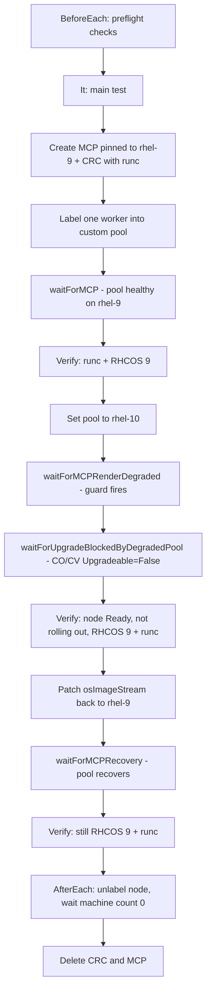

# Test Plan: runc RHCOS 10 Upgrade Guard

## Summary (for managers)

This document describes the **end-to-end test** for [OCPNODE-4013](https://redhat.atlassian.net/browse/OCPNODE-4013):
when a node pool uses **runc** as the container runtime and is moved to **RHCOS 10**, the Machine Config
Operator (MCO) must **block** the upgrade. RHEL 10 no longer ships `runc`, so allowing that move would
break workloads on those nodes.

**What the test proves**

- A pool with **runc + `rhel-10` osImageStream** is blocked at render time (`MachineConfigPool` `Degraded` / `RenderDegraded`).
- The node **stays on RHCOS 9** with **runc** — no silent breakage.
- Cluster upgrade is blocked via **`Upgradeable=False`** on the machine-config operator and ClusterVersion
  (not via immediate cluster-wide `Degraded`).
- Reverting the pool to **`rhel-9`** clears the guard and the pool recovers.

**Why it matters**

OCP 5.0 supports **dual OS streams** (RHCOS 9 and 10). Customers still on runc must switch to **crun**
before moving to RHCOS 10. This test is the automated safety net for that guard (MCO [PR 5891](https://github.com/openshift/machine-config-operator/pull/5891)),
tracked under story [OCPNODE-4494](https://redhat.atlassian.net/browse/OCPNODE-4494).

**Test artifact:** `test/extended/node/runc_upgrade_cases.go` — disruptive, serial e2e; runs on Tech Preview
clusters with dual streams enabled.

---

## Metadata

| Field               | Value |
|---------------------|-------|
| **Test file**       | `test/extended/node/runc_upgrade_cases.go` |
| **Package**         | `node` |
| **Test suite**      | `[Suite:openshift/disruptive-longrunning][sig-node][Serial][Disruptive] runc RHCOS 10 upgrade guard` |
| **Feature**        | [OCPSTRAT-3154](https://redhat.atlassian.net/browse/OCPSTRAT-3154) — runc deprecation warning in OCP 5.0 for clusters upgrading from 4.22 |
| **Epic**            | [OCPNODE-4013](https://redhat.atlassian.net/browse/OCPNODE-4013) — Block upgrade from RHCOS 9 to RHCOS 10 when runc is in use |
| **User Story**      | [OCPNODE-4494](https://redhat.atlassian.net/browse/OCPNODE-4494) — Test suites: RHCOS 9 → RHCOS 10 upgrade (runc & crun) |
| **MCO change**      | [openshift/machine-config-operator#5891](https://github.com/openshift/machine-config-operator/pull/5891) — `validateNoRuncOnRHEL10()` in render controller |
| **Assignee**        | Aditi Sahay (asahay@redhat.com) |
| **Component**       | `sig-node`, MCO, CRI-O |
| **Test type**       | E2E / functional |
| **Ginkgo label**    | `[Suite:openshift/disruptive-longrunning][sig-node][Serial][Disruptive]` |
| **Disruptive**      | Yes |
| **Requires reboot** | Yes (node may drain/reboot during MCP rollout) |
| **Use case**        | UC-1 — runc on a pool that targets RHCOS 10 must be blocked |

---

## UC-1: Block RHCOS 9 → 10 osImageStream Move When Default Runtime Is runc

### Description

On a cluster with **dual OS streams** (`rhel-9` and `rhel-10`), when a **MachineConfigPool** has
**runc** configured as the default container runtime via a **ContainerRuntimeConfig** (`defaultRuntime: runc`),
the MCO must **block** moving that pool to **RHCOS 10** by setting **`MachineConfigPool` `Degraded=True`**
and **`RenderDegraded=True`**.

The guard is enforced in the **render controller** (`validateNoRuncOnRHEL10`). MCO then propagates
the degraded pool to **ClusterOperator `Upgradeable=False`** (`DegradedPool`) and **ClusterVersion
`Upgradeable=False`**. The node must **remain on RHCOS 9** with **runc** after the blocked `rhel-10`
stream change.

### Scope

| Item                       | Value |
|----------------------------|-------|
| **OpenShift versions**     | 5.0+ (dual-stream releases: 5.0, 5.1, 5.2) |
| **OS (baseline)**          | RHCOS 9 (`VERSION_ID=9.x`) on the test node |
| **OS (attempted)**         | RHCOS 10 via `MachineConfigPool.spec.osImageStream.name: rhel-10` |
| **Default runtime**        | `runc` via **ContainerRuntimeConfig** `99-runc-rhcos10-guard-runc` (drop-in at `/etc/crio/crio.conf.d/01-ctrcfg-defaultRuntime`) |
| **Custom pool**            | `runc-rhcos10-guard` (isolated MCP; one labeled pure worker) |
| **Baseline OS stream**     | `rhel-9` set on MCP at creation (avoids inheriting cluster default `rhel-10`) |
| **Feature gate / API**     | **OSStreams** — `OSImageStream` API must be available (Tech Preview via `FeatureGate`) |
| **Skip conditions**        | MicroShift, Hypershift (external control plane), single-replica topology (no pure worker), missing `OSImageStream` API / dual streams |

### Test Function

```go
g.It("blocks upgrade of RHCOS 9 to 10 when ContainerRuntimeConfig sets default runtime to runc")
```

### Guard signal (pass condition)

| Check | Expected |
|-------|----------|
| MCP `Degraded` | `True` after `osImageStream: rhel-10` patch |
| MCP `RenderDegraded` | `True` |
| Render message | Contains **`runc`** and **`rhel-10`** |
| Node OS after guard | Still **RHCOS 9** (`VERSION_ID=9.x`) |
| Node runtime after guard | Still **runc** |
| Node readiness after guard | **Ready=True**; `currentConfig == desiredConfig` (no MCO rollout in progress) |
| `ClusterOperator/machine-config` after guard | **Upgradeable=False**, reason **DegradedPool**; **Degraded=False**, **Available=True** |
| `ClusterVersion` after guard | **Upgradeable=False** (aggregates CO); **Available=True**, **Progressing=False**, **Degraded=False** |
| Recovery (`osImageStream: rhel-9`) | MCP returns healthy (`waitForMCPRecovery`); node still **Ready**, not rolling out, **RHCOS 9 + runc** |

> **Note:** `Degraded=True` on CO/CVO can take ~30 minutes if the pool stays degraded (known MCO
> behavior). This test asserts **Upgradeable=False** within 5 minutes, matching MCO extended-test
> patterns, and recovers before the delayed Degraded signal would fire.

### Test structure



---

## Test overview

This test validates that the MCO **blocks** an unsafe OS stream move when **runc** is the
default runtime. It uses an isolated custom pool (`runc-rhcos10-guard`) with a single labeled
worker so the rest of the cluster is not disturbed.

The automation in `runc_upgrade_cases.go` performs all setup, assertion, and cleanup. Manual
execution is not required when running via `openshift-tests`.

### Cluster prerequisites

- OpenShift **5.0+** with **Tech Preview** enabled (see [Cluster setup](#cluster-setup-tech-preview--dual-streams) below)
- **`OSImageStream`** API available (`OSStreams` feature gate)
- Both **`rhel-9`** and **`rhel-10`** streams present in `osimagestream/cluster`
- At least one **pure worker** node
- MCO build that includes [PR 5891](https://github.com/openshift/machine-config-operator/pull/5891) guard logic (payload or `mco-push`)

### Cluster setup: Tech Preview + dual streams

On **OCP 5.0**, `featureSet` lives on the **`FeatureGate`** CR — **not** on `ClusterVersion`.
Patching `clusterversion/version` with `spec.featureSet` is ignored (`unknown field`).

```bash
export KUBECONFIG=/path/to/kubeconfig

# Enable Tech Preview (OCP 5.0+)
oc patch featuregate cluster --type=merge \
  -p '{"spec":{"featureSet":"TechPreviewNoUpgrade"}}'

# Verify feature set applied
oc get featuregate cluster -o jsonpath='{.spec.featureSet}{"\n"}'
# expect: TechPreviewNoUpgrade

# Wait a few minutes, then confirm API + dual streams
oc api-resources --api-group=machineconfiguration.openshift.io | grep osimagestream
oc get osimagestream cluster -o jsonpath='{.status.availableStreams[*].name}{"\n"}'
# expect: rhel-9 rhel-10
```

| OCP version | Where to set Tech Preview |
|-------------|---------------------------|
| 4.x | `oc patch clusterversion version --type=merge -p '{"spec":{"featureSet":"TechPreviewNoUpgrade"}}'` |
| **5.0+** | `oc patch featuregate cluster --type=merge -p '{"spec":{"featureSet":"TechPreviewNoUpgrade"}}'` |

If `oc get osimagestream` returns **"doesn't have a resource type osimagestream"**, Tech Preview /
`OSStreams` is not active yet — the test will skip in `BeforeEach`.

### What the test does (high level)

1. **Preflight** — skip on MicroShift, Hypershift, SNO, or missing dual streams / `OSImageStream` API.
2. **Isolate** — create custom MCP with **`spec.osImageStream: rhel-9`** and a **ContainerRuntimeConfig** setting `defaultRuntime: runc`; label one pure worker into the pool.
3. **Baseline** — wait for a healthy pool rollout (`waitForMCP`); verify **runc** and **RHCOS 9** on the node.
4. **Trigger** — patch the pool to **`rhel-10`** via `setPoolOSImageStream`.
5. **Assert guard** — expect MCP **`Degraded=True`** and **`RenderDegraded=True`** with a message referencing **runc** and **rhel-10**; confirm the node **stays** on RHCOS 9 with runc.
6. **Cleanup** — remove node label, wait until the custom pool has **zero machines**, then delete ContainerRuntimeConfig and MachineConfigPool.

> **Design note:** The MCP is pinned to **`rhel-9` at creation** so the pool does not inherit the
> cluster default stream (often `rhel-10` on dual-stream clusters). **ContainerRuntimeConfig** is the
> supported OpenShift path for setting default runtime (not a raw CRI-O drop-in MachineConfig).

### Key helpers

| Function | Role |
|----------|------|
| `requireOSImageStreams` | Skip if `OSImageStream` API or dual streams are missing |
| `createRuncGuardMCP` | Create isolated pool with **`osImageStream: rhel-9`** in spec |
| `createRuncGuardCRC` | Create **ContainerRuntimeConfig** with `defaultRuntime: runc` for the custom pool |
| `labelRandomPureWorker` | Move one pure worker into the custom pool |
| `setPoolOSImageStream` | Patch `spec.osImageStream` (used to trigger **`rhel-10`** move) |
| `waitForMCP` | Wait for healthy pool rollout during baseline |
| `waitForMCPRenderDegraded` | Wait for guard to fire after `rhel-10` patch |
| `waitForMCPRecovery` | Wait for pool to clear degraded state after reverting to `rhel-9` |
| `waitForUpgradeBlockedByDegradedPool` | Poll for CO/CV `Upgradeable=False` (DegradedPool); CO/CV stay `Degraded=False` |
| `verifyNodeReadyAndNotRollingOut` | Assert node Ready and `currentConfig == desiredConfig` |
| `waitForMCPMachineCount` | Wait for node to leave pool before MCP deletion (cleanup) |
| `nodeRHELMajorVersion` / `nodeUsesRuncRuntime` | Verify OS and runtime on the node |

---

## Pass/Fail Criteria

| Check | Pass condition |
|-------|----------------|
| OSImageStream API | `osimagestream/cluster` exists |
| Dual streams | `rhel-9` and `rhel-10` in `status.availableStreams` |
| MCP baseline stream | `spec.osImageStream.name: rhel-9` at pool creation |
| Baseline node OS | `VERSION_ID=9.x` before `rhel-10` attempt |
| Baseline runtime | `default_runtime = "runc"` on test node |
| Pool healthy (baseline) | MCP `Updated=True`, `Updating=False`, `Degraded=False` |
| Guard after `rhel-10` patch | MCP `Degraded=True` **and** `RenderDegraded=True` |
| Render message | Contains `runc` and `rhel-10` |
| Node after guard | **Ready**; `currentConfig == desiredConfig`; still `VERSION_ID=9.x` and `default_runtime = "runc"` |
| CO/CV after guard | CO/CV **Upgradeable=False**; CO/CV **Degraded=False** |
| Cleanup | Node unlabeled, pool machine count **0**, then CRC and MCP deleted |

---

## Running the Automated Test

Build the test binary from the `origin` repo:

```bash
cd origin
make WHAT=cmd/openshift-tests
```

Run against a prepared cluster:

```bash
export KUBECONFIG=/path/to/kubeconfig

./openshift-tests run-test \
  "[Suite:openshift/disruptive-longrunning][sig-node][Serial][Disruptive] runc RHCOS 10 upgrade guard blocks upgrade of RHCOS 9 to 10 when ContainerRuntimeConfig sets default runtime to runc"
```

Typical runtime: **~7–10 minutes** when prerequisites are met.

### Suggested CI lanes

| Job | Notes |
|-----|-------|
| `periodic-ci-openshift-release-main-nightly-5.0-e2e-aws-ovn-runc-techpreview` | Dual stream + Tech Preview |
| `periodic-ci-openshift-release-main-nightly-5.0-e2e-gcp-ovn-runc` | runc runtime context |

---

## Related tests

| Test / doc | Relationship |
|------------|--------------|
| [runcdeprecationcases.md](./runcdeprecationcases.md) / [OCPNODE-4567](https://redhat.atlassian.net/browse/OCPNODE-4567) | Fresh **5.0** install on RHCOS 9 uses **crun** (UseCase3) |
| [OCPNODE-4013 design doc](https://redhat.atlassian.net/browse/OCPNODE-4013) | Epic — UC-1 (this test), UC-6 crun happy path (planned) |
| MCO `mco_osimagestream` tests | Private/extended MCO coverage for stream transitions |
