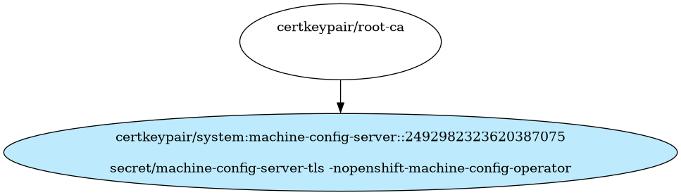

# MachineConfig Operator Certificates

MachineConfig Operator Certificates

- [Signing Certificate/Key Pairs](#signing-certificatekey-pairs)
- [Serving Certificate/Key Pairs](#serving-certificatekey-pairs)
    - [system:machine-config-server](#systemmachine-config-server)
- [Client Certificate/Key Pairs](#client-certificatekey-pairs)
- [Certificates Without Keys](#certificates-without-keys)
    - [root-ca](#root-ca)
- [Certificate Authority Bundles](#certificate-authority-bundles)

## Signing Certificate/Key Pairs

## Serving Certificate/Key Pairs

### system:machine-config-server

| Property | Value |
| ----------- | ----------- |
| Type | Serving |
| CommonName | system:machine-config-server |
| SerialNumber | 2492982323620387075 |
| Issuer CommonName | root-ca |
| Validity | 10y |
| Signature Algorithm | SHA256-RSA |
| PublicKey Algorithm | RSA 2048 bit |
| Usages |  |
| ExtendedUsages | - ExtKeyUsageServerAuth |
| DNS Names | - api-int.ci-op-mlisxgvx-5feef.aws-2.ci.openshift.org |
| IP Addresses |  |

#### system:machine-config-server Locations
| Namespace | Secret Name |
| ----------- | ----------- |
| openshift-machine-config-operator | machine-config-server-tls |

| File | Permissions | User | Group | SE Linux |
| ----------- | ----------- | ----------- | ----------- | ----------- |

## Client Certificate/Key Pairs

## Certificates Without Keys

These certificates are present in certificate authority bundles, but do not have keys in the cluster.
This happens when the installer bootstrap clusters with a set of certificate/key pairs that are deleted during the
installation process.

### root-ca

| Property | Value |
| ----------- | ----------- |
| Type |  |
| CommonName | root-ca |
| SerialNumber |  |
| Issuer CommonName | None |
| Validity |  |
| Signature Algorithm |  |
| PublicKey Algorithm |   |
| Usages |  |
| ExtendedUsages |  |

#### root-ca Locations
| Namespace | Secret Name |
| ----------- | ----------- |

| File | Permissions | User | Group | SE Linux |
| ----------- | ----------- | ----------- | ----------- | ----------- |

## Certificate Authority Bundles

