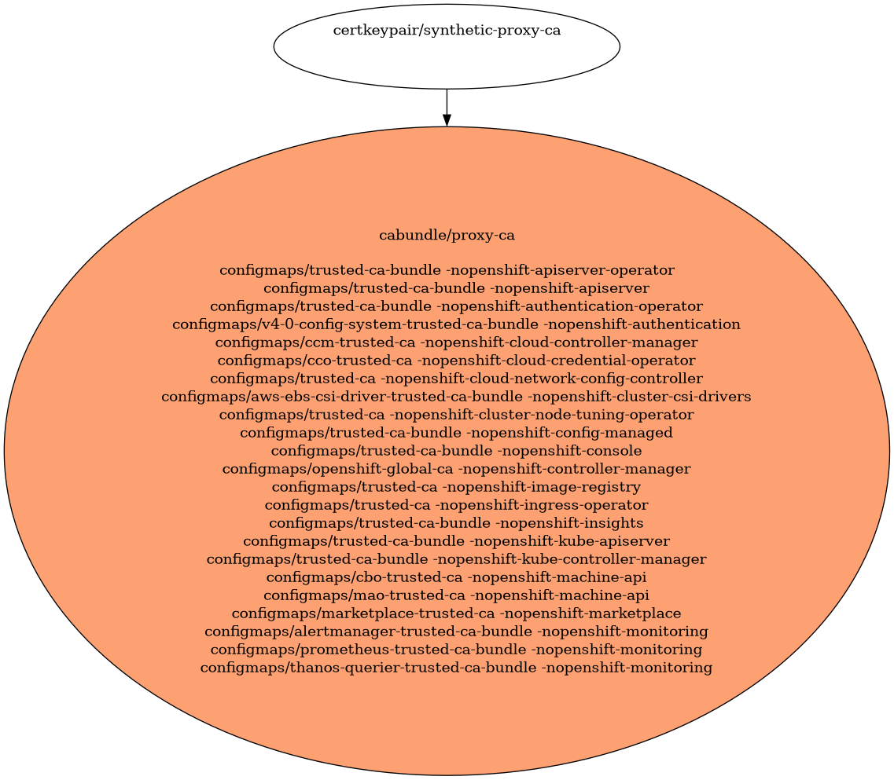

# Proxy Certificates

Proxy Certificates

- [Signing Certificate/Key Pairs](#signing-certificatekey-pairs)
- [Serving Certificate/Key Pairs](#serving-certificatekey-pairs)
- [Client Certificate/Key Pairs](#client-certificatekey-pairs)
- [Certificates Without Keys](#certificates-without-keys)
    - [synthetic-proxy-ca](#synthetic-proxy-ca)
- [Certificate Authority Bundles](#certificate-authority-bundles)
    - [proxy-ca](#proxy-ca)

## Signing Certificate/Key Pairs

## Serving Certificate/Key Pairs

## Client Certificate/Key Pairs

## Certificates Without Keys

These certificates are present in certificate authority bundles, but do not have keys in the cluster.
This happens when the installer bootstrap clusters with a set of certificate/key pairs that are deleted during the
installation process.

### synthetic-proxy-ca

| Property | Value |
| ----------- | ----------- |
| Type |  |
| CommonName | synthetic-proxy-ca |
| SerialNumber |  |
| Issuer CommonName | None |
| Validity |  |
| Signature Algorithm |  |
| PublicKey Algorithm |   |
| Usages |  |
| ExtendedUsages |  |

#### synthetic-proxy-ca Locations
| Namespace | Secret Name |
| ----------- | ----------- |

| File | Permissions | User | Group | SE Linux |
| ----------- | ----------- | ----------- | ----------- | ----------- |

## Certificate Authority Bundles

### proxy-ca

**Bundled Certificates**

| CommonName | Issuer CommonName | Validity | PublicKey Algorithm |
| ----------- | ----------- | ----------- | ----------- |
| [synthetic-proxy-ca](#synthetic-proxy-ca) | None |  |   |

#### proxy-ca Locations
| Namespace | ConfigMap Name |
| ----------- | ----------- |
| openshift-apiserver-operator | trusted-ca-bundle |
| openshift-apiserver | trusted-ca-bundle |
| openshift-authentication-operator | trusted-ca-bundle |
| openshift-authentication | v4-0-config-system-trusted-ca-bundle |
| openshift-cloud-controller-manager | ccm-trusted-ca |
| openshift-cloud-credential-operator | cco-trusted-ca |
| openshift-cloud-network-config-controller | trusted-ca |
| openshift-cluster-csi-drivers | aws-ebs-csi-driver-trusted-ca-bundle |
| openshift-cluster-node-tuning-operator | trusted-ca |
| openshift-config-managed | trusted-ca-bundle |
| openshift-console | trusted-ca-bundle |
| openshift-controller-manager | openshift-global-ca |
| openshift-image-registry | trusted-ca |
| openshift-ingress-operator | trusted-ca |
| openshift-insights | trusted-ca-bundle |
| openshift-kube-apiserver | trusted-ca-bundle |
| openshift-kube-controller-manager | trusted-ca-bundle |
| openshift-machine-api | cbo-trusted-ca |
| openshift-machine-api | mao-trusted-ca |
| openshift-marketplace | marketplace-trusted-ca |
| openshift-monitoring | alertmanager-trusted-ca-bundle |
| openshift-monitoring | prometheus-trusted-ca-bundle |
| openshift-monitoring | thanos-querier-trusted-ca-bundle |

| File | Permissions | User | Group | SE Linux |
| ----------- | ----------- | ----------- | ----------- | ----------- |

