# Service Serving Certificates

Service Serving Certificates

- [Signing Certificate/Key Pairs](#signing-certificatekey-pairs)
    - [openshift-service-serving-signer@1704273805](#openshift-service-serving-signer1704273805)
- [Serving Certificate/Key Pairs](#serving-certificatekey-pairs)
    - [*.cloud-controller-manager-operator.openshift-cloud-controller-manager-operator.svc](#*.cloud-controller-manager-operator.openshift-cloud-controller-manager-operator.svc)
    - [*.cluster-monitoring-operator.openshift-monitoring.svc](#*.cluster-monitoring-operator.openshift-monitoring.svc)
    - [*.image-registry-operator.openshift-image-registry.svc](#*.image-registry-operator.openshift-image-registry.svc)
    - [*.kube-state-metrics.openshift-monitoring.svc](#*.kube-state-metrics.openshift-monitoring.svc)
    - [*.machine-approver.openshift-cluster-machine-approver.svc](#*.machine-approver.openshift-cluster-machine-approver.svc)
    - [*.metrics.openshift-cluster-samples-operator.svc](#*.metrics.openshift-cluster-samples-operator.svc)
    - [*.metrics.openshift-network-operator.svc](#*.metrics.openshift-network-operator.svc)
    - [*.network-metrics-service.openshift-multus.svc](#*.network-metrics-service.openshift-multus.svc)
    - [*.node-exporter.openshift-monitoring.svc](#*.node-exporter.openshift-monitoring.svc)
    - [*.node-tuning-operator.openshift-cluster-node-tuning-operator.svc](#*.node-tuning-operator.openshift-cluster-node-tuning-operator.svc)
    - [*.openshift-state-metrics.openshift-monitoring.svc](#*.openshift-state-metrics.openshift-monitoring.svc)
    - [*.ovn-kubernetes-control-plane.openshift-ovn-kubernetes.svc](#*.ovn-kubernetes-control-plane.openshift-ovn-kubernetes.svc)
    - [*.ovn-kubernetes-node.openshift-ovn-kubernetes.svc](#*.ovn-kubernetes-node.openshift-ovn-kubernetes.svc)
    - [*.prometheus-k8s-thanos-sidecar.openshift-monitoring.svc](#*.prometheus-k8s-thanos-sidecar.openshift-monitoring.svc)
    - [*.prometheus-operator.openshift-monitoring.svc](#*.prometheus-operator.openshift-monitoring.svc)
    - [alertmanager-main.openshift-monitoring.svc](#alertmanager-main.openshift-monitoring.svc)
    - [api.openshift-apiserver.svc](#api.openshift-apiserver.svc)
    - [api.openshift-oauth-apiserver.svc](#api.openshift-oauth-apiserver.svc)
    - [aws-ebs-csi-driver-controller-metrics.openshift-cluster-csi-drivers.svc](#aws-ebs-csi-driver-controller-metrics.openshift-cluster-csi-drivers.svc)
    - [catalog-operator-metrics.openshift-operator-lifecycle-manager.svc](#catalog-operator-metrics.openshift-operator-lifecycle-manager.svc)
    - [cco-metrics.openshift-cloud-credential-operator.svc](#cco-metrics.openshift-cloud-credential-operator.svc)
    - [cluster-autoscaler-operator.openshift-machine-api.svc](#cluster-autoscaler-operator.openshift-machine-api.svc)
    - [cluster-baremetal-operator-service.openshift-machine-api.svc](#cluster-baremetal-operator-service.openshift-machine-api.svc)
    - [cluster-baremetal-webhook-service.openshift-machine-api.svc](#cluster-baremetal-webhook-service.openshift-machine-api.svc)
    - [cluster-storage-operator-metrics.openshift-cluster-storage-operator.svc](#cluster-storage-operator-metrics.openshift-cluster-storage-operator.svc)
    - [cluster-version-operator.openshift-cluster-version.svc](#cluster-version-operator.openshift-cluster-version.svc)
    - [console.openshift-console.svc](#console.openshift-console.svc)
    - [control-plane-machine-set-operator.openshift-machine-api.svc](#control-plane-machine-set-operator.openshift-machine-api.svc)
    - [controller-manager.openshift-controller-manager.svc](#controller-manager.openshift-controller-manager.svc)
    - [csi-snapshot-controller-operator-metrics.openshift-cluster-storage-operator.svc](#csi-snapshot-controller-operator-metrics.openshift-cluster-storage-operator.svc)
    - [csi-snapshot-webhook.openshift-cluster-storage-operator.svc](#csi-snapshot-webhook.openshift-cluster-storage-operator.svc)
    - [dns-default.openshift-dns.svc](#dns-default.openshift-dns.svc)
    - [etcd.openshift-etcd.svc](#etcd.openshift-etcd.svc)
    - [image-registry.openshift-image-registry.svc](#image-registry.openshift-image-registry.svc)
    - [kube-controller-manager.openshift-kube-controller-manager.svc](#kube-controller-manager.openshift-kube-controller-manager.svc)
    - [machine-api-controllers.openshift-machine-api.svc](#machine-api-controllers.openshift-machine-api.svc)
    - [machine-api-operator-machine-webhook.openshift-machine-api.svc](#machine-api-operator-machine-webhook.openshift-machine-api.svc)
    - [machine-api-operator-webhook.openshift-machine-api.svc](#machine-api-operator-webhook.openshift-machine-api.svc)
    - [machine-api-operator.openshift-machine-api.svc](#machine-api-operator.openshift-machine-api.svc)
    - [machine-config-controller.openshift-machine-config-operator.svc](#machine-config-controller.openshift-machine-config-operator.svc)
    - [machine-config-daemon.openshift-machine-config-operator.svc](#machine-config-daemon.openshift-machine-config-operator.svc)
    - [machine-config-operator.openshift-machine-config-operator.svc](#machine-config-operator.openshift-machine-config-operator.svc)
    - [marketplace-operator-metrics.openshift-marketplace.svc](#marketplace-operator-metrics.openshift-marketplace.svc)
    - [metrics.openshift-apiserver-operator.svc](#metrics.openshift-apiserver-operator.svc)
    - [metrics.openshift-authentication-operator.svc](#metrics.openshift-authentication-operator.svc)
    - [metrics.openshift-config-operator.svc](#metrics.openshift-config-operator.svc)
    - [metrics.openshift-console-operator.svc](#metrics.openshift-console-operator.svc)
    - [metrics.openshift-controller-manager-operator.svc](#metrics.openshift-controller-manager-operator.svc)
    - [metrics.openshift-dns-operator.svc](#metrics.openshift-dns-operator.svc)
    - [metrics.openshift-etcd-operator.svc](#metrics.openshift-etcd-operator.svc)
    - [metrics.openshift-ingress-operator.svc](#metrics.openshift-ingress-operator.svc)
    - [metrics.openshift-insights.svc](#metrics.openshift-insights.svc)
    - [metrics.openshift-kube-apiserver-operator.svc](#metrics.openshift-kube-apiserver-operator.svc)
    - [metrics.openshift-kube-controller-manager-operator.svc](#metrics.openshift-kube-controller-manager-operator.svc)
    - [metrics.openshift-kube-scheduler-operator.svc](#metrics.openshift-kube-scheduler-operator.svc)
    - [metrics.openshift-kube-storage-version-migrator-operator.svc](#metrics.openshift-kube-storage-version-migrator-operator.svc)
    - [metrics.openshift-service-ca-operator.svc](#metrics.openshift-service-ca-operator.svc)
    - [monitoring-plugin.openshift-monitoring.svc](#monitoring-plugin.openshift-monitoring.svc)
    - [multus-admission-controller.openshift-multus.svc](#multus-admission-controller.openshift-multus.svc)
    - [oauth-openshift.openshift-authentication.svc](#oauth-openshift.openshift-authentication.svc)
    - [olm-operator-metrics.openshift-operator-lifecycle-manager.svc](#olm-operator-metrics.openshift-operator-lifecycle-manager.svc)
    - [package-server-manager-metrics.openshift-operator-lifecycle-manager.svc](#package-server-manager-metrics.openshift-operator-lifecycle-manager.svc)
    - [performance-addon-operator-service.openshift-cluster-node-tuning-operator.svc](#performance-addon-operator-service.openshift-cluster-node-tuning-operator.svc)
    - [pod-identity-webhook.openshift-cloud-credential-operator.svc](#pod-identity-webhook.openshift-cloud-credential-operator.svc)
    - [prometheus-adapter.openshift-monitoring.svc](#prometheus-adapter.openshift-monitoring.svc)
    - [prometheus-k8s.openshift-monitoring.svc](#prometheus-k8s.openshift-monitoring.svc)
    - [prometheus-operator-admission-webhook.openshift-monitoring.svc](#prometheus-operator-admission-webhook.openshift-monitoring.svc)
    - [promtail.openshift-e2e-loki.svc](#promtail.openshift-e2e-loki.svc)
    - [route-controller-manager.openshift-route-controller-manager.svc](#route-controller-manager.openshift-route-controller-manager.svc)
    - [router-internal-default.openshift-ingress.svc](#router-internal-default.openshift-ingress.svc)
    - [scheduler.openshift-kube-scheduler.svc](#scheduler.openshift-kube-scheduler.svc)
    - [thanos-querier.openshift-monitoring.svc](#thanos-querier.openshift-monitoring.svc)
    - [webhook.openshift-console-operator.svc](#webhook.openshift-console-operator.svc)
- [Client Certificate/Key Pairs](#client-certificatekey-pairs)
- [Certificates Without Keys](#certificates-without-keys)
- [Certificate Authority Bundles](#certificate-authority-bundles)
    - [openshift-service-serving-signer@1704273805](#openshift-service-serving-signer1704273805)

## Signing Certificate/Key Pairs

### openshift-service-serving-signer@1704273805

| Property | Value |
| ----------- | ----------- |
| Type | Signer |
| CommonName | openshift-service-serving-signer@1704273805 |
| SerialNumber | 9050947389700482827 |
| Issuer CommonName | [openshift-service-serving-signer@1704273805](#openshift-service-serving-signer1704273805) |
| Validity | 2y60d |
| Signature Algorithm | SHA256-RSA |
| PublicKey Algorithm | RSA 2048 bit |
| Usages | - KeyUsageDigitalSignature - KeyUsageKeyEncipherment - KeyUsageCertSign |
| ExtendedUsages |  |

#### openshift-service-serving-signer@1704273805 Locations
| Namespace | Secret Name |
| ----------- | ----------- |
| openshift-service-ca | signing-key |

| File | Permissions | User | Group | SE Linux |
| ----------- | ----------- | ----------- | ----------- | ----------- |

## Serving Certificate/Key Pairs

### *.cloud-controller-manager-operator.openshift-cloud-controller-manager-operator.svc
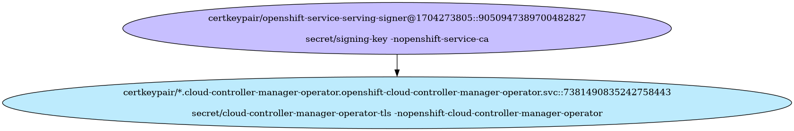

| Property | Value |
| ----------- | ----------- |
| Type | Serving |
| CommonName | *.cloud-controller-manager-operator.openshift-cloud-controller-manager-operator.svc |
| SerialNumber | 7381490835242758443 |
| Issuer CommonName | [openshift-service-serving-signer@1704273805](#openshift-service-serving-signer1704273805) |
| Validity | 2y |
| Signature Algorithm | SHA256-RSA |
| PublicKey Algorithm | RSA 2048 bit |
| Usages | - KeyUsageDigitalSignature - KeyUsageKeyEncipherment |
| ExtendedUsages | - ExtKeyUsageServerAuth |
| DNS Names | - *.cloud-controller-manager-operator.openshift-cloud-controller-manager-operator.svc - *.cloud-controller-manager-operator.openshift-cloud-controller-manager-operator.svc.cluster.local - cloud-controller-manager-operator.openshift-cloud-controller-manager-operator.svc - cloud-controller-manager-operator.openshift-cloud-controller-manager-operator.svc.cluster.local |
| IP Addresses |  |

#### *.cloud-controller-manager-operator.openshift-cloud-controller-manager-operator.svc Locations
| Namespace | Secret Name |
| ----------- | ----------- |
| openshift-cloud-controller-manager-operator | cloud-controller-manager-operator-tls |

| File | Permissions | User | Group | SE Linux |
| ----------- | ----------- | ----------- | ----------- | ----------- |

### *.cluster-monitoring-operator.openshift-monitoring.svc
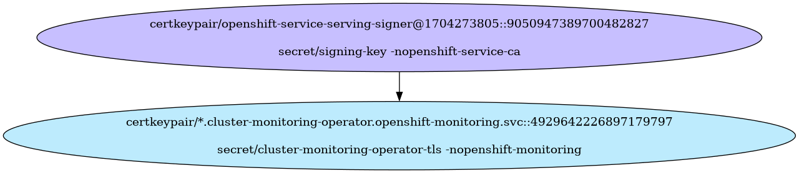

| Property | Value |
| ----------- | ----------- |
| Type | Serving |
| CommonName | *.cluster-monitoring-operator.openshift-monitoring.svc |
| SerialNumber | 4929642226897179797 |
| Issuer CommonName | [openshift-service-serving-signer@1704273805](#openshift-service-serving-signer1704273805) |
| Validity | 2y |
| Signature Algorithm | SHA256-RSA |
| PublicKey Algorithm | RSA 2048 bit |
| Usages | - KeyUsageDigitalSignature - KeyUsageKeyEncipherment |
| ExtendedUsages | - ExtKeyUsageServerAuth |
| DNS Names | - *.cluster-monitoring-operator.openshift-monitoring.svc - *.cluster-monitoring-operator.openshift-monitoring.svc.cluster.local - cluster-monitoring-operator.openshift-monitoring.svc - cluster-monitoring-operator.openshift-monitoring.svc.cluster.local |
| IP Addresses |  |

#### *.cluster-monitoring-operator.openshift-monitoring.svc Locations
| Namespace | Secret Name |
| ----------- | ----------- |
| openshift-monitoring | cluster-monitoring-operator-tls |

| File | Permissions | User | Group | SE Linux |
| ----------- | ----------- | ----------- | ----------- | ----------- |

### *.image-registry-operator.openshift-image-registry.svc
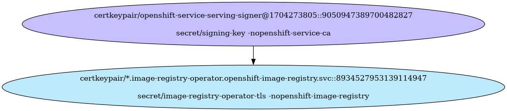

| Property | Value |
| ----------- | ----------- |
| Type | Serving |
| CommonName | *.image-registry-operator.openshift-image-registry.svc |
| SerialNumber | 8934527953139114947 |
| Issuer CommonName | [openshift-service-serving-signer@1704273805](#openshift-service-serving-signer1704273805) |
| Validity | 2y |
| Signature Algorithm | SHA256-RSA |
| PublicKey Algorithm | RSA 2048 bit |
| Usages | - KeyUsageDigitalSignature - KeyUsageKeyEncipherment |
| ExtendedUsages | - ExtKeyUsageServerAuth |
| DNS Names | - *.image-registry-operator.openshift-image-registry.svc - *.image-registry-operator.openshift-image-registry.svc.cluster.local - image-registry-operator.openshift-image-registry.svc - image-registry-operator.openshift-image-registry.svc.cluster.local |
| IP Addresses |  |

#### *.image-registry-operator.openshift-image-registry.svc Locations
| Namespace | Secret Name |
| ----------- | ----------- |
| openshift-image-registry | image-registry-operator-tls |

| File | Permissions | User | Group | SE Linux |
| ----------- | ----------- | ----------- | ----------- | ----------- |

### *.kube-state-metrics.openshift-monitoring.svc
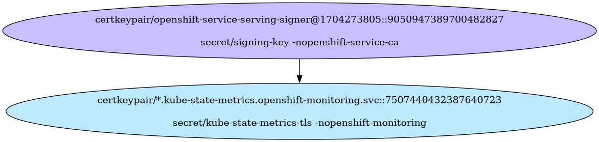

| Property | Value |
| ----------- | ----------- |
| Type | Serving |
| CommonName | *.kube-state-metrics.openshift-monitoring.svc |
| SerialNumber | 7507440432387640723 |
| Issuer CommonName | [openshift-service-serving-signer@1704273805](#openshift-service-serving-signer1704273805) |
| Validity | 2y |
| Signature Algorithm | SHA256-RSA |
| PublicKey Algorithm | RSA 2048 bit |
| Usages | - KeyUsageDigitalSignature - KeyUsageKeyEncipherment |
| ExtendedUsages | - ExtKeyUsageServerAuth |
| DNS Names | - *.kube-state-metrics.openshift-monitoring.svc - *.kube-state-metrics.openshift-monitoring.svc.cluster.local - kube-state-metrics.openshift-monitoring.svc - kube-state-metrics.openshift-monitoring.svc.cluster.local |
| IP Addresses |  |

#### *.kube-state-metrics.openshift-monitoring.svc Locations
| Namespace | Secret Name |
| ----------- | ----------- |
| openshift-monitoring | kube-state-metrics-tls |

| File | Permissions | User | Group | SE Linux |
| ----------- | ----------- | ----------- | ----------- | ----------- |

### *.machine-approver.openshift-cluster-machine-approver.svc
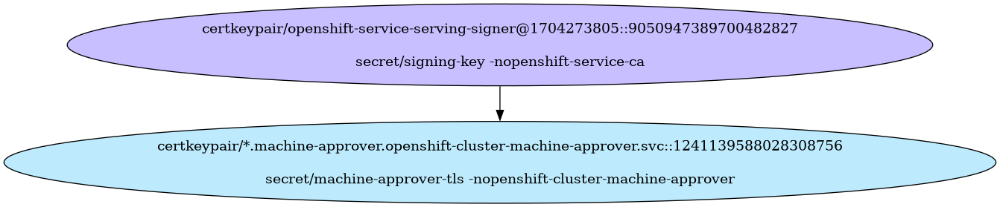

| Property | Value |
| ----------- | ----------- |
| Type | Serving |
| CommonName | *.machine-approver.openshift-cluster-machine-approver.svc |
| SerialNumber | 1241139588028308756 |
| Issuer CommonName | [openshift-service-serving-signer@1704273805](#openshift-service-serving-signer1704273805) |
| Validity | 2y |
| Signature Algorithm | SHA256-RSA |
| PublicKey Algorithm | RSA 2048 bit |
| Usages | - KeyUsageDigitalSignature - KeyUsageKeyEncipherment |
| ExtendedUsages | - ExtKeyUsageServerAuth |
| DNS Names | - *.machine-approver.openshift-cluster-machine-approver.svc - *.machine-approver.openshift-cluster-machine-approver.svc.cluster.local - machine-approver.openshift-cluster-machine-approver.svc - machine-approver.openshift-cluster-machine-approver.svc.cluster.local |
| IP Addresses |  |

#### *.machine-approver.openshift-cluster-machine-approver.svc Locations
| Namespace | Secret Name |
| ----------- | ----------- |
| openshift-cluster-machine-approver | machine-approver-tls |

| File | Permissions | User | Group | SE Linux |
| ----------- | ----------- | ----------- | ----------- | ----------- |

### *.metrics.openshift-cluster-samples-operator.svc

| Property | Value |
| ----------- | ----------- |
| Type | Serving |
| CommonName | *.metrics.openshift-cluster-samples-operator.svc |
| SerialNumber | 431710722391152754 |
| Issuer CommonName | [openshift-service-serving-signer@1704273805](#openshift-service-serving-signer1704273805) |
| Validity | 2y |
| Signature Algorithm | SHA256-RSA |
| PublicKey Algorithm | RSA 2048 bit |
| Usages | - KeyUsageDigitalSignature - KeyUsageKeyEncipherment |
| ExtendedUsages | - ExtKeyUsageServerAuth |
| DNS Names | - *.metrics.openshift-cluster-samples-operator.svc - *.metrics.openshift-cluster-samples-operator.svc.cluster.local - metrics.openshift-cluster-samples-operator.svc - metrics.openshift-cluster-samples-operator.svc.cluster.local |
| IP Addresses |  |

#### *.metrics.openshift-cluster-samples-operator.svc Locations
| Namespace | Secret Name |
| ----------- | ----------- |
| openshift-cluster-samples-operator | samples-operator-tls |

| File | Permissions | User | Group | SE Linux |
| ----------- | ----------- | ----------- | ----------- | ----------- |

### *.metrics.openshift-network-operator.svc
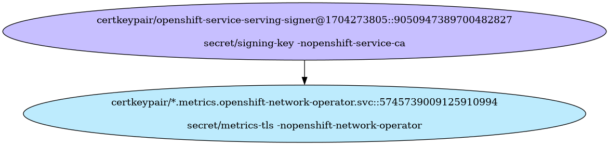

| Property | Value |
| ----------- | ----------- |
| Type | Serving |
| CommonName | *.metrics.openshift-network-operator.svc |
| SerialNumber | 5745739009125910994 |
| Issuer CommonName | [openshift-service-serving-signer@1704273805](#openshift-service-serving-signer1704273805) |
| Validity | 2y |
| Signature Algorithm | SHA256-RSA |
| PublicKey Algorithm | RSA 2048 bit |
| Usages | - KeyUsageDigitalSignature - KeyUsageKeyEncipherment |
| ExtendedUsages | - ExtKeyUsageServerAuth |
| DNS Names | - *.metrics.openshift-network-operator.svc - *.metrics.openshift-network-operator.svc.cluster.local - metrics.openshift-network-operator.svc - metrics.openshift-network-operator.svc.cluster.local |
| IP Addresses |  |

#### *.metrics.openshift-network-operator.svc Locations
| Namespace | Secret Name |
| ----------- | ----------- |
| openshift-network-operator | metrics-tls |

| File | Permissions | User | Group | SE Linux |
| ----------- | ----------- | ----------- | ----------- | ----------- |

### *.network-metrics-service.openshift-multus.svc
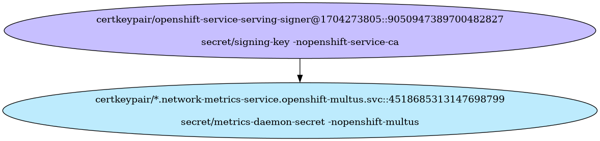

| Property | Value |
| ----------- | ----------- |
| Type | Serving |
| CommonName | *.network-metrics-service.openshift-multus.svc |
| SerialNumber | 4518685313147698799 |
| Issuer CommonName | [openshift-service-serving-signer@1704273805](#openshift-service-serving-signer1704273805) |
| Validity | 2y |
| Signature Algorithm | SHA256-RSA |
| PublicKey Algorithm | RSA 2048 bit |
| Usages | - KeyUsageDigitalSignature - KeyUsageKeyEncipherment |
| ExtendedUsages | - ExtKeyUsageServerAuth |
| DNS Names | - *.network-metrics-service.openshift-multus.svc - *.network-metrics-service.openshift-multus.svc.cluster.local - network-metrics-service.openshift-multus.svc - network-metrics-service.openshift-multus.svc.cluster.local |
| IP Addresses |  |

#### *.network-metrics-service.openshift-multus.svc Locations
| Namespace | Secret Name |
| ----------- | ----------- |
| openshift-multus | metrics-daemon-secret |

| File | Permissions | User | Group | SE Linux |
| ----------- | ----------- | ----------- | ----------- | ----------- |

### *.node-exporter.openshift-monitoring.svc
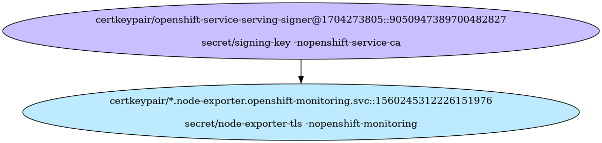

| Property | Value |
| ----------- | ----------- |
| Type | Serving |
| CommonName | *.node-exporter.openshift-monitoring.svc |
| SerialNumber | 1560245312226151976 |
| Issuer CommonName | [openshift-service-serving-signer@1704273805](#openshift-service-serving-signer1704273805) |
| Validity | 2y |
| Signature Algorithm | SHA256-RSA |
| PublicKey Algorithm | RSA 2048 bit |
| Usages | - KeyUsageDigitalSignature - KeyUsageKeyEncipherment |
| ExtendedUsages | - ExtKeyUsageServerAuth |
| DNS Names | - *.node-exporter.openshift-monitoring.svc - *.node-exporter.openshift-monitoring.svc.cluster.local - node-exporter.openshift-monitoring.svc - node-exporter.openshift-monitoring.svc.cluster.local |
| IP Addresses |  |

#### *.node-exporter.openshift-monitoring.svc Locations
| Namespace | Secret Name |
| ----------- | ----------- |
| openshift-monitoring | node-exporter-tls |

| File | Permissions | User | Group | SE Linux |
| ----------- | ----------- | ----------- | ----------- | ----------- |

### *.node-tuning-operator.openshift-cluster-node-tuning-operator.svc
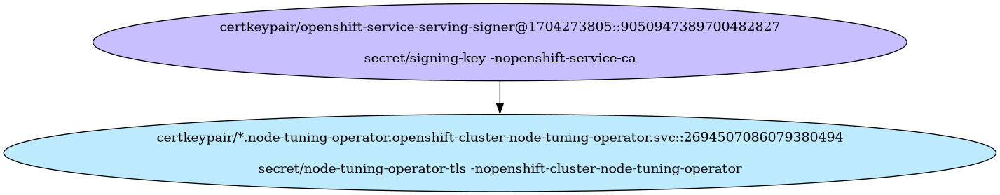

| Property | Value |
| ----------- | ----------- |
| Type | Serving |
| CommonName | *.node-tuning-operator.openshift-cluster-node-tuning-operator.svc |
| SerialNumber | 2694507086079380494 |
| Issuer CommonName | [openshift-service-serving-signer@1704273805](#openshift-service-serving-signer1704273805) |
| Validity | 2y |
| Signature Algorithm | SHA256-RSA |
| PublicKey Algorithm | RSA 2048 bit |
| Usages | - KeyUsageDigitalSignature - KeyUsageKeyEncipherment |
| ExtendedUsages | - ExtKeyUsageServerAuth |
| DNS Names | - *.node-tuning-operator.openshift-cluster-node-tuning-operator.svc - *.node-tuning-operator.openshift-cluster-node-tuning-operator.svc.cluster.local - node-tuning-operator.openshift-cluster-node-tuning-operator.svc - node-tuning-operator.openshift-cluster-node-tuning-operator.svc.cluster.local |
| IP Addresses |  |

#### *.node-tuning-operator.openshift-cluster-node-tuning-operator.svc Locations
| Namespace | Secret Name |
| ----------- | ----------- |
| openshift-cluster-node-tuning-operator | node-tuning-operator-tls |

| File | Permissions | User | Group | SE Linux |
| ----------- | ----------- | ----------- | ----------- | ----------- |

### *.openshift-state-metrics.openshift-monitoring.svc
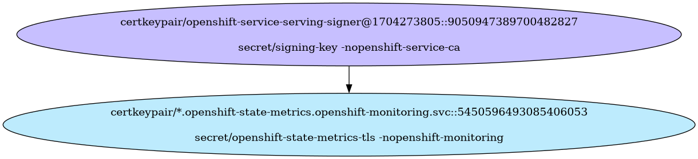

| Property | Value |
| ----------- | ----------- |
| Type | Serving |
| CommonName | *.openshift-state-metrics.openshift-monitoring.svc |
| SerialNumber | 5450596493085406053 |
| Issuer CommonName | [openshift-service-serving-signer@1704273805](#openshift-service-serving-signer1704273805) |
| Validity | 2y |
| Signature Algorithm | SHA256-RSA |
| PublicKey Algorithm | RSA 2048 bit |
| Usages | - KeyUsageDigitalSignature - KeyUsageKeyEncipherment |
| ExtendedUsages | - ExtKeyUsageServerAuth |
| DNS Names | - *.openshift-state-metrics.openshift-monitoring.svc - *.openshift-state-metrics.openshift-monitoring.svc.cluster.local - openshift-state-metrics.openshift-monitoring.svc - openshift-state-metrics.openshift-monitoring.svc.cluster.local |
| IP Addresses |  |

#### *.openshift-state-metrics.openshift-monitoring.svc Locations
| Namespace | Secret Name |
| ----------- | ----------- |
| openshift-monitoring | openshift-state-metrics-tls |

| File | Permissions | User | Group | SE Linux |
| ----------- | ----------- | ----------- | ----------- | ----------- |

### *.ovn-kubernetes-control-plane.openshift-ovn-kubernetes.svc

| Property | Value |
| ----------- | ----------- |
| Type | Serving |
| CommonName | *.ovn-kubernetes-control-plane.openshift-ovn-kubernetes.svc |
| SerialNumber | 7396398736636746460 |
| Issuer CommonName | [openshift-service-serving-signer@1704273805](#openshift-service-serving-signer1704273805) |
| Validity | 2y |
| Signature Algorithm | SHA256-RSA |
| PublicKey Algorithm | RSA 2048 bit |
| Usages | - KeyUsageDigitalSignature - KeyUsageKeyEncipherment |
| ExtendedUsages | - ExtKeyUsageServerAuth |
| DNS Names | - *.ovn-kubernetes-control-plane.openshift-ovn-kubernetes.svc - *.ovn-kubernetes-control-plane.openshift-ovn-kubernetes.svc.cluster.local - ovn-kubernetes-control-plane.openshift-ovn-kubernetes.svc - ovn-kubernetes-control-plane.openshift-ovn-kubernetes.svc.cluster.local |
| IP Addresses |  |

#### *.ovn-kubernetes-control-plane.openshift-ovn-kubernetes.svc Locations
| Namespace | Secret Name |
| ----------- | ----------- |
| openshift-ovn-kubernetes | ovn-control-plane-metrics-cert |

| File | Permissions | User | Group | SE Linux |
| ----------- | ----------- | ----------- | ----------- | ----------- |

### *.ovn-kubernetes-node.openshift-ovn-kubernetes.svc
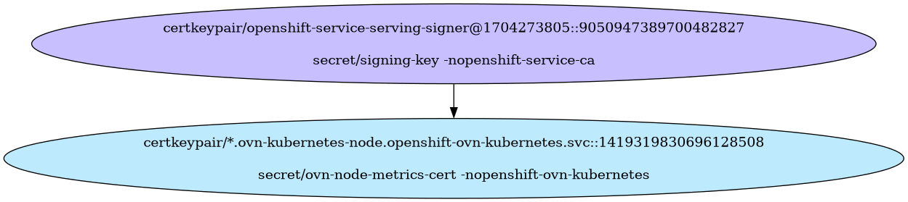

| Property | Value |
| ----------- | ----------- |
| Type | Serving |
| CommonName | *.ovn-kubernetes-node.openshift-ovn-kubernetes.svc |
| SerialNumber | 1419319830696128508 |
| Issuer CommonName | [openshift-service-serving-signer@1704273805](#openshift-service-serving-signer1704273805) |
| Validity | 2y |
| Signature Algorithm | SHA256-RSA |
| PublicKey Algorithm | RSA 2048 bit |
| Usages | - KeyUsageDigitalSignature - KeyUsageKeyEncipherment |
| ExtendedUsages | - ExtKeyUsageServerAuth |
| DNS Names | - *.ovn-kubernetes-node.openshift-ovn-kubernetes.svc - *.ovn-kubernetes-node.openshift-ovn-kubernetes.svc.cluster.local - ovn-kubernetes-node.openshift-ovn-kubernetes.svc - ovn-kubernetes-node.openshift-ovn-kubernetes.svc.cluster.local |
| IP Addresses |  |

#### *.ovn-kubernetes-node.openshift-ovn-kubernetes.svc Locations
| Namespace | Secret Name |
| ----------- | ----------- |
| openshift-ovn-kubernetes | ovn-node-metrics-cert |

| File | Permissions | User | Group | SE Linux |
| ----------- | ----------- | ----------- | ----------- | ----------- |

### *.prometheus-k8s-thanos-sidecar.openshift-monitoring.svc
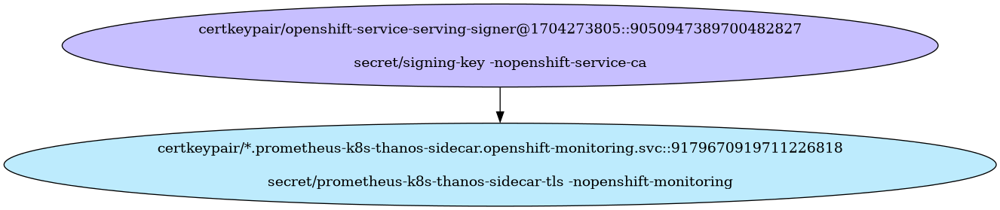

| Property | Value |
| ----------- | ----------- |
| Type | Serving |
| CommonName | *.prometheus-k8s-thanos-sidecar.openshift-monitoring.svc |
| SerialNumber | 9179670919711226818 |
| Issuer CommonName | [openshift-service-serving-signer@1704273805](#openshift-service-serving-signer1704273805) |
| Validity | 2y |
| Signature Algorithm | SHA256-RSA |
| PublicKey Algorithm | RSA 2048 bit |
| Usages | - KeyUsageDigitalSignature - KeyUsageKeyEncipherment |
| ExtendedUsages | - ExtKeyUsageServerAuth |
| DNS Names | - *.prometheus-k8s-thanos-sidecar.openshift-monitoring.svc - *.prometheus-k8s-thanos-sidecar.openshift-monitoring.svc.cluster.local - prometheus-k8s-thanos-sidecar.openshift-monitoring.svc - prometheus-k8s-thanos-sidecar.openshift-monitoring.svc.cluster.local |
| IP Addresses |  |

#### *.prometheus-k8s-thanos-sidecar.openshift-monitoring.svc Locations
| Namespace | Secret Name |
| ----------- | ----------- |
| openshift-monitoring | prometheus-k8s-thanos-sidecar-tls |

| File | Permissions | User | Group | SE Linux |
| ----------- | ----------- | ----------- | ----------- | ----------- |

### *.prometheus-operator.openshift-monitoring.svc
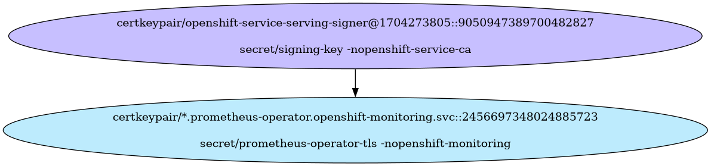

| Property | Value |
| ----------- | ----------- |
| Type | Serving |
| CommonName | *.prometheus-operator.openshift-monitoring.svc |
| SerialNumber | 2456697348024885723 |
| Issuer CommonName | [openshift-service-serving-signer@1704273805](#openshift-service-serving-signer1704273805) |
| Validity | 2y |
| Signature Algorithm | SHA256-RSA |
| PublicKey Algorithm | RSA 2048 bit |
| Usages | - KeyUsageDigitalSignature - KeyUsageKeyEncipherment |
| ExtendedUsages | - ExtKeyUsageServerAuth |
| DNS Names | - *.prometheus-operator.openshift-monitoring.svc - *.prometheus-operator.openshift-monitoring.svc.cluster.local - prometheus-operator.openshift-monitoring.svc - prometheus-operator.openshift-monitoring.svc.cluster.local |
| IP Addresses |  |

#### *.prometheus-operator.openshift-monitoring.svc Locations
| Namespace | Secret Name |
| ----------- | ----------- |
| openshift-monitoring | prometheus-operator-tls |

| File | Permissions | User | Group | SE Linux |
| ----------- | ----------- | ----------- | ----------- | ----------- |

### alertmanager-main.openshift-monitoring.svc
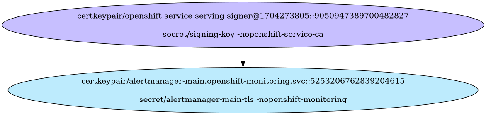

| Property | Value |
| ----------- | ----------- |
| Type | Serving |
| CommonName | alertmanager-main.openshift-monitoring.svc |
| SerialNumber | 5253206762839204615 |
| Issuer CommonName | [openshift-service-serving-signer@1704273805](#openshift-service-serving-signer1704273805) |
| Validity | 2y |
| Signature Algorithm | SHA256-RSA |
| PublicKey Algorithm | RSA 2048 bit |
| Usages | - KeyUsageDigitalSignature - KeyUsageKeyEncipherment |
| ExtendedUsages | - ExtKeyUsageServerAuth |
| DNS Names | - alertmanager-main.openshift-monitoring.svc - alertmanager-main.openshift-monitoring.svc.cluster.local |
| IP Addresses |  |

#### alertmanager-main.openshift-monitoring.svc Locations
| Namespace | Secret Name |
| ----------- | ----------- |
| openshift-monitoring | alertmanager-main-tls |

| File | Permissions | User | Group | SE Linux |
| ----------- | ----------- | ----------- | ----------- | ----------- |

### api.openshift-apiserver.svc
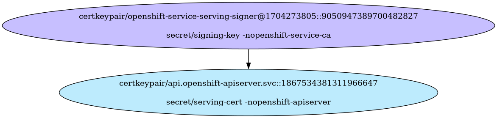

| Property | Value |
| ----------- | ----------- |
| Type | Serving |
| CommonName | api.openshift-apiserver.svc |
| SerialNumber | 1867534381311966647 |
| Issuer CommonName | [openshift-service-serving-signer@1704273805](#openshift-service-serving-signer1704273805) |
| Validity | 2y |
| Signature Algorithm | SHA256-RSA |
| PublicKey Algorithm | RSA 2048 bit |
| Usages | - KeyUsageDigitalSignature - KeyUsageKeyEncipherment |
| ExtendedUsages | - ExtKeyUsageServerAuth |
| DNS Names | - api.openshift-apiserver.svc - api.openshift-apiserver.svc.cluster.local |
| IP Addresses |  |

#### api.openshift-apiserver.svc Locations
| Namespace | Secret Name |
| ----------- | ----------- |
| openshift-apiserver | serving-cert |

| File | Permissions | User | Group | SE Linux |
| ----------- | ----------- | ----------- | ----------- | ----------- |

### api.openshift-oauth-apiserver.svc
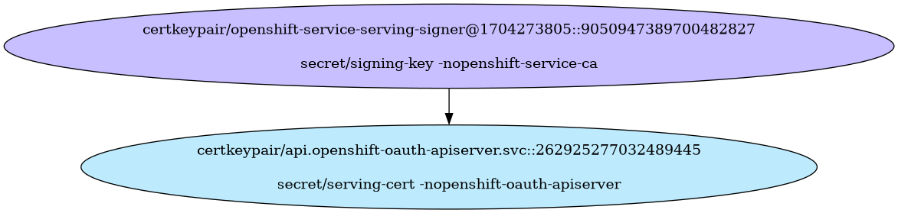

| Property | Value |
| ----------- | ----------- |
| Type | Serving |
| CommonName | api.openshift-oauth-apiserver.svc |
| SerialNumber | 262925277032489445 |
| Issuer CommonName | [openshift-service-serving-signer@1704273805](#openshift-service-serving-signer1704273805) |
| Validity | 2y |
| Signature Algorithm | SHA256-RSA |
| PublicKey Algorithm | RSA 2048 bit |
| Usages | - KeyUsageDigitalSignature - KeyUsageKeyEncipherment |
| ExtendedUsages | - ExtKeyUsageServerAuth |
| DNS Names | - api.openshift-oauth-apiserver.svc - api.openshift-oauth-apiserver.svc.cluster.local |
| IP Addresses |  |

#### api.openshift-oauth-apiserver.svc Locations
| Namespace | Secret Name |
| ----------- | ----------- |
| openshift-oauth-apiserver | serving-cert |

| File | Permissions | User | Group | SE Linux |
| ----------- | ----------- | ----------- | ----------- | ----------- |

### aws-ebs-csi-driver-controller-metrics.openshift-cluster-csi-drivers.svc

| Property | Value |
| ----------- | ----------- |
| Type | Serving |
| CommonName | aws-ebs-csi-driver-controller-metrics.openshift-cluster-csi-drivers.svc |
| SerialNumber | 7672092287646476476 |
| Issuer CommonName | [openshift-service-serving-signer@1704273805](#openshift-service-serving-signer1704273805) |
| Validity | 2y |
| Signature Algorithm | SHA256-RSA |
| PublicKey Algorithm | RSA 2048 bit |
| Usages | - KeyUsageDigitalSignature - KeyUsageKeyEncipherment |
| ExtendedUsages | - ExtKeyUsageServerAuth |
| DNS Names | - aws-ebs-csi-driver-controller-metrics.openshift-cluster-csi-drivers.svc - aws-ebs-csi-driver-controller-metrics.openshift-cluster-csi-drivers.svc.cluster.local |
| IP Addresses |  |

#### aws-ebs-csi-driver-controller-metrics.openshift-cluster-csi-drivers.svc Locations
| Namespace | Secret Name |
| ----------- | ----------- |
| openshift-cluster-csi-drivers | aws-ebs-csi-driver-controller-metrics-serving-cert |

| File | Permissions | User | Group | SE Linux |
| ----------- | ----------- | ----------- | ----------- | ----------- |

### catalog-operator-metrics.openshift-operator-lifecycle-manager.svc
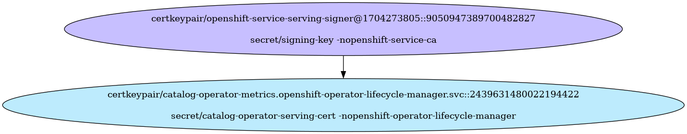

| Property | Value |
| ----------- | ----------- |
| Type | Serving |
| CommonName | catalog-operator-metrics.openshift-operator-lifecycle-manager.svc |
| SerialNumber | 2439631480022194422 |
| Issuer CommonName | [openshift-service-serving-signer@1704273805](#openshift-service-serving-signer1704273805) |
| Validity | 2y |
| Signature Algorithm | SHA256-RSA |
| PublicKey Algorithm | RSA 2048 bit |
| Usages | - KeyUsageDigitalSignature - KeyUsageKeyEncipherment |
| ExtendedUsages | - ExtKeyUsageServerAuth |
| DNS Names | - catalog-operator-metrics.openshift-operator-lifecycle-manager.svc - catalog-operator-metrics.openshift-operator-lifecycle-manager.svc.cluster.local |
| IP Addresses |  |

#### catalog-operator-metrics.openshift-operator-lifecycle-manager.svc Locations
| Namespace | Secret Name |
| ----------- | ----------- |
| openshift-operator-lifecycle-manager | catalog-operator-serving-cert |

| File | Permissions | User | Group | SE Linux |
| ----------- | ----------- | ----------- | ----------- | ----------- |

### cco-metrics.openshift-cloud-credential-operator.svc
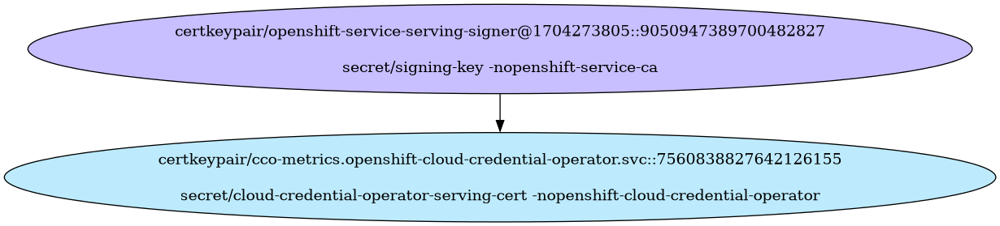

| Property | Value |
| ----------- | ----------- |
| Type | Serving |
| CommonName | cco-metrics.openshift-cloud-credential-operator.svc |
| SerialNumber | 7560838827642126155 |
| Issuer CommonName | [openshift-service-serving-signer@1704273805](#openshift-service-serving-signer1704273805) |
| Validity | 2y |
| Signature Algorithm | SHA256-RSA |
| PublicKey Algorithm | RSA 2048 bit |
| Usages | - KeyUsageDigitalSignature - KeyUsageKeyEncipherment |
| ExtendedUsages | - ExtKeyUsageServerAuth |
| DNS Names | - cco-metrics.openshift-cloud-credential-operator.svc - cco-metrics.openshift-cloud-credential-operator.svc.cluster.local |
| IP Addresses |  |

#### cco-metrics.openshift-cloud-credential-operator.svc Locations
| Namespace | Secret Name |
| ----------- | ----------- |
| openshift-cloud-credential-operator | cloud-credential-operator-serving-cert |

| File | Permissions | User | Group | SE Linux |
| ----------- | ----------- | ----------- | ----------- | ----------- |

### cluster-autoscaler-operator.openshift-machine-api.svc
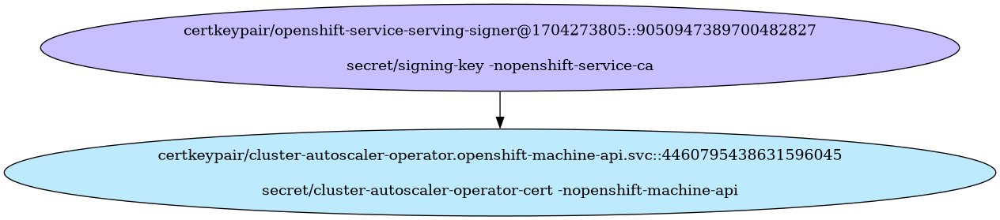

| Property | Value |
| ----------- | ----------- |
| Type | Serving |
| CommonName | cluster-autoscaler-operator.openshift-machine-api.svc |
| SerialNumber | 4460795438631596045 |
| Issuer CommonName | [openshift-service-serving-signer@1704273805](#openshift-service-serving-signer1704273805) |
| Validity | 2y |
| Signature Algorithm | SHA256-RSA |
| PublicKey Algorithm | RSA 2048 bit |
| Usages | - KeyUsageDigitalSignature - KeyUsageKeyEncipherment |
| ExtendedUsages | - ExtKeyUsageServerAuth |
| DNS Names | - cluster-autoscaler-operator.openshift-machine-api.svc - cluster-autoscaler-operator.openshift-machine-api.svc.cluster.local |
| IP Addresses |  |

#### cluster-autoscaler-operator.openshift-machine-api.svc Locations
| Namespace | Secret Name |
| ----------- | ----------- |
| openshift-machine-api | cluster-autoscaler-operator-cert |

| File | Permissions | User | Group | SE Linux |
| ----------- | ----------- | ----------- | ----------- | ----------- |

### cluster-baremetal-operator-service.openshift-machine-api.svc
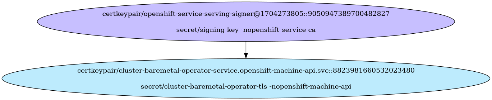

| Property | Value |
| ----------- | ----------- |
| Type | Serving |
| CommonName | cluster-baremetal-operator-service.openshift-machine-api.svc |
| SerialNumber | 8823981660532023480 |
| Issuer CommonName | [openshift-service-serving-signer@1704273805](#openshift-service-serving-signer1704273805) |
| Validity | 2y |
| Signature Algorithm | SHA256-RSA |
| PublicKey Algorithm | RSA 2048 bit |
| Usages | - KeyUsageDigitalSignature - KeyUsageKeyEncipherment |
| ExtendedUsages | - ExtKeyUsageServerAuth |
| DNS Names | - cluster-baremetal-operator-service.openshift-machine-api.svc - cluster-baremetal-operator-service.openshift-machine-api.svc.cluster.local |
| IP Addresses |  |

#### cluster-baremetal-operator-service.openshift-machine-api.svc Locations
| Namespace | Secret Name |
| ----------- | ----------- |
| openshift-machine-api | cluster-baremetal-operator-tls |

| File | Permissions | User | Group | SE Linux |
| ----------- | ----------- | ----------- | ----------- | ----------- |

### cluster-baremetal-webhook-service.openshift-machine-api.svc
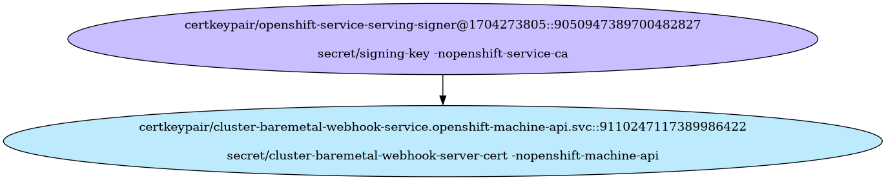

| Property | Value |
| ----------- | ----------- |
| Type | Serving |
| CommonName | cluster-baremetal-webhook-service.openshift-machine-api.svc |
| SerialNumber | 9110247117389986422 |
| Issuer CommonName | [openshift-service-serving-signer@1704273805](#openshift-service-serving-signer1704273805) |
| Validity | 2y |
| Signature Algorithm | SHA256-RSA |
| PublicKey Algorithm | RSA 2048 bit |
| Usages | - KeyUsageDigitalSignature - KeyUsageKeyEncipherment |
| ExtendedUsages | - ExtKeyUsageServerAuth |
| DNS Names | - cluster-baremetal-webhook-service.openshift-machine-api.svc - cluster-baremetal-webhook-service.openshift-machine-api.svc.cluster.local |
| IP Addresses |  |

#### cluster-baremetal-webhook-service.openshift-machine-api.svc Locations
| Namespace | Secret Name |
| ----------- | ----------- |
| openshift-machine-api | cluster-baremetal-webhook-server-cert |

| File | Permissions | User | Group | SE Linux |
| ----------- | ----------- | ----------- | ----------- | ----------- |

### cluster-storage-operator-metrics.openshift-cluster-storage-operator.svc
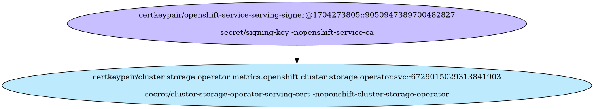

| Property | Value |
| ----------- | ----------- |
| Type | Serving |
| CommonName | cluster-storage-operator-metrics.openshift-cluster-storage-operator.svc |
| SerialNumber | 6729015029313841903 |
| Issuer CommonName | [openshift-service-serving-signer@1704273805](#openshift-service-serving-signer1704273805) |
| Validity | 2y |
| Signature Algorithm | SHA256-RSA |
| PublicKey Algorithm | RSA 2048 bit |
| Usages | - KeyUsageDigitalSignature - KeyUsageKeyEncipherment |
| ExtendedUsages | - ExtKeyUsageServerAuth |
| DNS Names | - cluster-storage-operator-metrics.openshift-cluster-storage-operator.svc - cluster-storage-operator-metrics.openshift-cluster-storage-operator.svc.cluster.local |
| IP Addresses |  |

#### cluster-storage-operator-metrics.openshift-cluster-storage-operator.svc Locations
| Namespace | Secret Name |
| ----------- | ----------- |
| openshift-cluster-storage-operator | cluster-storage-operator-serving-cert |

| File | Permissions | User | Group | SE Linux |
| ----------- | ----------- | ----------- | ----------- | ----------- |

### cluster-version-operator.openshift-cluster-version.svc
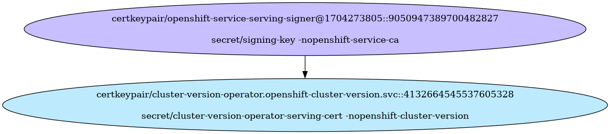

| Property | Value |
| ----------- | ----------- |
| Type | Serving |
| CommonName | cluster-version-operator.openshift-cluster-version.svc |
| SerialNumber | 4132664545537605328 |
| Issuer CommonName | [openshift-service-serving-signer@1704273805](#openshift-service-serving-signer1704273805) |
| Validity | 2y |
| Signature Algorithm | SHA256-RSA |
| PublicKey Algorithm | RSA 2048 bit |
| Usages | - KeyUsageDigitalSignature - KeyUsageKeyEncipherment |
| ExtendedUsages | - ExtKeyUsageServerAuth |
| DNS Names | - cluster-version-operator.openshift-cluster-version.svc - cluster-version-operator.openshift-cluster-version.svc.cluster.local |
| IP Addresses |  |

#### cluster-version-operator.openshift-cluster-version.svc Locations
| Namespace | Secret Name |
| ----------- | ----------- |
| openshift-cluster-version | cluster-version-operator-serving-cert |

| File | Permissions | User | Group | SE Linux |
| ----------- | ----------- | ----------- | ----------- | ----------- |

### console.openshift-console.svc
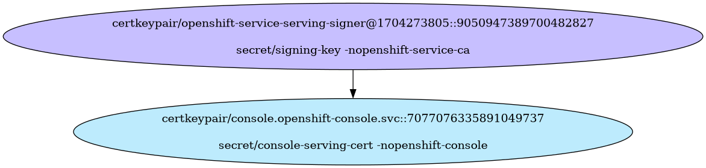

| Property | Value |
| ----------- | ----------- |
| Type | Serving |
| CommonName | console.openshift-console.svc |
| SerialNumber | 7077076335891049737 |
| Issuer CommonName | [openshift-service-serving-signer@1704273805](#openshift-service-serving-signer1704273805) |
| Validity | 2y |
| Signature Algorithm | SHA256-RSA |
| PublicKey Algorithm | RSA 2048 bit |
| Usages | - KeyUsageDigitalSignature - KeyUsageKeyEncipherment |
| ExtendedUsages | - ExtKeyUsageServerAuth |
| DNS Names | - console.openshift-console.svc - console.openshift-console.svc.cluster.local |
| IP Addresses |  |

#### console.openshift-console.svc Locations
| Namespace | Secret Name |
| ----------- | ----------- |
| openshift-console | console-serving-cert |

| File | Permissions | User | Group | SE Linux |
| ----------- | ----------- | ----------- | ----------- | ----------- |

### control-plane-machine-set-operator.openshift-machine-api.svc
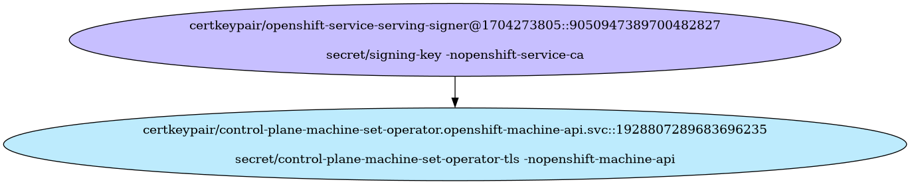

| Property | Value |
| ----------- | ----------- |
| Type | Serving |
| CommonName | control-plane-machine-set-operator.openshift-machine-api.svc |
| SerialNumber | 1928807289683696235 |
| Issuer CommonName | [openshift-service-serving-signer@1704273805](#openshift-service-serving-signer1704273805) |
| Validity | 2y |
| Signature Algorithm | SHA256-RSA |
| PublicKey Algorithm | RSA 2048 bit |
| Usages | - KeyUsageDigitalSignature - KeyUsageKeyEncipherment |
| ExtendedUsages | - ExtKeyUsageServerAuth |
| DNS Names | - control-plane-machine-set-operator.openshift-machine-api.svc - control-plane-machine-set-operator.openshift-machine-api.svc.cluster.local |
| IP Addresses |  |

#### control-plane-machine-set-operator.openshift-machine-api.svc Locations
| Namespace | Secret Name |
| ----------- | ----------- |
| openshift-machine-api | control-plane-machine-set-operator-tls |

| File | Permissions | User | Group | SE Linux |
| ----------- | ----------- | ----------- | ----------- | ----------- |

### controller-manager.openshift-controller-manager.svc
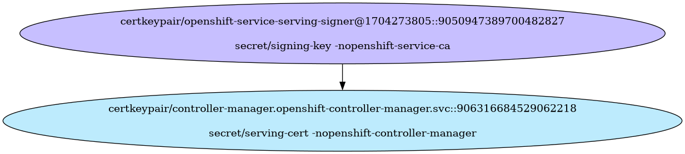

| Property | Value |
| ----------- | ----------- |
| Type | Serving |
| CommonName | controller-manager.openshift-controller-manager.svc |
| SerialNumber | 906316684529062218 |
| Issuer CommonName | [openshift-service-serving-signer@1704273805](#openshift-service-serving-signer1704273805) |
| Validity | 2y |
| Signature Algorithm | SHA256-RSA |
| PublicKey Algorithm | RSA 2048 bit |
| Usages | - KeyUsageDigitalSignature - KeyUsageKeyEncipherment |
| ExtendedUsages | - ExtKeyUsageServerAuth |
| DNS Names | - controller-manager.openshift-controller-manager.svc - controller-manager.openshift-controller-manager.svc.cluster.local |
| IP Addresses |  |

#### controller-manager.openshift-controller-manager.svc Locations
| Namespace | Secret Name |
| ----------- | ----------- |
| openshift-controller-manager | serving-cert |

| File | Permissions | User | Group | SE Linux |
| ----------- | ----------- | ----------- | ----------- | ----------- |

### csi-snapshot-controller-operator-metrics.openshift-cluster-storage-operator.svc
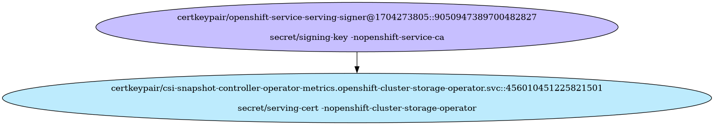

| Property | Value |
| ----------- | ----------- |
| Type | Serving |
| CommonName | csi-snapshot-controller-operator-metrics.openshift-cluster-storage-operator.svc |
| SerialNumber | 456010451225821501 |
| Issuer CommonName | [openshift-service-serving-signer@1704273805](#openshift-service-serving-signer1704273805) |
| Validity | 2y |
| Signature Algorithm | SHA256-RSA |
| PublicKey Algorithm | RSA 2048 bit |
| Usages | - KeyUsageDigitalSignature - KeyUsageKeyEncipherment |
| ExtendedUsages | - ExtKeyUsageServerAuth |
| DNS Names | - csi-snapshot-controller-operator-metrics.openshift-cluster-storage-operator.svc - csi-snapshot-controller-operator-metrics.openshift-cluster-storage-operator.svc.cluster.local |
| IP Addresses |  |

#### csi-snapshot-controller-operator-metrics.openshift-cluster-storage-operator.svc Locations
| Namespace | Secret Name |
| ----------- | ----------- |
| openshift-cluster-storage-operator | serving-cert |

| File | Permissions | User | Group | SE Linux |
| ----------- | ----------- | ----------- | ----------- | ----------- |

### csi-snapshot-webhook.openshift-cluster-storage-operator.svc
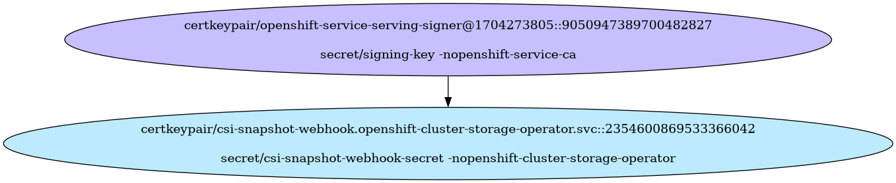

| Property | Value |
| ----------- | ----------- |
| Type | Serving |
| CommonName | csi-snapshot-webhook.openshift-cluster-storage-operator.svc |
| SerialNumber | 2354600869533366042 |
| Issuer CommonName | [openshift-service-serving-signer@1704273805](#openshift-service-serving-signer1704273805) |
| Validity | 2y |
| Signature Algorithm | SHA256-RSA |
| PublicKey Algorithm | RSA 2048 bit |
| Usages | - KeyUsageDigitalSignature - KeyUsageKeyEncipherment |
| ExtendedUsages | - ExtKeyUsageServerAuth |
| DNS Names | - csi-snapshot-webhook.openshift-cluster-storage-operator.svc - csi-snapshot-webhook.openshift-cluster-storage-operator.svc.cluster.local |
| IP Addresses |  |

#### csi-snapshot-webhook.openshift-cluster-storage-operator.svc Locations
| Namespace | Secret Name |
| ----------- | ----------- |
| openshift-cluster-storage-operator | csi-snapshot-webhook-secret |

| File | Permissions | User | Group | SE Linux |
| ----------- | ----------- | ----------- | ----------- | ----------- |

### dns-default.openshift-dns.svc

| Property | Value |
| ----------- | ----------- |
| Type | Serving |
| CommonName | dns-default.openshift-dns.svc |
| SerialNumber | 6631730757423562715 |
| Issuer CommonName | [openshift-service-serving-signer@1704273805](#openshift-service-serving-signer1704273805) |
| Validity | 2y |
| Signature Algorithm | SHA256-RSA |
| PublicKey Algorithm | RSA 2048 bit |
| Usages | - KeyUsageDigitalSignature - KeyUsageKeyEncipherment |
| ExtendedUsages | - ExtKeyUsageServerAuth |
| DNS Names | - dns-default.openshift-dns.svc - dns-default.openshift-dns.svc.cluster.local |
| IP Addresses |  |

#### dns-default.openshift-dns.svc Locations
| Namespace | Secret Name |
| ----------- | ----------- |
| openshift-dns | dns-default-metrics-tls |

| File | Permissions | User | Group | SE Linux |
| ----------- | ----------- | ----------- | ----------- | ----------- |

### etcd.openshift-etcd.svc
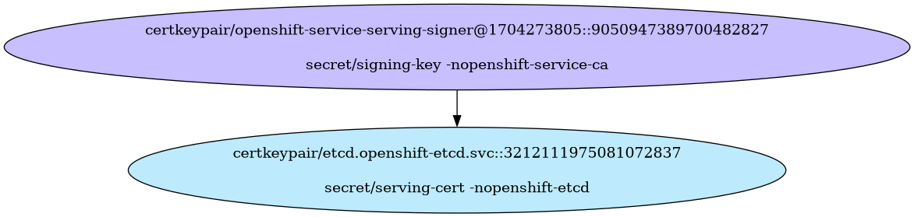

| Property | Value |
| ----------- | ----------- |
| Type | Serving |
| CommonName | etcd.openshift-etcd.svc |
| SerialNumber | 3212111975081072837 |
| Issuer CommonName | [openshift-service-serving-signer@1704273805](#openshift-service-serving-signer1704273805) |
| Validity | 2y |
| Signature Algorithm | SHA256-RSA |
| PublicKey Algorithm | RSA 2048 bit |
| Usages | - KeyUsageDigitalSignature - KeyUsageKeyEncipherment |
| ExtendedUsages | - ExtKeyUsageServerAuth |
| DNS Names | - etcd.openshift-etcd.svc - etcd.openshift-etcd.svc.cluster.local |
| IP Addresses |  |

#### etcd.openshift-etcd.svc Locations
| Namespace | Secret Name |
| ----------- | ----------- |
| openshift-etcd | serving-cert |

| File | Permissions | User | Group | SE Linux |
| ----------- | ----------- | ----------- | ----------- | ----------- |

### image-registry.openshift-image-registry.svc
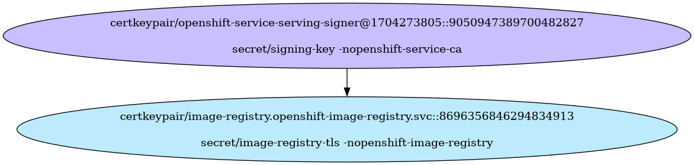

| Property | Value |
| ----------- | ----------- |
| Type | Serving |
| CommonName | image-registry.openshift-image-registry.svc |
| SerialNumber | 8696356846294834913 |
| Issuer CommonName | [openshift-service-serving-signer@1704273805](#openshift-service-serving-signer1704273805) |
| Validity | 2y |
| Signature Algorithm | SHA256-RSA |
| PublicKey Algorithm | RSA 2048 bit |
| Usages | - KeyUsageDigitalSignature - KeyUsageKeyEncipherment |
| ExtendedUsages | - ExtKeyUsageServerAuth |
| DNS Names | - image-registry.openshift-image-registry.svc - image-registry.openshift-image-registry.svc.cluster.local |
| IP Addresses |  |

#### image-registry.openshift-image-registry.svc Locations
| Namespace | Secret Name |
| ----------- | ----------- |
| openshift-image-registry | image-registry-tls |

| File | Permissions | User | Group | SE Linux |
| ----------- | ----------- | ----------- | ----------- | ----------- |

### kube-controller-manager.openshift-kube-controller-manager.svc
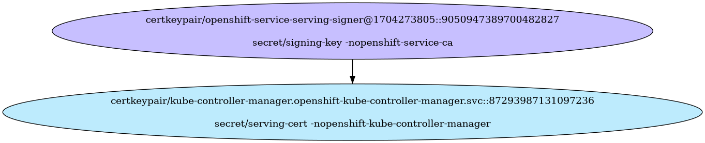

| Property | Value |
| ----------- | ----------- |
| Type | Serving |
| CommonName | kube-controller-manager.openshift-kube-controller-manager.svc |
| SerialNumber | 87293987131097236 |
| Issuer CommonName | [openshift-service-serving-signer@1704273805](#openshift-service-serving-signer1704273805) |
| Validity | 2y |
| Signature Algorithm | SHA256-RSA |
| PublicKey Algorithm | RSA 2048 bit |
| Usages | - KeyUsageDigitalSignature - KeyUsageKeyEncipherment |
| ExtendedUsages | - ExtKeyUsageServerAuth |
| DNS Names | - kube-controller-manager.openshift-kube-controller-manager.svc - kube-controller-manager.openshift-kube-controller-manager.svc.cluster.local |
| IP Addresses |  |

#### kube-controller-manager.openshift-kube-controller-manager.svc Locations
| Namespace | Secret Name |
| ----------- | ----------- |
| openshift-kube-controller-manager | serving-cert |

| File | Permissions | User | Group | SE Linux |
| ----------- | ----------- | ----------- | ----------- | ----------- |

### machine-api-controllers.openshift-machine-api.svc
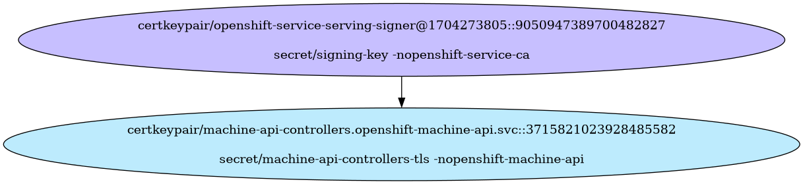

| Property | Value |
| ----------- | ----------- |
| Type | Serving |
| CommonName | machine-api-controllers.openshift-machine-api.svc |
| SerialNumber | 3715821023928485582 |
| Issuer CommonName | [openshift-service-serving-signer@1704273805](#openshift-service-serving-signer1704273805) |
| Validity | 2y |
| Signature Algorithm | SHA256-RSA |
| PublicKey Algorithm | RSA 2048 bit |
| Usages | - KeyUsageDigitalSignature - KeyUsageKeyEncipherment |
| ExtendedUsages | - ExtKeyUsageServerAuth |
| DNS Names | - machine-api-controllers.openshift-machine-api.svc - machine-api-controllers.openshift-machine-api.svc.cluster.local |
| IP Addresses |  |

#### machine-api-controllers.openshift-machine-api.svc Locations
| Namespace | Secret Name |
| ----------- | ----------- |
| openshift-machine-api | machine-api-controllers-tls |

| File | Permissions | User | Group | SE Linux |
| ----------- | ----------- | ----------- | ----------- | ----------- |

### machine-api-operator-machine-webhook.openshift-machine-api.svc
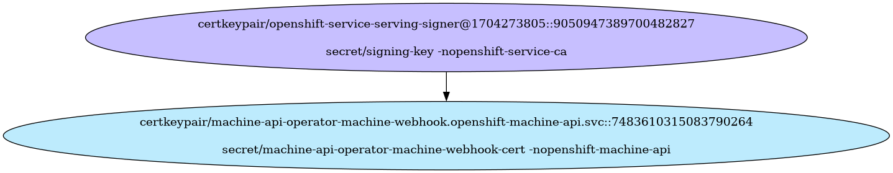

| Property | Value |
| ----------- | ----------- |
| Type | Serving |
| CommonName | machine-api-operator-machine-webhook.openshift-machine-api.svc |
| SerialNumber | 7483610315083790264 |
| Issuer CommonName | [openshift-service-serving-signer@1704273805](#openshift-service-serving-signer1704273805) |
| Validity | 2y |
| Signature Algorithm | SHA256-RSA |
| PublicKey Algorithm | RSA 2048 bit |
| Usages | - KeyUsageDigitalSignature - KeyUsageKeyEncipherment |
| ExtendedUsages | - ExtKeyUsageServerAuth |
| DNS Names | - machine-api-operator-machine-webhook.openshift-machine-api.svc - machine-api-operator-machine-webhook.openshift-machine-api.svc.cluster.local |
| IP Addresses |  |

#### machine-api-operator-machine-webhook.openshift-machine-api.svc Locations
| Namespace | Secret Name |
| ----------- | ----------- |
| openshift-machine-api | machine-api-operator-machine-webhook-cert |

| File | Permissions | User | Group | SE Linux |
| ----------- | ----------- | ----------- | ----------- | ----------- |

### machine-api-operator-webhook.openshift-machine-api.svc
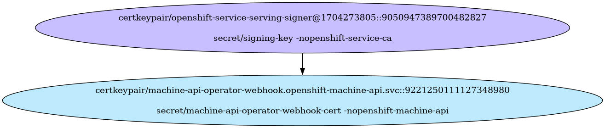

| Property | Value |
| ----------- | ----------- |
| Type | Serving |
| CommonName | machine-api-operator-webhook.openshift-machine-api.svc |
| SerialNumber | 9221250111127348980 |
| Issuer CommonName | [openshift-service-serving-signer@1704273805](#openshift-service-serving-signer1704273805) |
| Validity | 2y |
| Signature Algorithm | SHA256-RSA |
| PublicKey Algorithm | RSA 2048 bit |
| Usages | - KeyUsageDigitalSignature - KeyUsageKeyEncipherment |
| ExtendedUsages | - ExtKeyUsageServerAuth |
| DNS Names | - machine-api-operator-webhook.openshift-machine-api.svc - machine-api-operator-webhook.openshift-machine-api.svc.cluster.local |
| IP Addresses |  |

#### machine-api-operator-webhook.openshift-machine-api.svc Locations
| Namespace | Secret Name |
| ----------- | ----------- |
| openshift-machine-api | machine-api-operator-webhook-cert |

| File | Permissions | User | Group | SE Linux |
| ----------- | ----------- | ----------- | ----------- | ----------- |

### machine-api-operator.openshift-machine-api.svc
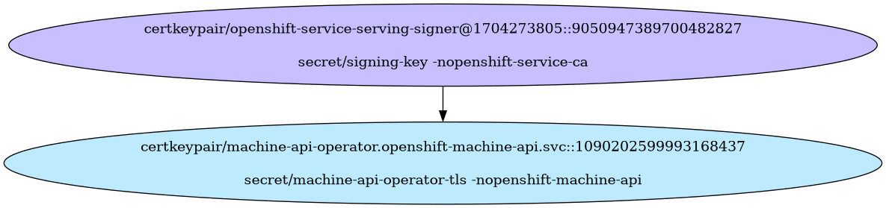

| Property | Value |
| ----------- | ----------- |
| Type | Serving |
| CommonName | machine-api-operator.openshift-machine-api.svc |
| SerialNumber | 1090202599993168437 |
| Issuer CommonName | [openshift-service-serving-signer@1704273805](#openshift-service-serving-signer1704273805) |
| Validity | 2y |
| Signature Algorithm | SHA256-RSA |
| PublicKey Algorithm | RSA 2048 bit |
| Usages | - KeyUsageDigitalSignature - KeyUsageKeyEncipherment |
| ExtendedUsages | - ExtKeyUsageServerAuth |
| DNS Names | - machine-api-operator.openshift-machine-api.svc - machine-api-operator.openshift-machine-api.svc.cluster.local |
| IP Addresses |  |

#### machine-api-operator.openshift-machine-api.svc Locations
| Namespace | Secret Name |
| ----------- | ----------- |
| openshift-machine-api | machine-api-operator-tls |

| File | Permissions | User | Group | SE Linux |
| ----------- | ----------- | ----------- | ----------- | ----------- |

### machine-config-controller.openshift-machine-config-operator.svc
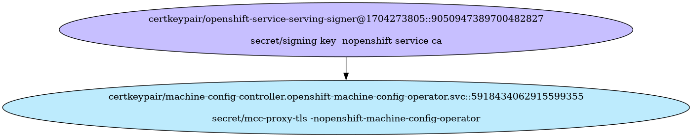

| Property | Value |
| ----------- | ----------- |
| Type | Serving |
| CommonName | machine-config-controller.openshift-machine-config-operator.svc |
| SerialNumber | 5918434062915599355 |
| Issuer CommonName | [openshift-service-serving-signer@1704273805](#openshift-service-serving-signer1704273805) |
| Validity | 2y |
| Signature Algorithm | SHA256-RSA |
| PublicKey Algorithm | RSA 2048 bit |
| Usages | - KeyUsageDigitalSignature - KeyUsageKeyEncipherment |
| ExtendedUsages | - ExtKeyUsageServerAuth |
| DNS Names | - machine-config-controller.openshift-machine-config-operator.svc - machine-config-controller.openshift-machine-config-operator.svc.cluster.local |
| IP Addresses |  |

#### machine-config-controller.openshift-machine-config-operator.svc Locations
| Namespace | Secret Name |
| ----------- | ----------- |
| openshift-machine-config-operator | mcc-proxy-tls |

| File | Permissions | User | Group | SE Linux |
| ----------- | ----------- | ----------- | ----------- | ----------- |

### machine-config-daemon.openshift-machine-config-operator.svc

| Property | Value |
| ----------- | ----------- |
| Type | Serving |
| CommonName | machine-config-daemon.openshift-machine-config-operator.svc |
| SerialNumber | 8477084497009951049 |
| Issuer CommonName | [openshift-service-serving-signer@1704273805](#openshift-service-serving-signer1704273805) |
| Validity | 2y |
| Signature Algorithm | SHA256-RSA |
| PublicKey Algorithm | RSA 2048 bit |
| Usages | - KeyUsageDigitalSignature - KeyUsageKeyEncipherment |
| ExtendedUsages | - ExtKeyUsageServerAuth |
| DNS Names | - machine-config-daemon.openshift-machine-config-operator.svc - machine-config-daemon.openshift-machine-config-operator.svc.cluster.local |
| IP Addresses |  |

#### machine-config-daemon.openshift-machine-config-operator.svc Locations
| Namespace | Secret Name |
| ----------- | ----------- |
| openshift-machine-config-operator | proxy-tls |

| File | Permissions | User | Group | SE Linux |
| ----------- | ----------- | ----------- | ----------- | ----------- |

### machine-config-operator.openshift-machine-config-operator.svc
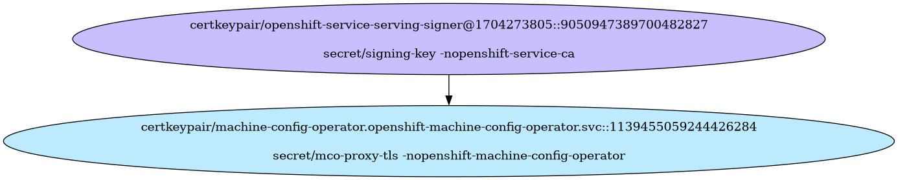

| Property | Value |
| ----------- | ----------- |
| Type | Serving |
| CommonName | machine-config-operator.openshift-machine-config-operator.svc |
| SerialNumber | 1139455059244426284 |
| Issuer CommonName | [openshift-service-serving-signer@1704273805](#openshift-service-serving-signer1704273805) |
| Validity | 2y |
| Signature Algorithm | SHA256-RSA |
| PublicKey Algorithm | RSA 2048 bit |
| Usages | - KeyUsageDigitalSignature - KeyUsageKeyEncipherment |
| ExtendedUsages | - ExtKeyUsageServerAuth |
| DNS Names | - machine-config-operator.openshift-machine-config-operator.svc - machine-config-operator.openshift-machine-config-operator.svc.cluster.local |
| IP Addresses |  |

#### machine-config-operator.openshift-machine-config-operator.svc Locations
| Namespace | Secret Name |
| ----------- | ----------- |
| openshift-machine-config-operator | mco-proxy-tls |

| File | Permissions | User | Group | SE Linux |
| ----------- | ----------- | ----------- | ----------- | ----------- |

### marketplace-operator-metrics.openshift-marketplace.svc
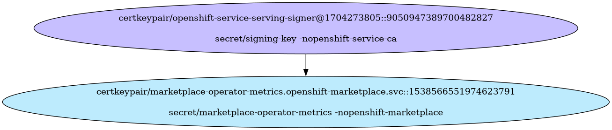

| Property | Value |
| ----------- | ----------- |
| Type | Serving |
| CommonName | marketplace-operator-metrics.openshift-marketplace.svc |
| SerialNumber | 1538566551974623791 |
| Issuer CommonName | [openshift-service-serving-signer@1704273805](#openshift-service-serving-signer1704273805) |
| Validity | 2y |
| Signature Algorithm | SHA256-RSA |
| PublicKey Algorithm | RSA 2048 bit |
| Usages | - KeyUsageDigitalSignature - KeyUsageKeyEncipherment |
| ExtendedUsages | - ExtKeyUsageServerAuth |
| DNS Names | - marketplace-operator-metrics.openshift-marketplace.svc - marketplace-operator-metrics.openshift-marketplace.svc.cluster.local |
| IP Addresses |  |

#### marketplace-operator-metrics.openshift-marketplace.svc Locations
| Namespace | Secret Name |
| ----------- | ----------- |
| openshift-marketplace | marketplace-operator-metrics |

| File | Permissions | User | Group | SE Linux |
| ----------- | ----------- | ----------- | ----------- | ----------- |

### metrics.openshift-apiserver-operator.svc
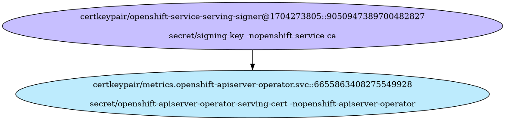

| Property | Value |
| ----------- | ----------- |
| Type | Serving |
| CommonName | metrics.openshift-apiserver-operator.svc |
| SerialNumber | 6655863408275549928 |
| Issuer CommonName | [openshift-service-serving-signer@1704273805](#openshift-service-serving-signer1704273805) |
| Validity | 2y |
| Signature Algorithm | SHA256-RSA |
| PublicKey Algorithm | RSA 2048 bit |
| Usages | - KeyUsageDigitalSignature - KeyUsageKeyEncipherment |
| ExtendedUsages | - ExtKeyUsageServerAuth |
| DNS Names | - metrics.openshift-apiserver-operator.svc - metrics.openshift-apiserver-operator.svc.cluster.local |
| IP Addresses |  |

#### metrics.openshift-apiserver-operator.svc Locations
| Namespace | Secret Name |
| ----------- | ----------- |
| openshift-apiserver-operator | openshift-apiserver-operator-serving-cert |

| File | Permissions | User | Group | SE Linux |
| ----------- | ----------- | ----------- | ----------- | ----------- |

### metrics.openshift-authentication-operator.svc
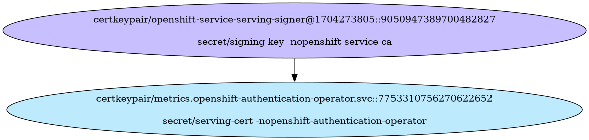

| Property | Value |
| ----------- | ----------- |
| Type | Serving |
| CommonName | metrics.openshift-authentication-operator.svc |
| SerialNumber | 7753310756270622652 |
| Issuer CommonName | [openshift-service-serving-signer@1704273805](#openshift-service-serving-signer1704273805) |
| Validity | 2y |
| Signature Algorithm | SHA256-RSA |
| PublicKey Algorithm | RSA 2048 bit |
| Usages | - KeyUsageDigitalSignature - KeyUsageKeyEncipherment |
| ExtendedUsages | - ExtKeyUsageServerAuth |
| DNS Names | - metrics.openshift-authentication-operator.svc - metrics.openshift-authentication-operator.svc.cluster.local |
| IP Addresses |  |

#### metrics.openshift-authentication-operator.svc Locations
| Namespace | Secret Name |
| ----------- | ----------- |
| openshift-authentication-operator | serving-cert |

| File | Permissions | User | Group | SE Linux |
| ----------- | ----------- | ----------- | ----------- | ----------- |

### metrics.openshift-config-operator.svc
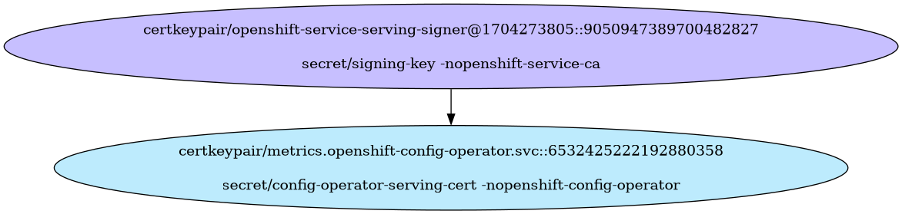

| Property | Value |
| ----------- | ----------- |
| Type | Serving |
| CommonName | metrics.openshift-config-operator.svc |
| SerialNumber | 6532425222192880358 |
| Issuer CommonName | [openshift-service-serving-signer@1704273805](#openshift-service-serving-signer1704273805) |
| Validity | 2y |
| Signature Algorithm | SHA256-RSA |
| PublicKey Algorithm | RSA 2048 bit |
| Usages | - KeyUsageDigitalSignature - KeyUsageKeyEncipherment |
| ExtendedUsages | - ExtKeyUsageServerAuth |
| DNS Names | - metrics.openshift-config-operator.svc - metrics.openshift-config-operator.svc.cluster.local |
| IP Addresses |  |

#### metrics.openshift-config-operator.svc Locations
| Namespace | Secret Name |
| ----------- | ----------- |
| openshift-config-operator | config-operator-serving-cert |

| File | Permissions | User | Group | SE Linux |
| ----------- | ----------- | ----------- | ----------- | ----------- |

### metrics.openshift-console-operator.svc
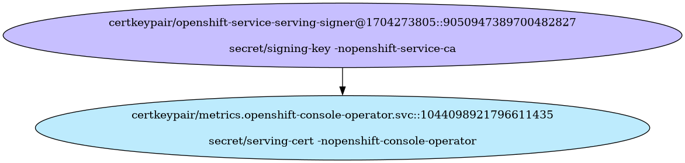

| Property | Value |
| ----------- | ----------- |
| Type | Serving |
| CommonName | metrics.openshift-console-operator.svc |
| SerialNumber | 1044098921796611435 |
| Issuer CommonName | [openshift-service-serving-signer@1704273805](#openshift-service-serving-signer1704273805) |
| Validity | 2y |
| Signature Algorithm | SHA256-RSA |
| PublicKey Algorithm | RSA 2048 bit |
| Usages | - KeyUsageDigitalSignature - KeyUsageKeyEncipherment |
| ExtendedUsages | - ExtKeyUsageServerAuth |
| DNS Names | - metrics.openshift-console-operator.svc - metrics.openshift-console-operator.svc.cluster.local |
| IP Addresses |  |

#### metrics.openshift-console-operator.svc Locations
| Namespace | Secret Name |
| ----------- | ----------- |
| openshift-console-operator | serving-cert |

| File | Permissions | User | Group | SE Linux |
| ----------- | ----------- | ----------- | ----------- | ----------- |

### metrics.openshift-controller-manager-operator.svc
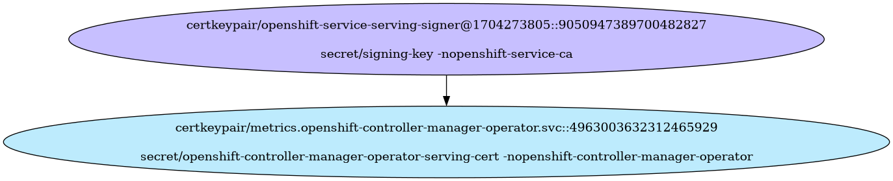

| Property | Value |
| ----------- | ----------- |
| Type | Serving |
| CommonName | metrics.openshift-controller-manager-operator.svc |
| SerialNumber | 4963003632312465929 |
| Issuer CommonName | [openshift-service-serving-signer@1704273805](#openshift-service-serving-signer1704273805) |
| Validity | 2y |
| Signature Algorithm | SHA256-RSA |
| PublicKey Algorithm | RSA 2048 bit |
| Usages | - KeyUsageDigitalSignature - KeyUsageKeyEncipherment |
| ExtendedUsages | - ExtKeyUsageServerAuth |
| DNS Names | - metrics.openshift-controller-manager-operator.svc - metrics.openshift-controller-manager-operator.svc.cluster.local |
| IP Addresses |  |

#### metrics.openshift-controller-manager-operator.svc Locations
| Namespace | Secret Name |
| ----------- | ----------- |
| openshift-controller-manager-operator | openshift-controller-manager-operator-serving-cert |

| File | Permissions | User | Group | SE Linux |
| ----------- | ----------- | ----------- | ----------- | ----------- |

### metrics.openshift-dns-operator.svc
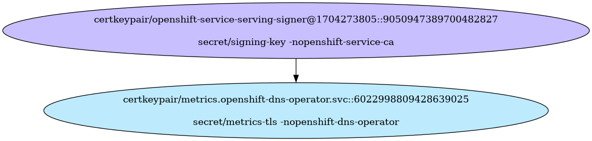

| Property | Value |
| ----------- | ----------- |
| Type | Serving |
| CommonName | metrics.openshift-dns-operator.svc |
| SerialNumber | 6022998809428639025 |
| Issuer CommonName | [openshift-service-serving-signer@1704273805](#openshift-service-serving-signer1704273805) |
| Validity | 2y |
| Signature Algorithm | SHA256-RSA |
| PublicKey Algorithm | RSA 2048 bit |
| Usages | - KeyUsageDigitalSignature - KeyUsageKeyEncipherment |
| ExtendedUsages | - ExtKeyUsageServerAuth |
| DNS Names | - metrics.openshift-dns-operator.svc - metrics.openshift-dns-operator.svc.cluster.local |
| IP Addresses |  |

#### metrics.openshift-dns-operator.svc Locations
| Namespace | Secret Name |
| ----------- | ----------- |
| openshift-dns-operator | metrics-tls |

| File | Permissions | User | Group | SE Linux |
| ----------- | ----------- | ----------- | ----------- | ----------- |

### metrics.openshift-etcd-operator.svc
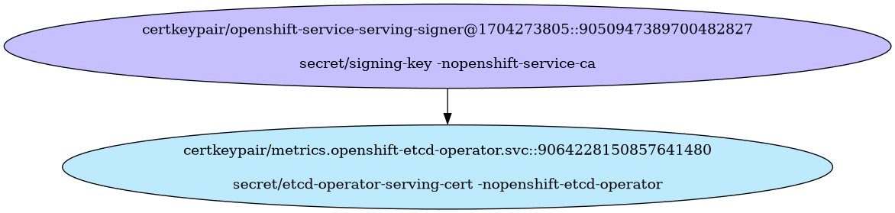

| Property | Value |
| ----------- | ----------- |
| Type | Serving |
| CommonName | metrics.openshift-etcd-operator.svc |
| SerialNumber | 9064228150857641480 |
| Issuer CommonName | [openshift-service-serving-signer@1704273805](#openshift-service-serving-signer1704273805) |
| Validity | 2y |
| Signature Algorithm | SHA256-RSA |
| PublicKey Algorithm | RSA 2048 bit |
| Usages | - KeyUsageDigitalSignature - KeyUsageKeyEncipherment |
| ExtendedUsages | - ExtKeyUsageServerAuth |
| DNS Names | - metrics.openshift-etcd-operator.svc - metrics.openshift-etcd-operator.svc.cluster.local |
| IP Addresses |  |

#### metrics.openshift-etcd-operator.svc Locations
| Namespace | Secret Name |
| ----------- | ----------- |
| openshift-etcd-operator | etcd-operator-serving-cert |

| File | Permissions | User | Group | SE Linux |
| ----------- | ----------- | ----------- | ----------- | ----------- |

### metrics.openshift-ingress-operator.svc
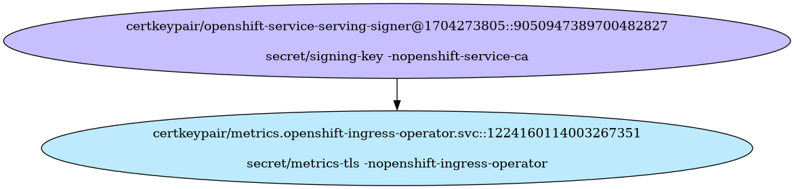

| Property | Value |
| ----------- | ----------- |
| Type | Serving |
| CommonName | metrics.openshift-ingress-operator.svc |
| SerialNumber | 1224160114003267351 |
| Issuer CommonName | [openshift-service-serving-signer@1704273805](#openshift-service-serving-signer1704273805) |
| Validity | 2y |
| Signature Algorithm | SHA256-RSA |
| PublicKey Algorithm | RSA 2048 bit |
| Usages | - KeyUsageDigitalSignature - KeyUsageKeyEncipherment |
| ExtendedUsages | - ExtKeyUsageServerAuth |
| DNS Names | - metrics.openshift-ingress-operator.svc - metrics.openshift-ingress-operator.svc.cluster.local |
| IP Addresses |  |

#### metrics.openshift-ingress-operator.svc Locations
| Namespace | Secret Name |
| ----------- | ----------- |
| openshift-ingress-operator | metrics-tls |

| File | Permissions | User | Group | SE Linux |
| ----------- | ----------- | ----------- | ----------- | ----------- |

### metrics.openshift-insights.svc
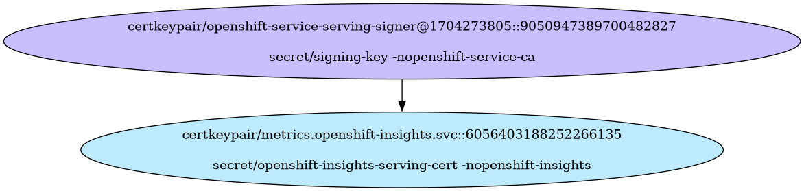

| Property | Value |
| ----------- | ----------- |
| Type | Serving |
| CommonName | metrics.openshift-insights.svc |
| SerialNumber | 6056403188252266135 |
| Issuer CommonName | [openshift-service-serving-signer@1704273805](#openshift-service-serving-signer1704273805) |
| Validity | 2y |
| Signature Algorithm | SHA256-RSA |
| PublicKey Algorithm | RSA 2048 bit |
| Usages | - KeyUsageDigitalSignature - KeyUsageKeyEncipherment |
| ExtendedUsages | - ExtKeyUsageServerAuth |
| DNS Names | - metrics.openshift-insights.svc - metrics.openshift-insights.svc.cluster.local |
| IP Addresses |  |

#### metrics.openshift-insights.svc Locations
| Namespace | Secret Name |
| ----------- | ----------- |
| openshift-insights | openshift-insights-serving-cert |

| File | Permissions | User | Group | SE Linux |
| ----------- | ----------- | ----------- | ----------- | ----------- |

### metrics.openshift-kube-apiserver-operator.svc
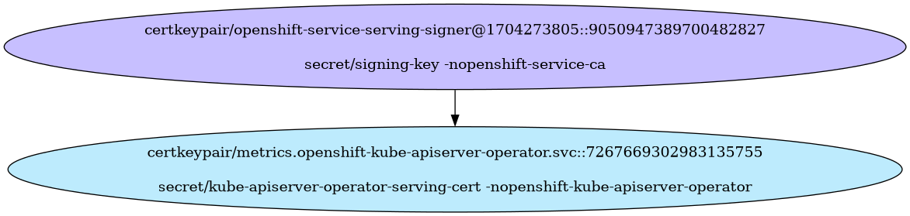

| Property | Value |
| ----------- | ----------- |
| Type | Serving |
| CommonName | metrics.openshift-kube-apiserver-operator.svc |
| SerialNumber | 7267669302983135755 |
| Issuer CommonName | [openshift-service-serving-signer@1704273805](#openshift-service-serving-signer1704273805) |
| Validity | 2y |
| Signature Algorithm | SHA256-RSA |
| PublicKey Algorithm | RSA 2048 bit |
| Usages | - KeyUsageDigitalSignature - KeyUsageKeyEncipherment |
| ExtendedUsages | - ExtKeyUsageServerAuth |
| DNS Names | - metrics.openshift-kube-apiserver-operator.svc - metrics.openshift-kube-apiserver-operator.svc.cluster.local |
| IP Addresses |  |

#### metrics.openshift-kube-apiserver-operator.svc Locations
| Namespace | Secret Name |
| ----------- | ----------- |
| openshift-kube-apiserver-operator | kube-apiserver-operator-serving-cert |

| File | Permissions | User | Group | SE Linux |
| ----------- | ----------- | ----------- | ----------- | ----------- |

### metrics.openshift-kube-controller-manager-operator.svc
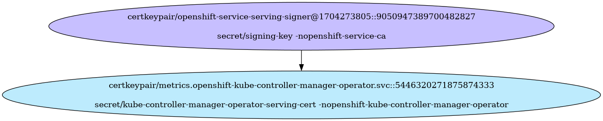

| Property | Value |
| ----------- | ----------- |
| Type | Serving |
| CommonName | metrics.openshift-kube-controller-manager-operator.svc |
| SerialNumber | 5446320271875874333 |
| Issuer CommonName | [openshift-service-serving-signer@1704273805](#openshift-service-serving-signer1704273805) |
| Validity | 2y |
| Signature Algorithm | SHA256-RSA |
| PublicKey Algorithm | RSA 2048 bit |
| Usages | - KeyUsageDigitalSignature - KeyUsageKeyEncipherment |
| ExtendedUsages | - ExtKeyUsageServerAuth |
| DNS Names | - metrics.openshift-kube-controller-manager-operator.svc - metrics.openshift-kube-controller-manager-operator.svc.cluster.local |
| IP Addresses |  |

#### metrics.openshift-kube-controller-manager-operator.svc Locations
| Namespace | Secret Name |
| ----------- | ----------- |
| openshift-kube-controller-manager-operator | kube-controller-manager-operator-serving-cert |

| File | Permissions | User | Group | SE Linux |
| ----------- | ----------- | ----------- | ----------- | ----------- |

### metrics.openshift-kube-scheduler-operator.svc
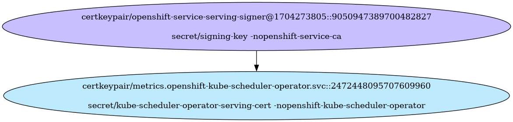

| Property | Value |
| ----------- | ----------- |
| Type | Serving |
| CommonName | metrics.openshift-kube-scheduler-operator.svc |
| SerialNumber | 2472448095707609960 |
| Issuer CommonName | [openshift-service-serving-signer@1704273805](#openshift-service-serving-signer1704273805) |
| Validity | 2y |
| Signature Algorithm | SHA256-RSA |
| PublicKey Algorithm | RSA 2048 bit |
| Usages | - KeyUsageDigitalSignature - KeyUsageKeyEncipherment |
| ExtendedUsages | - ExtKeyUsageServerAuth |
| DNS Names | - metrics.openshift-kube-scheduler-operator.svc - metrics.openshift-kube-scheduler-operator.svc.cluster.local |
| IP Addresses |  |

#### metrics.openshift-kube-scheduler-operator.svc Locations
| Namespace | Secret Name |
| ----------- | ----------- |
| openshift-kube-scheduler-operator | kube-scheduler-operator-serving-cert |

| File | Permissions | User | Group | SE Linux |
| ----------- | ----------- | ----------- | ----------- | ----------- |

### metrics.openshift-kube-storage-version-migrator-operator.svc
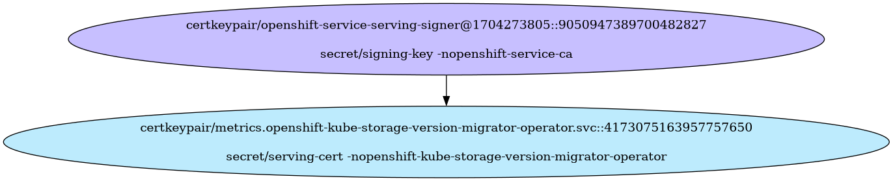

| Property | Value |
| ----------- | ----------- |
| Type | Serving |
| CommonName | metrics.openshift-kube-storage-version-migrator-operator.svc |
| SerialNumber | 4173075163957757650 |
| Issuer CommonName | [openshift-service-serving-signer@1704273805](#openshift-service-serving-signer1704273805) |
| Validity | 2y |
| Signature Algorithm | SHA256-RSA |
| PublicKey Algorithm | RSA 2048 bit |
| Usages | - KeyUsageDigitalSignature - KeyUsageKeyEncipherment |
| ExtendedUsages | - ExtKeyUsageServerAuth |
| DNS Names | - metrics.openshift-kube-storage-version-migrator-operator.svc - metrics.openshift-kube-storage-version-migrator-operator.svc.cluster.local |
| IP Addresses |  |

#### metrics.openshift-kube-storage-version-migrator-operator.svc Locations
| Namespace | Secret Name |
| ----------- | ----------- |
| openshift-kube-storage-version-migrator-operator | serving-cert |

| File | Permissions | User | Group | SE Linux |
| ----------- | ----------- | ----------- | ----------- | ----------- |

### metrics.openshift-service-ca-operator.svc
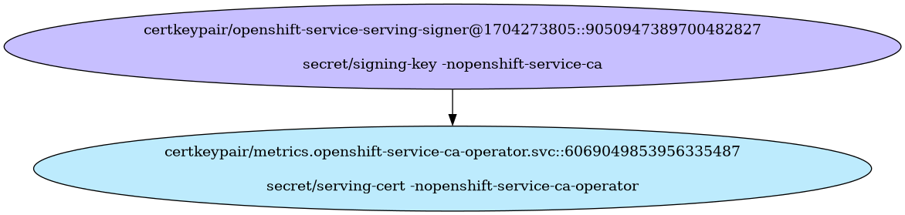

| Property | Value |
| ----------- | ----------- |
| Type | Serving |
| CommonName | metrics.openshift-service-ca-operator.svc |
| SerialNumber | 6069049853956335487 |
| Issuer CommonName | [openshift-service-serving-signer@1704273805](#openshift-service-serving-signer1704273805) |
| Validity | 2y |
| Signature Algorithm | SHA256-RSA |
| PublicKey Algorithm | RSA 2048 bit |
| Usages | - KeyUsageDigitalSignature - KeyUsageKeyEncipherment |
| ExtendedUsages | - ExtKeyUsageServerAuth |
| DNS Names | - metrics.openshift-service-ca-operator.svc - metrics.openshift-service-ca-operator.svc.cluster.local |
| IP Addresses |  |

#### metrics.openshift-service-ca-operator.svc Locations
| Namespace | Secret Name |
| ----------- | ----------- |
| openshift-service-ca-operator | serving-cert |

| File | Permissions | User | Group | SE Linux |
| ----------- | ----------- | ----------- | ----------- | ----------- |

### monitoring-plugin.openshift-monitoring.svc
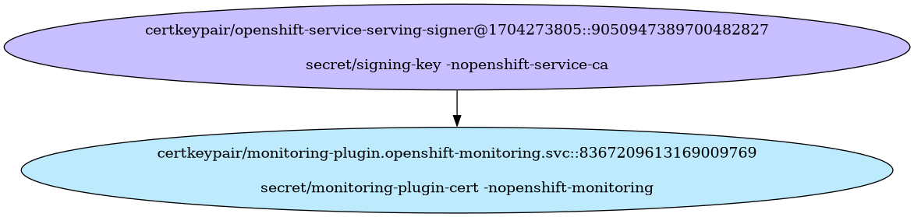

| Property | Value |
| ----------- | ----------- |
| Type | Serving |
| CommonName | monitoring-plugin.openshift-monitoring.svc |
| SerialNumber | 8367209613169009769 |
| Issuer CommonName | [openshift-service-serving-signer@1704273805](#openshift-service-serving-signer1704273805) |
| Validity | 2y |
| Signature Algorithm | SHA256-RSA |
| PublicKey Algorithm | RSA 2048 bit |
| Usages | - KeyUsageDigitalSignature - KeyUsageKeyEncipherment |
| ExtendedUsages | - ExtKeyUsageServerAuth |
| DNS Names | - monitoring-plugin.openshift-monitoring.svc - monitoring-plugin.openshift-monitoring.svc.cluster.local |
| IP Addresses |  |

#### monitoring-plugin.openshift-monitoring.svc Locations
| Namespace | Secret Name |
| ----------- | ----------- |
| openshift-monitoring | monitoring-plugin-cert |

| File | Permissions | User | Group | SE Linux |
| ----------- | ----------- | ----------- | ----------- | ----------- |

### multus-admission-controller.openshift-multus.svc
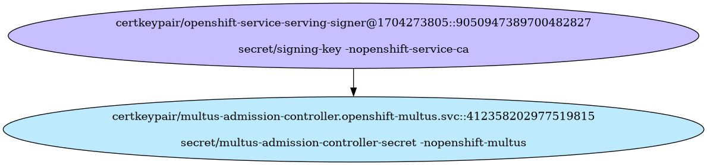

| Property | Value |
| ----------- | ----------- |
| Type | Serving |
| CommonName | multus-admission-controller.openshift-multus.svc |
| SerialNumber | 412358202977519815 |
| Issuer CommonName | [openshift-service-serving-signer@1704273805](#openshift-service-serving-signer1704273805) |
| Validity | 2y |
| Signature Algorithm | SHA256-RSA |
| PublicKey Algorithm | RSA 2048 bit |
| Usages | - KeyUsageDigitalSignature - KeyUsageKeyEncipherment |
| ExtendedUsages | - ExtKeyUsageServerAuth |
| DNS Names | - multus-admission-controller.openshift-multus.svc - multus-admission-controller.openshift-multus.svc.cluster.local |
| IP Addresses |  |

#### multus-admission-controller.openshift-multus.svc Locations
| Namespace | Secret Name |
| ----------- | ----------- |
| openshift-multus | multus-admission-controller-secret |

| File | Permissions | User | Group | SE Linux |
| ----------- | ----------- | ----------- | ----------- | ----------- |

### oauth-openshift.openshift-authentication.svc
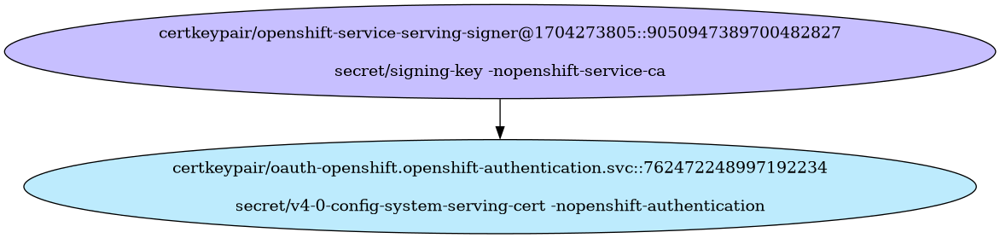

| Property | Value |
| ----------- | ----------- |
| Type | Serving |
| CommonName | oauth-openshift.openshift-authentication.svc |
| SerialNumber | 762472248997192234 |
| Issuer CommonName | [openshift-service-serving-signer@1704273805](#openshift-service-serving-signer1704273805) |
| Validity | 2y |
| Signature Algorithm | SHA256-RSA |
| PublicKey Algorithm | RSA 2048 bit |
| Usages | - KeyUsageDigitalSignature - KeyUsageKeyEncipherment |
| ExtendedUsages | - ExtKeyUsageServerAuth |
| DNS Names | - oauth-openshift.openshift-authentication.svc - oauth-openshift.openshift-authentication.svc.cluster.local |
| IP Addresses |  |

#### oauth-openshift.openshift-authentication.svc Locations
| Namespace | Secret Name |
| ----------- | ----------- |
| openshift-authentication | v4-0-config-system-serving-cert |

| File | Permissions | User | Group | SE Linux |
| ----------- | ----------- | ----------- | ----------- | ----------- |

### olm-operator-metrics.openshift-operator-lifecycle-manager.svc
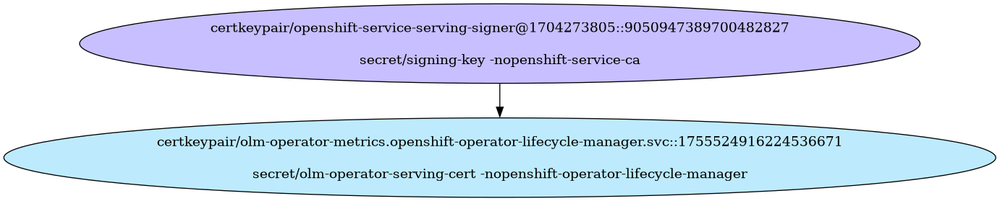

| Property | Value |
| ----------- | ----------- |
| Type | Serving |
| CommonName | olm-operator-metrics.openshift-operator-lifecycle-manager.svc |
| SerialNumber | 1755524916224536671 |
| Issuer CommonName | [openshift-service-serving-signer@1704273805](#openshift-service-serving-signer1704273805) |
| Validity | 2y |
| Signature Algorithm | SHA256-RSA |
| PublicKey Algorithm | RSA 2048 bit |
| Usages | - KeyUsageDigitalSignature - KeyUsageKeyEncipherment |
| ExtendedUsages | - ExtKeyUsageServerAuth |
| DNS Names | - olm-operator-metrics.openshift-operator-lifecycle-manager.svc - olm-operator-metrics.openshift-operator-lifecycle-manager.svc.cluster.local |
| IP Addresses |  |

#### olm-operator-metrics.openshift-operator-lifecycle-manager.svc Locations
| Namespace | Secret Name |
| ----------- | ----------- |
| openshift-operator-lifecycle-manager | olm-operator-serving-cert |

| File | Permissions | User | Group | SE Linux |
| ----------- | ----------- | ----------- | ----------- | ----------- |

### package-server-manager-metrics.openshift-operator-lifecycle-manager.svc
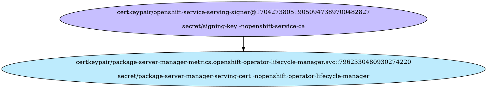

| Property | Value |
| ----------- | ----------- |
| Type | Serving |
| CommonName | package-server-manager-metrics.openshift-operator-lifecycle-manager.svc |
| SerialNumber | 7962330480930274220 |
| Issuer CommonName | [openshift-service-serving-signer@1704273805](#openshift-service-serving-signer1704273805) |
| Validity | 2y |
| Signature Algorithm | SHA256-RSA |
| PublicKey Algorithm | RSA 2048 bit |
| Usages | - KeyUsageDigitalSignature - KeyUsageKeyEncipherment |
| ExtendedUsages | - ExtKeyUsageServerAuth |
| DNS Names | - package-server-manager-metrics.openshift-operator-lifecycle-manager.svc - package-server-manager-metrics.openshift-operator-lifecycle-manager.svc.cluster.local |
| IP Addresses |  |

#### package-server-manager-metrics.openshift-operator-lifecycle-manager.svc Locations
| Namespace | Secret Name |
| ----------- | ----------- |
| openshift-operator-lifecycle-manager | package-server-manager-serving-cert |

| File | Permissions | User | Group | SE Linux |
| ----------- | ----------- | ----------- | ----------- | ----------- |

### performance-addon-operator-service.openshift-cluster-node-tuning-operator.svc
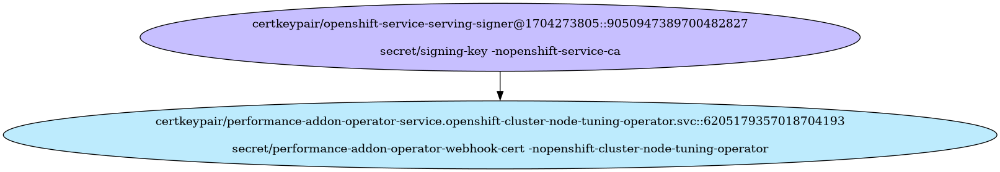

| Property | Value |
| ----------- | ----------- |
| Type | Serving |
| CommonName | performance-addon-operator-service.openshift-cluster-node-tuning-operator.svc |
| SerialNumber | 6205179357018704193 |
| Issuer CommonName | [openshift-service-serving-signer@1704273805](#openshift-service-serving-signer1704273805) |
| Validity | 2y |
| Signature Algorithm | SHA256-RSA |
| PublicKey Algorithm | RSA 2048 bit |
| Usages | - KeyUsageDigitalSignature - KeyUsageKeyEncipherment |
| ExtendedUsages | - ExtKeyUsageServerAuth |
| DNS Names | - performance-addon-operator-service.openshift-cluster-node-tuning-operator.svc - performance-addon-operator-service.openshift-cluster-node-tuning-operator.svc.cluster.local |
| IP Addresses |  |

#### performance-addon-operator-service.openshift-cluster-node-tuning-operator.svc Locations
| Namespace | Secret Name |
| ----------- | ----------- |
| openshift-cluster-node-tuning-operator | performance-addon-operator-webhook-cert |

| File | Permissions | User | Group | SE Linux |
| ----------- | ----------- | ----------- | ----------- | ----------- |

### pod-identity-webhook.openshift-cloud-credential-operator.svc
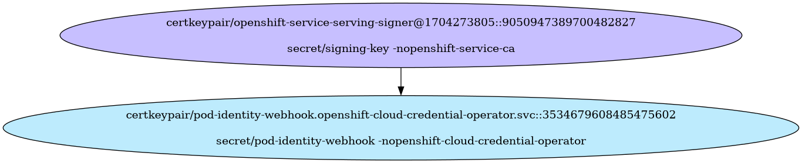

| Property | Value |
| ----------- | ----------- |
| Type | Serving |
| CommonName | pod-identity-webhook.openshift-cloud-credential-operator.svc |
| SerialNumber | 3534679608485475602 |
| Issuer CommonName | [openshift-service-serving-signer@1704273805](#openshift-service-serving-signer1704273805) |
| Validity | 2y |
| Signature Algorithm | SHA256-RSA |
| PublicKey Algorithm | RSA 2048 bit |
| Usages | - KeyUsageDigitalSignature - KeyUsageKeyEncipherment |
| ExtendedUsages | - ExtKeyUsageServerAuth |
| DNS Names | - pod-identity-webhook.openshift-cloud-credential-operator.svc - pod-identity-webhook.openshift-cloud-credential-operator.svc.cluster.local |
| IP Addresses |  |

#### pod-identity-webhook.openshift-cloud-credential-operator.svc Locations
| Namespace | Secret Name |
| ----------- | ----------- |
| openshift-cloud-credential-operator | pod-identity-webhook |

| File | Permissions | User | Group | SE Linux |
| ----------- | ----------- | ----------- | ----------- | ----------- |

### prometheus-adapter.openshift-monitoring.svc

| Property | Value |
| ----------- | ----------- |
| Type | Serving |
| CommonName | prometheus-adapter.openshift-monitoring.svc |
| SerialNumber | 4891356121144781423 |
| Issuer CommonName | [openshift-service-serving-signer@1704273805](#openshift-service-serving-signer1704273805) |
| Validity | 2y |
| Signature Algorithm | SHA256-RSA |
| PublicKey Algorithm | RSA 2048 bit |
| Usages | - KeyUsageDigitalSignature - KeyUsageKeyEncipherment |
| ExtendedUsages | - ExtKeyUsageServerAuth |
| DNS Names | - prometheus-adapter.openshift-monitoring.svc - prometheus-adapter.openshift-monitoring.svc.cluster.local |
| IP Addresses |  |

#### prometheus-adapter.openshift-monitoring.svc Locations
| Namespace | Secret Name |
| ----------- | ----------- |
| openshift-monitoring | prometheus-adapter-tls |

| File | Permissions | User | Group | SE Linux |
| ----------- | ----------- | ----------- | ----------- | ----------- |

### prometheus-k8s.openshift-monitoring.svc
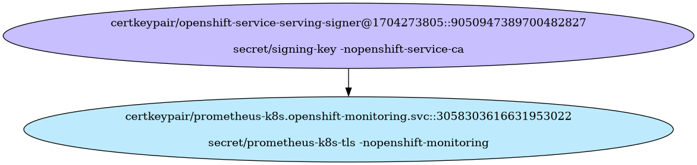

| Property | Value |
| ----------- | ----------- |
| Type | Serving |
| CommonName | prometheus-k8s.openshift-monitoring.svc |
| SerialNumber | 3058303616631953022 |
| Issuer CommonName | [openshift-service-serving-signer@1704273805](#openshift-service-serving-signer1704273805) |
| Validity | 2y |
| Signature Algorithm | SHA256-RSA |
| PublicKey Algorithm | RSA 2048 bit |
| Usages | - KeyUsageDigitalSignature - KeyUsageKeyEncipherment |
| ExtendedUsages | - ExtKeyUsageServerAuth |
| DNS Names | - prometheus-k8s.openshift-monitoring.svc - prometheus-k8s.openshift-monitoring.svc.cluster.local |
| IP Addresses |  |

#### prometheus-k8s.openshift-monitoring.svc Locations
| Namespace | Secret Name |
| ----------- | ----------- |
| openshift-monitoring | prometheus-k8s-tls |

| File | Permissions | User | Group | SE Linux |
| ----------- | ----------- | ----------- | ----------- | ----------- |

### prometheus-operator-admission-webhook.openshift-monitoring.svc
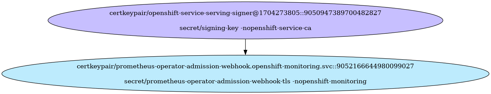

| Property | Value |
| ----------- | ----------- |
| Type | Serving |
| CommonName | prometheus-operator-admission-webhook.openshift-monitoring.svc |
| SerialNumber | 9052166644980099027 |
| Issuer CommonName | [openshift-service-serving-signer@1704273805](#openshift-service-serving-signer1704273805) |
| Validity | 2y |
| Signature Algorithm | SHA256-RSA |
| PublicKey Algorithm | RSA 2048 bit |
| Usages | - KeyUsageDigitalSignature - KeyUsageKeyEncipherment |
| ExtendedUsages | - ExtKeyUsageServerAuth |
| DNS Names | - prometheus-operator-admission-webhook.openshift-monitoring.svc - prometheus-operator-admission-webhook.openshift-monitoring.svc.cluster.local |
| IP Addresses |  |

#### prometheus-operator-admission-webhook.openshift-monitoring.svc Locations
| Namespace | Secret Name |
| ----------- | ----------- |
| openshift-monitoring | prometheus-operator-admission-webhook-tls |

| File | Permissions | User | Group | SE Linux |
| ----------- | ----------- | ----------- | ----------- | ----------- |

### promtail.openshift-e2e-loki.svc
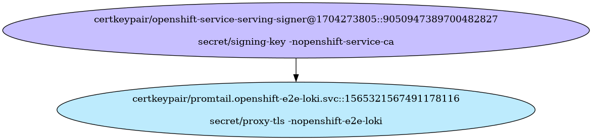

| Property | Value |
| ----------- | ----------- |
| Type | Serving |
| CommonName | promtail.openshift-e2e-loki.svc |
| SerialNumber | 1565321567491178116 |
| Issuer CommonName | [openshift-service-serving-signer@1704273805](#openshift-service-serving-signer1704273805) |
| Validity | 2y |
| Signature Algorithm | SHA256-RSA |
| PublicKey Algorithm | RSA 2048 bit |
| Usages | - KeyUsageDigitalSignature - KeyUsageKeyEncipherment |
| ExtendedUsages | - ExtKeyUsageServerAuth |
| DNS Names | - promtail.openshift-e2e-loki.svc - promtail.openshift-e2e-loki.svc.cluster.local |
| IP Addresses |  |

#### promtail.openshift-e2e-loki.svc Locations
| Namespace | Secret Name |
| ----------- | ----------- |
| openshift-e2e-loki | proxy-tls |

| File | Permissions | User | Group | SE Linux |
| ----------- | ----------- | ----------- | ----------- | ----------- |

### route-controller-manager.openshift-route-controller-manager.svc

| Property | Value |
| ----------- | ----------- |
| Type | Serving |
| CommonName | route-controller-manager.openshift-route-controller-manager.svc |
| SerialNumber | 269974335918590084 |
| Issuer CommonName | [openshift-service-serving-signer@1704273805](#openshift-service-serving-signer1704273805) |
| Validity | 2y |
| Signature Algorithm | SHA256-RSA |
| PublicKey Algorithm | RSA 2048 bit |
| Usages | - KeyUsageDigitalSignature - KeyUsageKeyEncipherment |
| ExtendedUsages | - ExtKeyUsageServerAuth |
| DNS Names | - route-controller-manager.openshift-route-controller-manager.svc - route-controller-manager.openshift-route-controller-manager.svc.cluster.local |
| IP Addresses |  |

#### route-controller-manager.openshift-route-controller-manager.svc Locations
| Namespace | Secret Name |
| ----------- | ----------- |
| openshift-route-controller-manager | serving-cert |

| File | Permissions | User | Group | SE Linux |
| ----------- | ----------- | ----------- | ----------- | ----------- |

### router-internal-default.openshift-ingress.svc
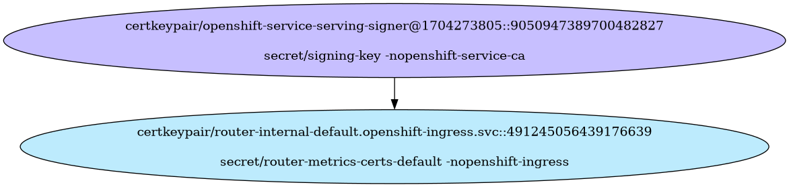

| Property | Value |
| ----------- | ----------- |
| Type | Serving |
| CommonName | router-internal-default.openshift-ingress.svc |
| SerialNumber | 491245056439176639 |
| Issuer CommonName | [openshift-service-serving-signer@1704273805](#openshift-service-serving-signer1704273805) |
| Validity | 2y |
| Signature Algorithm | SHA256-RSA |
| PublicKey Algorithm | RSA 2048 bit |
| Usages | - KeyUsageDigitalSignature - KeyUsageKeyEncipherment |
| ExtendedUsages | - ExtKeyUsageServerAuth |
| DNS Names | - router-internal-default.openshift-ingress.svc - router-internal-default.openshift-ingress.svc.cluster.local |
| IP Addresses |  |

#### router-internal-default.openshift-ingress.svc Locations
| Namespace | Secret Name |
| ----------- | ----------- |
| openshift-ingress | router-metrics-certs-default |

| File | Permissions | User | Group | SE Linux |
| ----------- | ----------- | ----------- | ----------- | ----------- |

### scheduler.openshift-kube-scheduler.svc
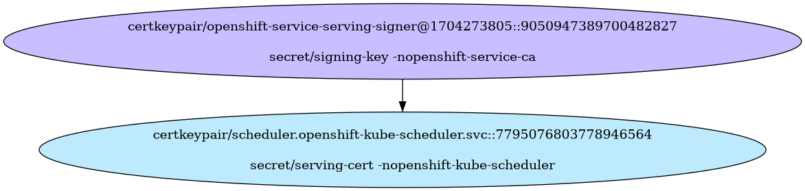

| Property | Value |
| ----------- | ----------- |
| Type | Serving |
| CommonName | scheduler.openshift-kube-scheduler.svc |
| SerialNumber | 7795076803778946564 |
| Issuer CommonName | [openshift-service-serving-signer@1704273805](#openshift-service-serving-signer1704273805) |
| Validity | 2y |
| Signature Algorithm | SHA256-RSA |
| PublicKey Algorithm | RSA 2048 bit |
| Usages | - KeyUsageDigitalSignature - KeyUsageKeyEncipherment |
| ExtendedUsages | - ExtKeyUsageServerAuth |
| DNS Names | - scheduler.openshift-kube-scheduler.svc - scheduler.openshift-kube-scheduler.svc.cluster.local |
| IP Addresses |  |

#### scheduler.openshift-kube-scheduler.svc Locations
| Namespace | Secret Name |
| ----------- | ----------- |
| openshift-kube-scheduler | serving-cert |

| File | Permissions | User | Group | SE Linux |
| ----------- | ----------- | ----------- | ----------- | ----------- |

### thanos-querier.openshift-monitoring.svc
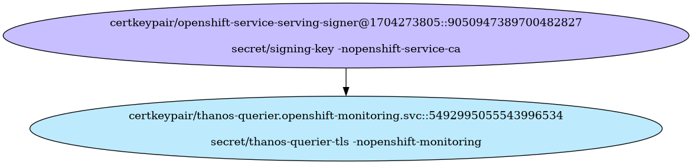

| Property | Value |
| ----------- | ----------- |
| Type | Serving |
| CommonName | thanos-querier.openshift-monitoring.svc |
| SerialNumber | 5492995055543996534 |
| Issuer CommonName | [openshift-service-serving-signer@1704273805](#openshift-service-serving-signer1704273805) |
| Validity | 2y |
| Signature Algorithm | SHA256-RSA |
| PublicKey Algorithm | RSA 2048 bit |
| Usages | - KeyUsageDigitalSignature - KeyUsageKeyEncipherment |
| ExtendedUsages | - ExtKeyUsageServerAuth |
| DNS Names | - thanos-querier.openshift-monitoring.svc - thanos-querier.openshift-monitoring.svc.cluster.local |
| IP Addresses |  |

#### thanos-querier.openshift-monitoring.svc Locations
| Namespace | Secret Name |
| ----------- | ----------- |
| openshift-monitoring | thanos-querier-tls |

| File | Permissions | User | Group | SE Linux |
| ----------- | ----------- | ----------- | ----------- | ----------- |

### webhook.openshift-console-operator.svc
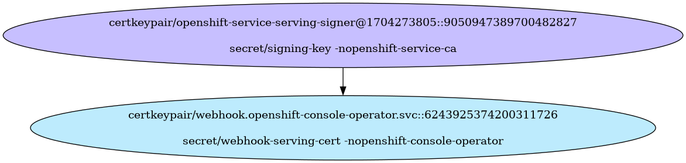

| Property | Value |
| ----------- | ----------- |
| Type | Serving |
| CommonName | webhook.openshift-console-operator.svc |
| SerialNumber | 6243925374200311726 |
| Issuer CommonName | [openshift-service-serving-signer@1704273805](#openshift-service-serving-signer1704273805) |
| Validity | 2y |
| Signature Algorithm | SHA256-RSA |
| PublicKey Algorithm | RSA 2048 bit |
| Usages | - KeyUsageDigitalSignature - KeyUsageKeyEncipherment |
| ExtendedUsages | - ExtKeyUsageServerAuth |
| DNS Names | - webhook.openshift-console-operator.svc - webhook.openshift-console-operator.svc.cluster.local |
| IP Addresses |  |

#### webhook.openshift-console-operator.svc Locations
| Namespace | Secret Name |
| ----------- | ----------- |
| openshift-console-operator | webhook-serving-cert |

| File | Permissions | User | Group | SE Linux |
| ----------- | ----------- | ----------- | ----------- | ----------- |

## Client Certificate/Key Pairs

## Certificates Without Keys

These certificates are present in certificate authority bundles, but do not have keys in the cluster.
This happens when the installer bootstrap clusters with a set of certificate/key pairs that are deleted during the
installation process.

## Certificate Authority Bundles

### openshift-service-serving-signer@1704273805
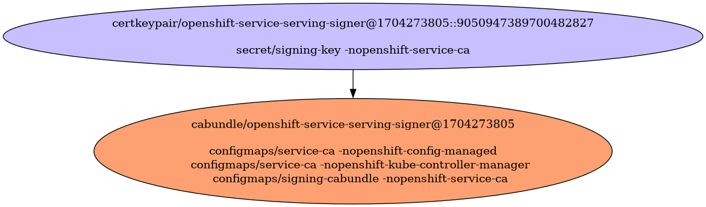

**Bundled Certificates**

| CommonName | Issuer CommonName | Validity | PublicKey Algorithm |
| ----------- | ----------- | ----------- | ----------- |
| [openshift-service-serving-signer@1704273805](#openshift-service-serving-signer1704273805) | [openshift-service-serving-signer@1704273805](#openshift-service-serving-signer1704273805) | 2y60d | RSA 2048 bit |

#### openshift-service-serving-signer@1704273805 Locations
| Namespace | ConfigMap Name |
| ----------- | ----------- |
| openshift-config-managed | service-ca |
| openshift-kube-controller-manager | service-ca |
| openshift-service-ca | signing-cabundle |

| File | Permissions | User | Group | SE Linux |
| ----------- | ----------- | ----------- | ----------- | ----------- |

