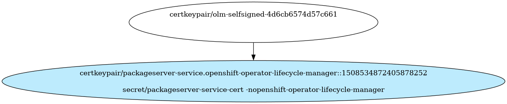

# Unknown OLM package server

Unknown OLM package server

- [Signing Certificate/Key Pairs](#signing-certificatekey-pairs)
- [Serving Certificate/Key Pairs](#serving-certificatekey-pairs)
    - [packageserver-service.openshift-operator-lifecycle-manager](#packageserver-service.openshift-operator-lifecycle-manager)
- [Client Certificate/Key Pairs](#client-certificatekey-pairs)
- [Certificates Without Keys](#certificates-without-keys)
    - [olm-selfsigned-4d6cb6574d57c661](#olm-selfsigned-4d6cb6574d57c661)
- [Certificate Authority Bundles](#certificate-authority-bundles)

## Signing Certificate/Key Pairs

## Serving Certificate/Key Pairs

### packageserver-service.openshift-operator-lifecycle-manager

| Property | Value |
| ----------- | ----------- |
| Type | Serving |
| CommonName | packageserver-service.openshift-operator-lifecycle-manager |
| SerialNumber | 1508534872405878252 |
| Issuer CommonName | olm-selfsigned-4d6cb6574d57c661 |
| Validity | 2y |
| Signature Algorithm | ECDSA-SHA256 |
| PublicKey Algorithm | ECDSA 256 bit, P-256 curve |
| Usages |  |
| ExtendedUsages | - ExtKeyUsageServerAuth |
| DNS Names | - packageserver-service.openshift-operator-lifecycle-manager - packageserver-service.openshift-operator-lifecycle-manager.svc |
| IP Addresses |  |

#### packageserver-service.openshift-operator-lifecycle-manager Locations
| Namespace | Secret Name |
| ----------- | ----------- |
| openshift-operator-lifecycle-manager | packageserver-service-cert |

| File | Permissions | User | Group | SE Linux |
| ----------- | ----------- | ----------- | ----------- | ----------- |

## Client Certificate/Key Pairs

## Certificates Without Keys

These certificates are present in certificate authority bundles, but do not have keys in the cluster.
This happens when the installer bootstrap clusters with a set of certificate/key pairs that are deleted during the
installation process.

### olm-selfsigned-4d6cb6574d57c661

| Property | Value |
| ----------- | ----------- |
| Type |  |
| CommonName | olm-selfsigned-4d6cb6574d57c661 |
| SerialNumber |  |
| Issuer CommonName | None |
| Validity |  |
| Signature Algorithm |  |
| PublicKey Algorithm |   |
| Usages |  |
| ExtendedUsages |  |

#### olm-selfsigned-4d6cb6574d57c661 Locations
| Namespace | Secret Name |
| ----------- | ----------- |

| File | Permissions | User | Group | SE Linux |
| ----------- | ----------- | ----------- | ----------- | ----------- |

## Certificate Authority Bundles

