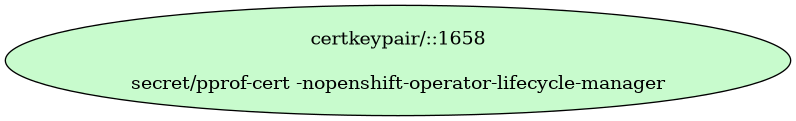

# Unknown OLM pprof

Unknown OLM pprof

- [Signing Certificate/Key Pairs](#signing-certificatekey-pairs)
- [Serving Certificate/Key Pairs](#serving-certificatekey-pairs)
- [Client Certificate/Key Pairs](#client-certificatekey-pairs)
    - 
- [Certificates Without Keys](#certificates-without-keys)
- [Certificate Authority Bundles](#certificate-authority-bundles)

## Signing Certificate/Key Pairs

## Serving Certificate/Key Pairs

## Client Certificate/Key Pairs

### 

| Property | Value |
| ----------- | ----------- |
| Type | Client |
| CommonName |  |
| SerialNumber | 1658 |
| Issuer CommonName |  |
| Validity | 24h |
| Signature Algorithm | SHA256-RSA |
| PublicKey Algorithm | RSA 4096 bit |
| Usages | - KeyUsageDigitalSignature |
| ExtendedUsages | - ExtKeyUsageClientAuth |
| Organizations (User Groups) | - Red Hat, Inc. |

####  Locations
| Namespace | Secret Name |
| ----------- | ----------- |
| openshift-operator-lifecycle-manager | pprof-cert |

| File | Permissions | User | Group | SE Linux |
| ----------- | ----------- | ----------- | ----------- | ----------- |

## Certificates Without Keys

These certificates are present in certificate authority bundles, but do not have keys in the cluster.
This happens when the installer bootstrap clusters with a set of certificate/key pairs that are deleted during the
installation process.

## Certificate Authority Bundles

