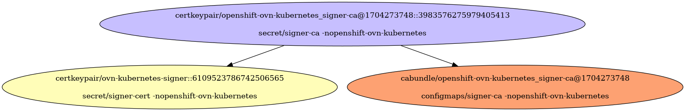
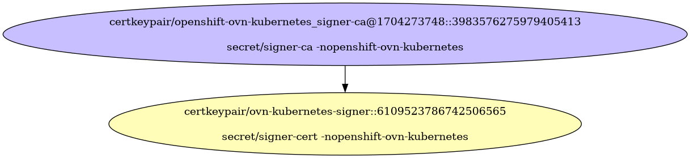
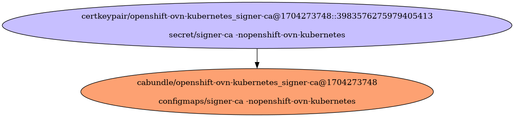

# Unknown OVN 02

Unknown OVN 02

- [Signing Certificate/Key Pairs](#signing-certificatekey-pairs)
    - [openshift-ovn-kubernetes_signer-ca@1704273748](#openshift-ovn-kubernetes_signer-ca1704273748)
- [Serving Certificate/Key Pairs](#serving-certificatekey-pairs)
    - [ovn-kubernetes-signer](#ovn-kubernetes-signer)
- [Client Certificate/Key Pairs](#client-certificatekey-pairs)
    - [ovn-kubernetes-signer](#ovn-kubernetes-signer)
- [Certificates Without Keys](#certificates-without-keys)
- [Certificate Authority Bundles](#certificate-authority-bundles)
    - [openshift-ovn-kubernetes_signer-ca@1704273748](#openshift-ovn-kubernetes_signer-ca1704273748)

## Signing Certificate/Key Pairs

### openshift-ovn-kubernetes_signer-ca@1704273748

| Property | Value |
| ----------- | ----------- |
| Type | Signer |
| CommonName | openshift-ovn-kubernetes_signer-ca@1704273748 |
| SerialNumber | 3983576275979405413 |
| Issuer CommonName | [openshift-ovn-kubernetes_signer-ca@1704273748](#openshift-ovn-kubernetes_signer-ca1704273748) |
| Validity | 10y |
| Signature Algorithm | SHA256-RSA |
| PublicKey Algorithm | RSA 2048 bit |
| Usages | - KeyUsageDigitalSignature - KeyUsageKeyEncipherment - KeyUsageCertSign |
| ExtendedUsages |  |

#### openshift-ovn-kubernetes_signer-ca@1704273748 Locations
| Namespace | Secret Name |
| ----------- | ----------- |
| openshift-ovn-kubernetes | signer-ca |

| File | Permissions | User | Group | SE Linux |
| ----------- | ----------- | ----------- | ----------- | ----------- |

## Serving Certificate/Key Pairs

### ovn-kubernetes-signer

| Property | Value |
| ----------- | ----------- |
| Type | Serving,Client |
| CommonName | ovn-kubernetes-signer |
| SerialNumber | 6109523786742506565 |
| Issuer CommonName | [openshift-ovn-kubernetes_signer-ca@1704273748](#openshift-ovn-kubernetes_signer-ca1704273748) |
| Validity | 182d |
| Signature Algorithm | SHA256-RSA |
| PublicKey Algorithm | RSA 2048 bit |
| Usages | - KeyUsageDigitalSignature - KeyUsageKeyEncipherment |
| ExtendedUsages | - ExtKeyUsageServerAuth - ExtKeyUsageClientAuth |
| Organizations (User Groups) |  |
| DNS Names | - ovn-kubernetes-signer |
| IP Addresses |  |

#### ovn-kubernetes-signer Locations
| Namespace | Secret Name |
| ----------- | ----------- |
| openshift-ovn-kubernetes | signer-cert |

| File | Permissions | User | Group | SE Linux |
| ----------- | ----------- | ----------- | ----------- | ----------- |

## Client Certificate/Key Pairs

### ovn-kubernetes-signer

| Property | Value |
| ----------- | ----------- |
| Type | Serving,Client |
| CommonName | ovn-kubernetes-signer |
| SerialNumber | 6109523786742506565 |
| Issuer CommonName | [openshift-ovn-kubernetes_signer-ca@1704273748](#openshift-ovn-kubernetes_signer-ca1704273748) |
| Validity | 182d |
| Signature Algorithm | SHA256-RSA |
| PublicKey Algorithm | RSA 2048 bit |
| Usages | - KeyUsageDigitalSignature - KeyUsageKeyEncipherment |
| ExtendedUsages | - ExtKeyUsageServerAuth - ExtKeyUsageClientAuth |
| Organizations (User Groups) |  |
| DNS Names | - ovn-kubernetes-signer |
| IP Addresses |  |

#### ovn-kubernetes-signer Locations
| Namespace | Secret Name |
| ----------- | ----------- |
| openshift-ovn-kubernetes | signer-cert |

| File | Permissions | User | Group | SE Linux |
| ----------- | ----------- | ----------- | ----------- | ----------- |

## Certificates Without Keys

These certificates are present in certificate authority bundles, but do not have keys in the cluster.
This happens when the installer bootstrap clusters with a set of certificate/key pairs that are deleted during the
installation process.

## Certificate Authority Bundles

### openshift-ovn-kubernetes_signer-ca@1704273748

**Bundled Certificates**

| CommonName | Issuer CommonName | Validity | PublicKey Algorithm |
| ----------- | ----------- | ----------- | ----------- |
| [openshift-ovn-kubernetes_signer-ca@1704273748](#openshift-ovn-kubernetes_signer-ca1704273748) | [openshift-ovn-kubernetes_signer-ca@1704273748](#openshift-ovn-kubernetes_signer-ca1704273748) | 10y | RSA 2048 bit |

#### openshift-ovn-kubernetes_signer-ca@1704273748 Locations
| Namespace | ConfigMap Name |
| ----------- | ----------- |
| openshift-ovn-kubernetes | signer-ca |

| File | Permissions | User | Group | SE Linux |
| ----------- | ----------- | ----------- | ----------- | ----------- |

