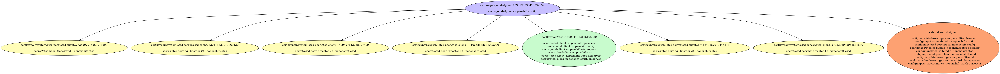
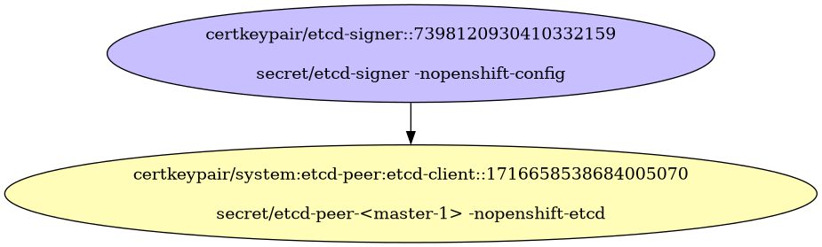
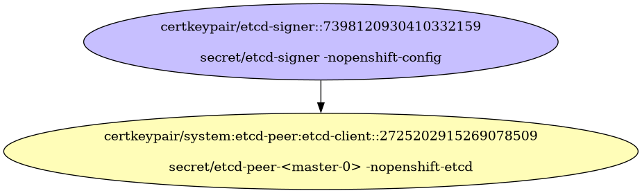
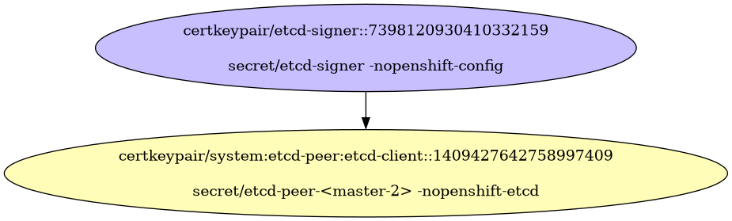
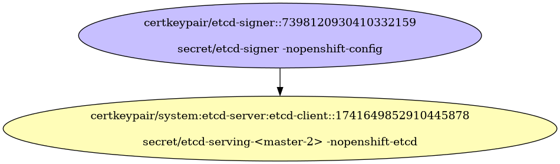
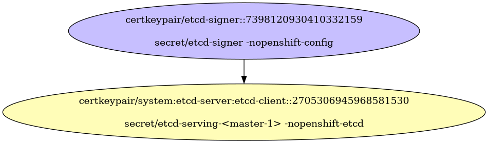
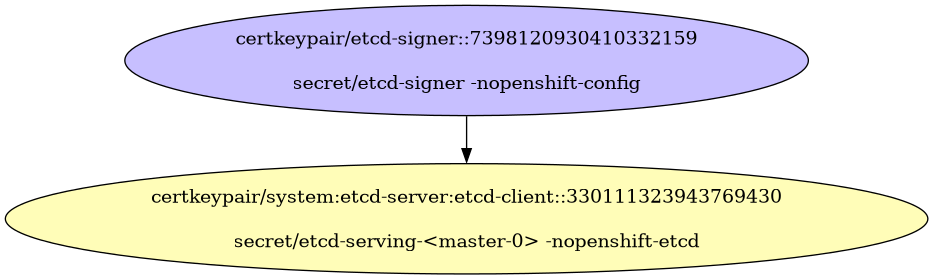
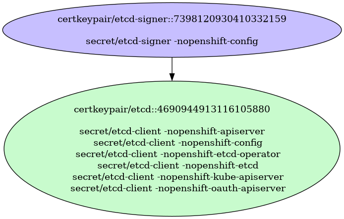
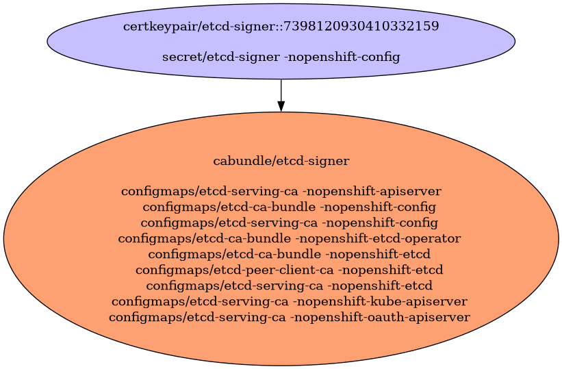

# etcd Certificates

etcd Certificates

- [Signing Certificate/Key Pairs](#signing-certificatekey-pairs)
    - [etcd-signer](#etcd-signer)
- [Serving Certificate/Key Pairs](#serving-certificatekey-pairs)
    - [system:etcd-peer:etcd-client](#systemetcd-peeretcd-client)
    - [system:etcd-peer:etcd-client](#systemetcd-peeretcd-client)
    - [system:etcd-peer:etcd-client](#systemetcd-peeretcd-client)
    - [system:etcd-server:etcd-client](#systemetcd-serveretcd-client)
    - [system:etcd-server:etcd-client](#systemetcd-serveretcd-client)
    - [system:etcd-server:etcd-client](#systemetcd-serveretcd-client)
- [Client Certificate/Key Pairs](#client-certificatekey-pairs)
    - [etcd](#etcd)
    - [system:etcd-peer:etcd-client](#systemetcd-peeretcd-client)
    - [system:etcd-peer:etcd-client](#systemetcd-peeretcd-client)
    - [system:etcd-peer:etcd-client](#systemetcd-peeretcd-client)
    - [system:etcd-server:etcd-client](#systemetcd-serveretcd-client)
    - [system:etcd-server:etcd-client](#systemetcd-serveretcd-client)
    - [system:etcd-server:etcd-client](#systemetcd-serveretcd-client)
- [Certificates Without Keys](#certificates-without-keys)
- [Certificate Authority Bundles](#certificate-authority-bundles)
    - [etcd-signer](#etcd-signer)

## Signing Certificate/Key Pairs

### etcd-signer

| Property | Value |
| ----------- | ----------- |
| Type | Signer |
| CommonName | etcd-signer |
| SerialNumber | 7398120930410332159 |
| Issuer CommonName | [etcd-signer](#etcd-signer) |
| Validity | 10y |
| Signature Algorithm | SHA256-RSA |
| PublicKey Algorithm | RSA 2048 bit |
| Usages | - KeyUsageDigitalSignature - KeyUsageKeyEncipherment - KeyUsageCertSign |
| ExtendedUsages |  |

#### etcd-signer Locations
| Namespace | Secret Name |
| ----------- | ----------- |
| openshift-config | etcd-signer |

| File | Permissions | User | Group | SE Linux |
| ----------- | ----------- | ----------- | ----------- | ----------- |

## Serving Certificate/Key Pairs

### system:etcd-peer:etcd-client

| Property | Value |
| ----------- | ----------- |
| Type | Serving,Client |
| CommonName | system:etcd-peer:etcd-client |
| SerialNumber | 1716658538684005070 |
| Issuer CommonName | [etcd-signer](#etcd-signer) |
| Validity | 3y |
| Signature Algorithm | SHA256-RSA |
| PublicKey Algorithm | RSA 2048 bit |
| Usages | - KeyUsageDigitalSignature - KeyUsageKeyEncipherment |
| ExtendedUsages | - ExtKeyUsageClientAuth - ExtKeyUsageServerAuth |
| Organizations (User Groups) | - system:etcd-peers |
| DNS Names | - localhost - 10.0.44.207 |
| IP Addresses | - 10.0.44.207 |

#### system:etcd-peer:etcd-client Locations
| Namespace | Secret Name |
| ----------- | ----------- |
| openshift-etcd | etcd-peer-<master-1> |

| File | Permissions | User | Group | SE Linux |
| ----------- | ----------- | ----------- | ----------- | ----------- |

### system:etcd-peer:etcd-client

| Property | Value |
| ----------- | ----------- |
| Type | Serving,Client |
| CommonName | system:etcd-peer:etcd-client |
| SerialNumber | 2725202915269078509 |
| Issuer CommonName | [etcd-signer](#etcd-signer) |
| Validity | 3y |
| Signature Algorithm | SHA256-RSA |
| PublicKey Algorithm | RSA 2048 bit |
| Usages | - KeyUsageDigitalSignature - KeyUsageKeyEncipherment |
| ExtendedUsages | - ExtKeyUsageClientAuth - ExtKeyUsageServerAuth |
| Organizations (User Groups) | - system:etcd-peers |
| DNS Names | - localhost - 10.0.30.49 |
| IP Addresses | - 10.0.30.49 |

#### system:etcd-peer:etcd-client Locations
| Namespace | Secret Name |
| ----------- | ----------- |
| openshift-etcd | etcd-peer-<master-0> |

| File | Permissions | User | Group | SE Linux |
| ----------- | ----------- | ----------- | ----------- | ----------- |

### system:etcd-peer:etcd-client

| Property | Value |
| ----------- | ----------- |
| Type | Serving,Client |
| CommonName | system:etcd-peer:etcd-client |
| SerialNumber | 1409427642758997409 |
| Issuer CommonName | [etcd-signer](#etcd-signer) |
| Validity | 3y |
| Signature Algorithm | SHA256-RSA |
| PublicKey Algorithm | RSA 2048 bit |
| Usages | - KeyUsageDigitalSignature - KeyUsageKeyEncipherment |
| ExtendedUsages | - ExtKeyUsageClientAuth - ExtKeyUsageServerAuth |
| Organizations (User Groups) | - system:etcd-peers |
| DNS Names | - localhost - 10.0.85.216 |
| IP Addresses | - 10.0.85.216 |

#### system:etcd-peer:etcd-client Locations
| Namespace | Secret Name |
| ----------- | ----------- |
| openshift-etcd | etcd-peer-<master-2> |

| File | Permissions | User | Group | SE Linux |
| ----------- | ----------- | ----------- | ----------- | ----------- |

### system:etcd-server:etcd-client

| Property | Value |
| ----------- | ----------- |
| Type | Serving,Client |
| CommonName | system:etcd-server:etcd-client |
| SerialNumber | 1741649852910445878 |
| Issuer CommonName | [etcd-signer](#etcd-signer) |
| Validity | 3y |
| Signature Algorithm | SHA256-RSA |
| PublicKey Algorithm | RSA 2048 bit |
| Usages | - KeyUsageDigitalSignature - KeyUsageKeyEncipherment |
| ExtendedUsages | - ExtKeyUsageClientAuth - ExtKeyUsageServerAuth |
| Organizations (User Groups) | - system:etcd-servers |
| DNS Names | - etcd.kube-system.svc - etcd.kube-system.svc.cluster.local - etcd.openshift-etcd.svc - etcd.openshift-etcd.svc.cluster.local - localhost - ::1 - 10.0.85.216 - 127.0.0.1 - ::1 |
| IP Addresses | - ::1 - 10.0.85.216 - 127.0.0.1 - ::1 |

#### system:etcd-server:etcd-client Locations
| Namespace | Secret Name |
| ----------- | ----------- |
| openshift-etcd | etcd-serving-<master-2> |

| File | Permissions | User | Group | SE Linux |
| ----------- | ----------- | ----------- | ----------- | ----------- |

### system:etcd-server:etcd-client

| Property | Value |
| ----------- | ----------- |
| Type | Serving,Client |
| CommonName | system:etcd-server:etcd-client |
| SerialNumber | 2705306945968581530 |
| Issuer CommonName | [etcd-signer](#etcd-signer) |
| Validity | 3y |
| Signature Algorithm | SHA256-RSA |
| PublicKey Algorithm | RSA 2048 bit |
| Usages | - KeyUsageDigitalSignature - KeyUsageKeyEncipherment |
| ExtendedUsages | - ExtKeyUsageClientAuth - ExtKeyUsageServerAuth |
| Organizations (User Groups) | - system:etcd-servers |
| DNS Names | - etcd.kube-system.svc - etcd.kube-system.svc.cluster.local - etcd.openshift-etcd.svc - etcd.openshift-etcd.svc.cluster.local - localhost - ::1 - 10.0.44.207 - 127.0.0.1 - ::1 |
| IP Addresses | - ::1 - 10.0.44.207 - 127.0.0.1 - ::1 |

#### system:etcd-server:etcd-client Locations
| Namespace | Secret Name |
| ----------- | ----------- |
| openshift-etcd | etcd-serving-<master-1> |

| File | Permissions | User | Group | SE Linux |
| ----------- | ----------- | ----------- | ----------- | ----------- |

### system:etcd-server:etcd-client

| Property | Value |
| ----------- | ----------- |
| Type | Serving,Client |
| CommonName | system:etcd-server:etcd-client |
| SerialNumber | 330111323943769430 |
| Issuer CommonName | [etcd-signer](#etcd-signer) |
| Validity | 3y |
| Signature Algorithm | SHA256-RSA |
| PublicKey Algorithm | RSA 2048 bit |
| Usages | - KeyUsageDigitalSignature - KeyUsageKeyEncipherment |
| ExtendedUsages | - ExtKeyUsageClientAuth - ExtKeyUsageServerAuth |
| Organizations (User Groups) | - system:etcd-servers |
| DNS Names | - etcd.kube-system.svc - etcd.kube-system.svc.cluster.local - etcd.openshift-etcd.svc - etcd.openshift-etcd.svc.cluster.local - localhost - ::1 - 10.0.30.49 - 127.0.0.1 - ::1 |
| IP Addresses | - ::1 - 10.0.30.49 - 127.0.0.1 - ::1 |

#### system:etcd-server:etcd-client Locations
| Namespace | Secret Name |
| ----------- | ----------- |
| openshift-etcd | etcd-serving-<master-0> |

| File | Permissions | User | Group | SE Linux |
| ----------- | ----------- | ----------- | ----------- | ----------- |

## Client Certificate/Key Pairs

### etcd

| Property | Value |
| ----------- | ----------- |
| Type | Client |
| CommonName | etcd |
| SerialNumber | 4690944913116105880 |
| Issuer CommonName | [etcd-signer](#etcd-signer) |
| Validity | 10y |
| Signature Algorithm | SHA256-RSA |
| PublicKey Algorithm | RSA 2048 bit |
| Usages | - KeyUsageDigitalSignature - KeyUsageKeyEncipherment |
| ExtendedUsages | - ExtKeyUsageClientAuth |
| Organizations (User Groups) | - etcd |

#### etcd Locations
| Namespace | Secret Name |
| ----------- | ----------- |
| openshift-apiserver | etcd-client |
| openshift-config | etcd-client |
| openshift-etcd-operator | etcd-client |
| openshift-etcd | etcd-client |
| openshift-kube-apiserver | etcd-client |
| openshift-oauth-apiserver | etcd-client |

| File | Permissions | User | Group | SE Linux |
| ----------- | ----------- | ----------- | ----------- | ----------- |

### system:etcd-peer:etcd-client

| Property | Value |
| ----------- | ----------- |
| Type | Serving,Client |
| CommonName | system:etcd-peer:etcd-client |
| SerialNumber | 1716658538684005070 |
| Issuer CommonName | [etcd-signer](#etcd-signer) |
| Validity | 3y |
| Signature Algorithm | SHA256-RSA |
| PublicKey Algorithm | RSA 2048 bit |
| Usages | - KeyUsageDigitalSignature - KeyUsageKeyEncipherment |
| ExtendedUsages | - ExtKeyUsageClientAuth - ExtKeyUsageServerAuth |
| Organizations (User Groups) | - system:etcd-peers |
| DNS Names | - localhost - 10.0.44.207 |
| IP Addresses | - 10.0.44.207 |

#### system:etcd-peer:etcd-client Locations
| Namespace | Secret Name |
| ----------- | ----------- |
| openshift-etcd | etcd-peer-<master-1> |

| File | Permissions | User | Group | SE Linux |
| ----------- | ----------- | ----------- | ----------- | ----------- |

### system:etcd-peer:etcd-client

| Property | Value |
| ----------- | ----------- |
| Type | Serving,Client |
| CommonName | system:etcd-peer:etcd-client |
| SerialNumber | 2725202915269078509 |
| Issuer CommonName | [etcd-signer](#etcd-signer) |
| Validity | 3y |
| Signature Algorithm | SHA256-RSA |
| PublicKey Algorithm | RSA 2048 bit |
| Usages | - KeyUsageDigitalSignature - KeyUsageKeyEncipherment |
| ExtendedUsages | - ExtKeyUsageClientAuth - ExtKeyUsageServerAuth |
| Organizations (User Groups) | - system:etcd-peers |
| DNS Names | - localhost - 10.0.30.49 |
| IP Addresses | - 10.0.30.49 |

#### system:etcd-peer:etcd-client Locations
| Namespace | Secret Name |
| ----------- | ----------- |
| openshift-etcd | etcd-peer-<master-0> |

| File | Permissions | User | Group | SE Linux |
| ----------- | ----------- | ----------- | ----------- | ----------- |

### system:etcd-peer:etcd-client

| Property | Value |
| ----------- | ----------- |
| Type | Serving,Client |
| CommonName | system:etcd-peer:etcd-client |
| SerialNumber | 1409427642758997409 |
| Issuer CommonName | [etcd-signer](#etcd-signer) |
| Validity | 3y |
| Signature Algorithm | SHA256-RSA |
| PublicKey Algorithm | RSA 2048 bit |
| Usages | - KeyUsageDigitalSignature - KeyUsageKeyEncipherment |
| ExtendedUsages | - ExtKeyUsageClientAuth - ExtKeyUsageServerAuth |
| Organizations (User Groups) | - system:etcd-peers |
| DNS Names | - localhost - 10.0.85.216 |
| IP Addresses | - 10.0.85.216 |

#### system:etcd-peer:etcd-client Locations
| Namespace | Secret Name |
| ----------- | ----------- |
| openshift-etcd | etcd-peer-<master-2> |

| File | Permissions | User | Group | SE Linux |
| ----------- | ----------- | ----------- | ----------- | ----------- |

### system:etcd-server:etcd-client

| Property | Value |
| ----------- | ----------- |
| Type | Serving,Client |
| CommonName | system:etcd-server:etcd-client |
| SerialNumber | 1741649852910445878 |
| Issuer CommonName | [etcd-signer](#etcd-signer) |
| Validity | 3y |
| Signature Algorithm | SHA256-RSA |
| PublicKey Algorithm | RSA 2048 bit |
| Usages | - KeyUsageDigitalSignature - KeyUsageKeyEncipherment |
| ExtendedUsages | - ExtKeyUsageClientAuth - ExtKeyUsageServerAuth |
| Organizations (User Groups) | - system:etcd-servers |
| DNS Names | - etcd.kube-system.svc - etcd.kube-system.svc.cluster.local - etcd.openshift-etcd.svc - etcd.openshift-etcd.svc.cluster.local - localhost - ::1 - 10.0.85.216 - 127.0.0.1 - ::1 |
| IP Addresses | - ::1 - 10.0.85.216 - 127.0.0.1 - ::1 |

#### system:etcd-server:etcd-client Locations
| Namespace | Secret Name |
| ----------- | ----------- |
| openshift-etcd | etcd-serving-<master-2> |

| File | Permissions | User | Group | SE Linux |
| ----------- | ----------- | ----------- | ----------- | ----------- |

### system:etcd-server:etcd-client

| Property | Value |
| ----------- | ----------- |
| Type | Serving,Client |
| CommonName | system:etcd-server:etcd-client |
| SerialNumber | 2705306945968581530 |
| Issuer CommonName | [etcd-signer](#etcd-signer) |
| Validity | 3y |
| Signature Algorithm | SHA256-RSA |
| PublicKey Algorithm | RSA 2048 bit |
| Usages | - KeyUsageDigitalSignature - KeyUsageKeyEncipherment |
| ExtendedUsages | - ExtKeyUsageClientAuth - ExtKeyUsageServerAuth |
| Organizations (User Groups) | - system:etcd-servers |
| DNS Names | - etcd.kube-system.svc - etcd.kube-system.svc.cluster.local - etcd.openshift-etcd.svc - etcd.openshift-etcd.svc.cluster.local - localhost - ::1 - 10.0.44.207 - 127.0.0.1 - ::1 |
| IP Addresses | - ::1 - 10.0.44.207 - 127.0.0.1 - ::1 |

#### system:etcd-server:etcd-client Locations
| Namespace | Secret Name |
| ----------- | ----------- |
| openshift-etcd | etcd-serving-<master-1> |

| File | Permissions | User | Group | SE Linux |
| ----------- | ----------- | ----------- | ----------- | ----------- |

### system:etcd-server:etcd-client

| Property | Value |
| ----------- | ----------- |
| Type | Serving,Client |
| CommonName | system:etcd-server:etcd-client |
| SerialNumber | 330111323943769430 |
| Issuer CommonName | [etcd-signer](#etcd-signer) |
| Validity | 3y |
| Signature Algorithm | SHA256-RSA |
| PublicKey Algorithm | RSA 2048 bit |
| Usages | - KeyUsageDigitalSignature - KeyUsageKeyEncipherment |
| ExtendedUsages | - ExtKeyUsageClientAuth - ExtKeyUsageServerAuth |
| Organizations (User Groups) | - system:etcd-servers |
| DNS Names | - etcd.kube-system.svc - etcd.kube-system.svc.cluster.local - etcd.openshift-etcd.svc - etcd.openshift-etcd.svc.cluster.local - localhost - ::1 - 10.0.30.49 - 127.0.0.1 - ::1 |
| IP Addresses | - ::1 - 10.0.30.49 - 127.0.0.1 - ::1 |

#### system:etcd-server:etcd-client Locations
| Namespace | Secret Name |
| ----------- | ----------- |
| openshift-etcd | etcd-serving-<master-0> |

| File | Permissions | User | Group | SE Linux |
| ----------- | ----------- | ----------- | ----------- | ----------- |

## Certificates Without Keys

These certificates are present in certificate authority bundles, but do not have keys in the cluster.
This happens when the installer bootstrap clusters with a set of certificate/key pairs that are deleted during the
installation process.

## Certificate Authority Bundles

### etcd-signer

**Bundled Certificates**

| CommonName | Issuer CommonName | Validity | PublicKey Algorithm |
| ----------- | ----------- | ----------- | ----------- |
| [etcd-signer](#etcd-signer) | [etcd-signer](#etcd-signer) | 10y | RSA 2048 bit |

#### etcd-signer Locations
| Namespace | ConfigMap Name |
| ----------- | ----------- |
| openshift-apiserver | etcd-serving-ca |
| openshift-config | etcd-ca-bundle |
| openshift-config | etcd-serving-ca |
| openshift-etcd-operator | etcd-ca-bundle |
| openshift-etcd | etcd-ca-bundle |
| openshift-etcd | etcd-peer-client-ca |
| openshift-etcd | etcd-serving-ca |
| openshift-kube-apiserver | etcd-serving-ca |
| openshift-oauth-apiserver | etcd-serving-ca |

| File | Permissions | User | Group | SE Linux |
| ----------- | ----------- | ----------- | ----------- | ----------- |

