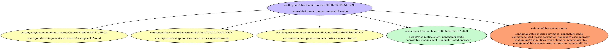
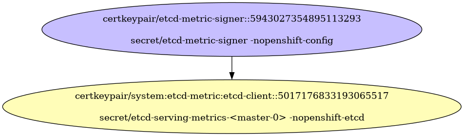
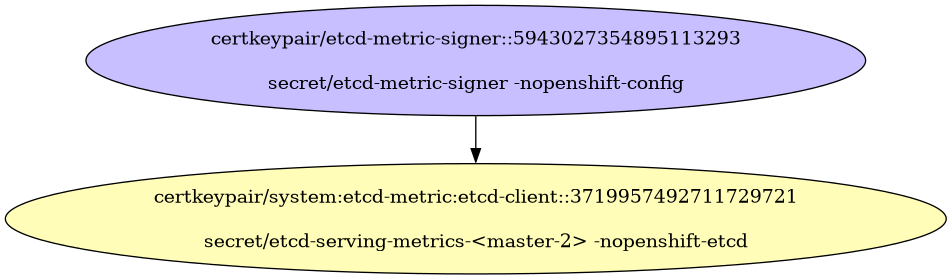
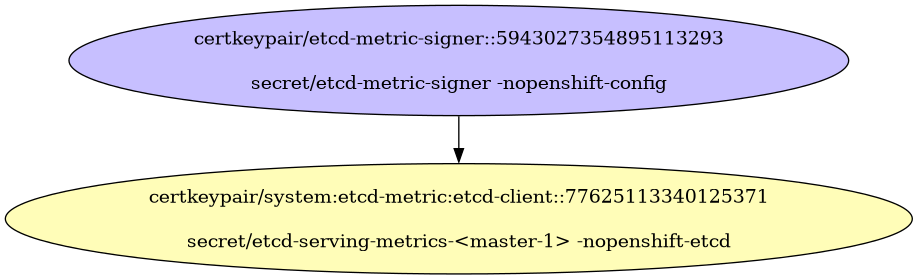
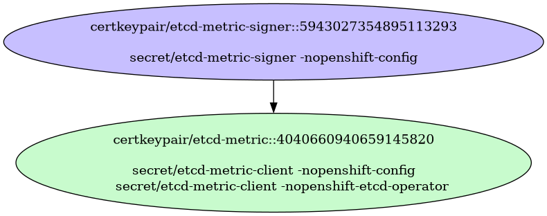
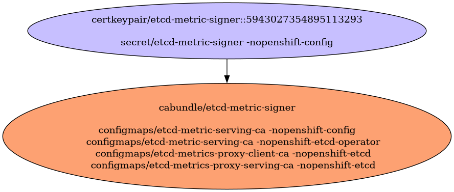

# etcd Metrics Certificates

etcd Metrics Certificates

- [Signing Certificate/Key Pairs](#signing-certificatekey-pairs)
    - [etcd-metric-signer](#etcd-metric-signer)
- [Serving Certificate/Key Pairs](#serving-certificatekey-pairs)
    - [system:etcd-metric:etcd-client](#systemetcd-metricetcd-client)
    - [system:etcd-metric:etcd-client](#systemetcd-metricetcd-client)
    - [system:etcd-metric:etcd-client](#systemetcd-metricetcd-client)
- [Client Certificate/Key Pairs](#client-certificatekey-pairs)
    - [etcd-metric](#etcd-metric)
    - [system:etcd-metric:etcd-client](#systemetcd-metricetcd-client)
    - [system:etcd-metric:etcd-client](#systemetcd-metricetcd-client)
    - [system:etcd-metric:etcd-client](#systemetcd-metricetcd-client)
- [Certificates Without Keys](#certificates-without-keys)
- [Certificate Authority Bundles](#certificate-authority-bundles)
    - [etcd-metric-signer](#etcd-metric-signer)

## Signing Certificate/Key Pairs

### etcd-metric-signer

| Property | Value |
| ----------- | ----------- |
| Type | Signer |
| CommonName | etcd-metric-signer |
| SerialNumber | 5943027354895113293 |
| Issuer CommonName | [etcd-metric-signer](#etcd-metric-signer) |
| Validity | 10y |
| Signature Algorithm | SHA256-RSA |
| PublicKey Algorithm | RSA 2048 bit |
| Usages | - KeyUsageDigitalSignature - KeyUsageKeyEncipherment - KeyUsageCertSign |
| ExtendedUsages |  |

#### etcd-metric-signer Locations
| Namespace | Secret Name |
| ----------- | ----------- |
| openshift-config | etcd-metric-signer |

| File | Permissions | User | Group | SE Linux |
| ----------- | ----------- | ----------- | ----------- | ----------- |

## Serving Certificate/Key Pairs

### system:etcd-metric:etcd-client

| Property | Value |
| ----------- | ----------- |
| Type | Serving,Client |
| CommonName | system:etcd-metric:etcd-client |
| SerialNumber | 5017176833193065517 |
| Issuer CommonName | [etcd-metric-signer](#etcd-metric-signer) |
| Validity | 3y |
| Signature Algorithm | SHA256-RSA |
| PublicKey Algorithm | RSA 2048 bit |
| Usages | - KeyUsageDigitalSignature - KeyUsageKeyEncipherment |
| ExtendedUsages | - ExtKeyUsageClientAuth - ExtKeyUsageServerAuth |
| Organizations (User Groups) | - system:etcd-metrics |
| DNS Names | - etcd.kube-system.svc - etcd.kube-system.svc.cluster.local - etcd.openshift-etcd.svc - etcd.openshift-etcd.svc.cluster.local - localhost - ::1 - 10.0.30.49 - 127.0.0.1 - ::1 |
| IP Addresses | - ::1 - 10.0.30.49 - 127.0.0.1 - ::1 |

#### system:etcd-metric:etcd-client Locations
| Namespace | Secret Name |
| ----------- | ----------- |
| openshift-etcd | etcd-serving-metrics-<master-0> |

| File | Permissions | User | Group | SE Linux |
| ----------- | ----------- | ----------- | ----------- | ----------- |

### system:etcd-metric:etcd-client

| Property | Value |
| ----------- | ----------- |
| Type | Serving,Client |
| CommonName | system:etcd-metric:etcd-client |
| SerialNumber | 3719957492711729721 |
| Issuer CommonName | [etcd-metric-signer](#etcd-metric-signer) |
| Validity | 3y |
| Signature Algorithm | SHA256-RSA |
| PublicKey Algorithm | RSA 2048 bit |
| Usages | - KeyUsageDigitalSignature - KeyUsageKeyEncipherment |
| ExtendedUsages | - ExtKeyUsageClientAuth - ExtKeyUsageServerAuth |
| Organizations (User Groups) | - system:etcd-metrics |
| DNS Names | - etcd.kube-system.svc - etcd.kube-system.svc.cluster.local - etcd.openshift-etcd.svc - etcd.openshift-etcd.svc.cluster.local - localhost - ::1 - 10.0.85.216 - 127.0.0.1 - ::1 |
| IP Addresses | - ::1 - 10.0.85.216 - 127.0.0.1 - ::1 |

#### system:etcd-metric:etcd-client Locations
| Namespace | Secret Name |
| ----------- | ----------- |
| openshift-etcd | etcd-serving-metrics-<master-2> |

| File | Permissions | User | Group | SE Linux |
| ----------- | ----------- | ----------- | ----------- | ----------- |

### system:etcd-metric:etcd-client

| Property | Value |
| ----------- | ----------- |
| Type | Serving,Client |
| CommonName | system:etcd-metric:etcd-client |
| SerialNumber | 77625113340125371 |
| Issuer CommonName | [etcd-metric-signer](#etcd-metric-signer) |
| Validity | 3y |
| Signature Algorithm | SHA256-RSA |
| PublicKey Algorithm | RSA 2048 bit |
| Usages | - KeyUsageDigitalSignature - KeyUsageKeyEncipherment |
| ExtendedUsages | - ExtKeyUsageClientAuth - ExtKeyUsageServerAuth |
| Organizations (User Groups) | - system:etcd-metrics |
| DNS Names | - etcd.kube-system.svc - etcd.kube-system.svc.cluster.local - etcd.openshift-etcd.svc - etcd.openshift-etcd.svc.cluster.local - localhost - ::1 - 10.0.44.207 - 127.0.0.1 - ::1 |
| IP Addresses | - ::1 - 10.0.44.207 - 127.0.0.1 - ::1 |

#### system:etcd-metric:etcd-client Locations
| Namespace | Secret Name |
| ----------- | ----------- |
| openshift-etcd | etcd-serving-metrics-<master-1> |

| File | Permissions | User | Group | SE Linux |
| ----------- | ----------- | ----------- | ----------- | ----------- |

## Client Certificate/Key Pairs

### etcd-metric

| Property | Value |
| ----------- | ----------- |
| Type | Client |
| CommonName | etcd-metric |
| SerialNumber | 4040660940659145820 |
| Issuer CommonName | [etcd-metric-signer](#etcd-metric-signer) |
| Validity | 10y |
| Signature Algorithm | SHA256-RSA |
| PublicKey Algorithm | RSA 2048 bit |
| Usages | - KeyUsageDigitalSignature - KeyUsageKeyEncipherment |
| ExtendedUsages | - ExtKeyUsageClientAuth |
| Organizations (User Groups) | - etcd-metric |

#### etcd-metric Locations
| Namespace | Secret Name |
| ----------- | ----------- |
| openshift-config | etcd-metric-client |
| openshift-etcd-operator | etcd-metric-client |

| File | Permissions | User | Group | SE Linux |
| ----------- | ----------- | ----------- | ----------- | ----------- |

### system:etcd-metric:etcd-client

| Property | Value |
| ----------- | ----------- |
| Type | Serving,Client |
| CommonName | system:etcd-metric:etcd-client |
| SerialNumber | 5017176833193065517 |
| Issuer CommonName | [etcd-metric-signer](#etcd-metric-signer) |
| Validity | 3y |
| Signature Algorithm | SHA256-RSA |
| PublicKey Algorithm | RSA 2048 bit |
| Usages | - KeyUsageDigitalSignature - KeyUsageKeyEncipherment |
| ExtendedUsages | - ExtKeyUsageClientAuth - ExtKeyUsageServerAuth |
| Organizations (User Groups) | - system:etcd-metrics |
| DNS Names | - etcd.kube-system.svc - etcd.kube-system.svc.cluster.local - etcd.openshift-etcd.svc - etcd.openshift-etcd.svc.cluster.local - localhost - ::1 - 10.0.30.49 - 127.0.0.1 - ::1 |
| IP Addresses | - ::1 - 10.0.30.49 - 127.0.0.1 - ::1 |

#### system:etcd-metric:etcd-client Locations
| Namespace | Secret Name |
| ----------- | ----------- |
| openshift-etcd | etcd-serving-metrics-<master-0> |

| File | Permissions | User | Group | SE Linux |
| ----------- | ----------- | ----------- | ----------- | ----------- |

### system:etcd-metric:etcd-client

| Property | Value |
| ----------- | ----------- |
| Type | Serving,Client |
| CommonName | system:etcd-metric:etcd-client |
| SerialNumber | 3719957492711729721 |
| Issuer CommonName | [etcd-metric-signer](#etcd-metric-signer) |
| Validity | 3y |
| Signature Algorithm | SHA256-RSA |
| PublicKey Algorithm | RSA 2048 bit |
| Usages | - KeyUsageDigitalSignature - KeyUsageKeyEncipherment |
| ExtendedUsages | - ExtKeyUsageClientAuth - ExtKeyUsageServerAuth |
| Organizations (User Groups) | - system:etcd-metrics |
| DNS Names | - etcd.kube-system.svc - etcd.kube-system.svc.cluster.local - etcd.openshift-etcd.svc - etcd.openshift-etcd.svc.cluster.local - localhost - ::1 - 10.0.85.216 - 127.0.0.1 - ::1 |
| IP Addresses | - ::1 - 10.0.85.216 - 127.0.0.1 - ::1 |

#### system:etcd-metric:etcd-client Locations
| Namespace | Secret Name |
| ----------- | ----------- |
| openshift-etcd | etcd-serving-metrics-<master-2> |

| File | Permissions | User | Group | SE Linux |
| ----------- | ----------- | ----------- | ----------- | ----------- |

### system:etcd-metric:etcd-client

| Property | Value |
| ----------- | ----------- |
| Type | Serving,Client |
| CommonName | system:etcd-metric:etcd-client |
| SerialNumber | 77625113340125371 |
| Issuer CommonName | [etcd-metric-signer](#etcd-metric-signer) |
| Validity | 3y |
| Signature Algorithm | SHA256-RSA |
| PublicKey Algorithm | RSA 2048 bit |
| Usages | - KeyUsageDigitalSignature - KeyUsageKeyEncipherment |
| ExtendedUsages | - ExtKeyUsageClientAuth - ExtKeyUsageServerAuth |
| Organizations (User Groups) | - system:etcd-metrics |
| DNS Names | - etcd.kube-system.svc - etcd.kube-system.svc.cluster.local - etcd.openshift-etcd.svc - etcd.openshift-etcd.svc.cluster.local - localhost - ::1 - 10.0.44.207 - 127.0.0.1 - ::1 |
| IP Addresses | - ::1 - 10.0.44.207 - 127.0.0.1 - ::1 |

#### system:etcd-metric:etcd-client Locations
| Namespace | Secret Name |
| ----------- | ----------- |
| openshift-etcd | etcd-serving-metrics-<master-1> |

| File | Permissions | User | Group | SE Linux |
| ----------- | ----------- | ----------- | ----------- | ----------- |

## Certificates Without Keys

These certificates are present in certificate authority bundles, but do not have keys in the cluster.
This happens when the installer bootstrap clusters with a set of certificate/key pairs that are deleted during the
installation process.

## Certificate Authority Bundles

### etcd-metric-signer

**Bundled Certificates**

| CommonName | Issuer CommonName | Validity | PublicKey Algorithm |
| ----------- | ----------- | ----------- | ----------- |
| [etcd-metric-signer](#etcd-metric-signer) | [etcd-metric-signer](#etcd-metric-signer) | 10y | RSA 2048 bit |

#### etcd-metric-signer Locations
| Namespace | ConfigMap Name |
| ----------- | ----------- |
| openshift-config | etcd-metric-serving-ca |
| openshift-etcd-operator | etcd-metric-serving-ca |
| openshift-etcd | etcd-metrics-proxy-client-ca |
| openshift-etcd | etcd-metrics-proxy-serving-ca |

| File | Permissions | User | Group | SE Linux |
| ----------- | ----------- | ----------- | ----------- | ----------- |

