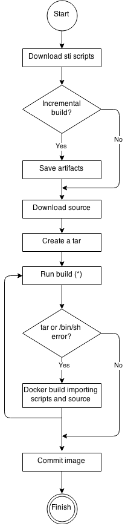

# s2i builder image requirements

The main advantage of using s2i for building reproducible docker images is ease
of use for developers. To meet that criteria you, as a builder image author,
should be aware of the two basic requirements for the best possible s2i
performance. These are:

* [required image contents](#required-image-contents)
* [s2i scripts](#s2i-scripts)


# Required image contents

The build process consists of three fundamental elements which are combined into the
final docker image. These are: source code, s2i scripts, and the builder image. During the
build process s2i must place sources and scripts inside that builder image. To do
so s2i creates a tar file containing the two and then streams that file into the
builder image. Before executing the `assemble` script, s2i untars that file and places
its contents into the destination specified with either the `--destination` flag or the value of
the `io.openshift.s2i.destination` label set in the builder image (the default destination is `/tmp`).
If your image does not have either `tar` or `/bin/sh` the s2i build will perform an additional
docker build to place the source code and scripts into an appropriate image and then run
the normal s2i build.

The following diagram illustrates the build workflow:



\* Run build's responsibility is to untar the sources, scripts and (optionally) artifacts
and invoke the `assemble` script. If this is the second run after any previous runs with
`tar`/`/bin/sh` errors, it will only run the `assemble` script, since both the source and
scripts are already present.


# s2i scripts

`s2i` expects you (the builder image author) to supply the following scripts:

* required:
    * [assemble](#assemble)
    * [run](#run)
* optional:
    * [save-artifacts](#save-artifacts)
    * [usage](#usage)
    * [test/run](#testrun)

All of the scripts can be written in any programming language, as long as the scripts
are executable inside the builder image. The build searches the following locations for
these scripts in the following order:

1. A script found at the `--scripts-url` URL
1. A script found in the application source `.s2i/bin` directory
1. A script found at the default image URL (`io.openshift.s2i.scripts-url` label)

Both the `io.openshift.s2i.scripts-url` label specified in the image and `--scripts-url` flag
can be supplied in any of the following forms to indicate where the scripts are located:

* `image://path_to_scripts_dir` - absolute path inside the image
* `file://path_to_scripts_dir` - relative or absolute path on the host machine
* `http(s)://path_to_scripts_dir` - URL to a directory

**NOTE**: In the case where the scripts are already placed inside the image (ie when
using `--scripts-url` flag or the `io.openshift.s2i.scripts-url` with the format
`image:///path/in/image`), then the `--destination` flag or the `io.openshift.s2i.destination`
label applies only to sources and artifacts.

## assemble

The `assemble` script is responsible for building the application artifacts from source
and placing them into the appropriate directories inside the image. The workflow for the
`assemble` script is:

1. Restore build artifacts (in case you want to support incremental builds (if using this,
   make sure you define [save-artifacts](#save-artifacts)) as well.
1. Place the application source code in the appropriate location.
1. Build any application artifacts.
1. Install the artifacts into locations appropriate for running.

In the case you need to assemble the Image using a different user than the runtime user defined 
in ``USER`` directive of Dockerfile, you can achive this by the following ways:

1. use the `--assemble-user` in cmd line
1. use the label `io.openshift.s2i.assemble-user`


#### Example `assemble` script:

**NOTE**: All the examples are written in [Bash](http://www.gnu.org/software/bash/)
and it is assumed that the tar contents unpack into the `/tmp` directory.

```
#!/bin/bash

# restore build artifacts
if [ "$(ls /tmp/artifacts/ 2>/dev/null)" ]; then
    mv /tmp/artifacts/* $HOME/.
fi

# move the application source
mv /tmp/s2i/src $HOME/src

# build application artifacts
pushd ${HOME}
make all

# install the artifacts
make install
popd
```

## run

The `run` script is responsible for executing your application.

#### Example `run` script:

```
#!/bin/bash

# run the application
/opt/application/run.sh
```

## save-artifacts

The `save-artifacts` script is responsible for gathering all the dependencies into a tar file and streaming it to the standard output (eg. for Ruby - gems installed by Bundler, for Java - `.m2` contents, etc.).  The existence of this can speed up the following build processes.  Note: it is critical that the `save-artifacts` script output only include the tar stream output and nothing else.  This is handled by redirecting output to /dev/null in the sample script below.

#### Example `save-artifacts` script:

```
#!/bin/bash

# Besides the tar command, all other output to standard out must 
# be surpressed.  Otherwise, the tar stream will be corrupted.
pushd ${HOME} >/dev/null
if [ -d deps ]; then
    # all deps contents to tar stream
    tar cf - deps
fi
popd >/dev/null

```

## usage

The `usage` script is for you (as the builder image author) to inform the user
how to use your image.

#### Example `usage` script:

```
#!/bin/bash

# inform the user how to use the image
cat <<EOF
This is a S2I sample builder image, to use it, install
https://github.com/openshift/source-to-image
EOF
```

## test/run

The `test/run` script is for you (as the builder image author) to create a simple
process to check whether the image is working correctly. The workflow of that process
should be the following:

1. Build the image.
1. Run the image to verify the `usage` script.
1. Run the `s2i build` to verify `assemble` script.
1. (Optional) Run the `s2i build` once more to verify `save-artifacts` script and
   `assemble`'s restore artifacts functionality.
1. Run the image to verify the test application is working.

**NOTE** The suggested place to put your test application built by your
`test/run` script is `test/test-app` in your image repository, see
[s2i create](https://github.com/openshift/source-to-image/blob/master/docs/cli.md#s2i-create).

# Additional steps
## OpenShift support
If you are intending to use this image with [OpenShift](https://github.com/openshift/origin), review and follow the OpenShift [image creation guidelines](https://docs.openshift.org/latest/creating_images/guidelines.html).
